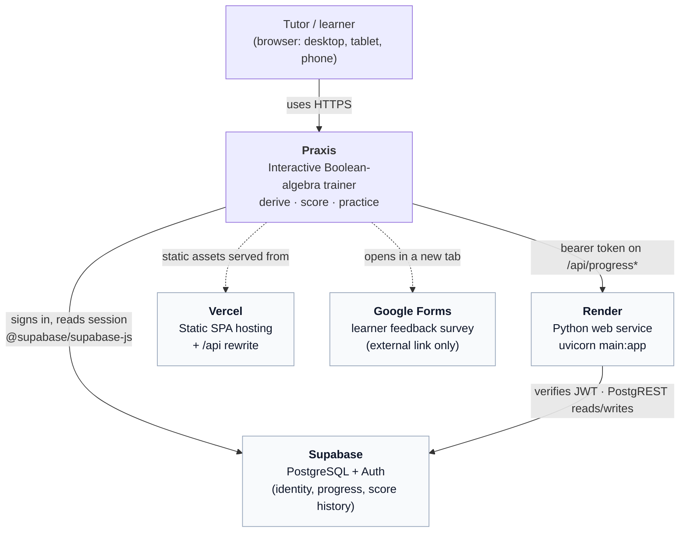
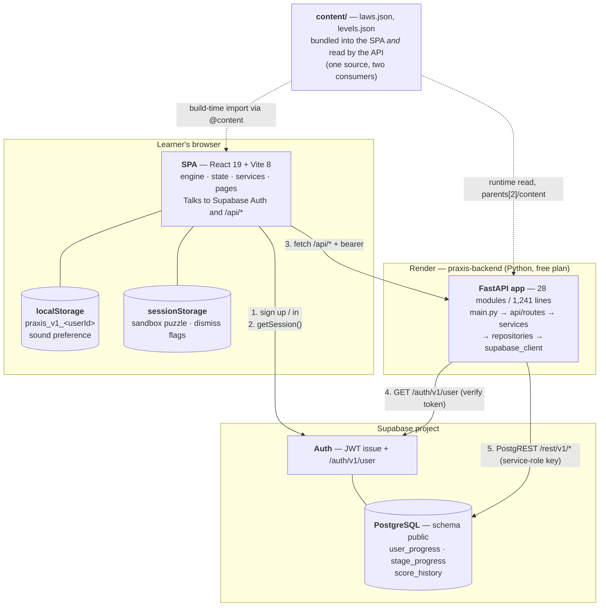
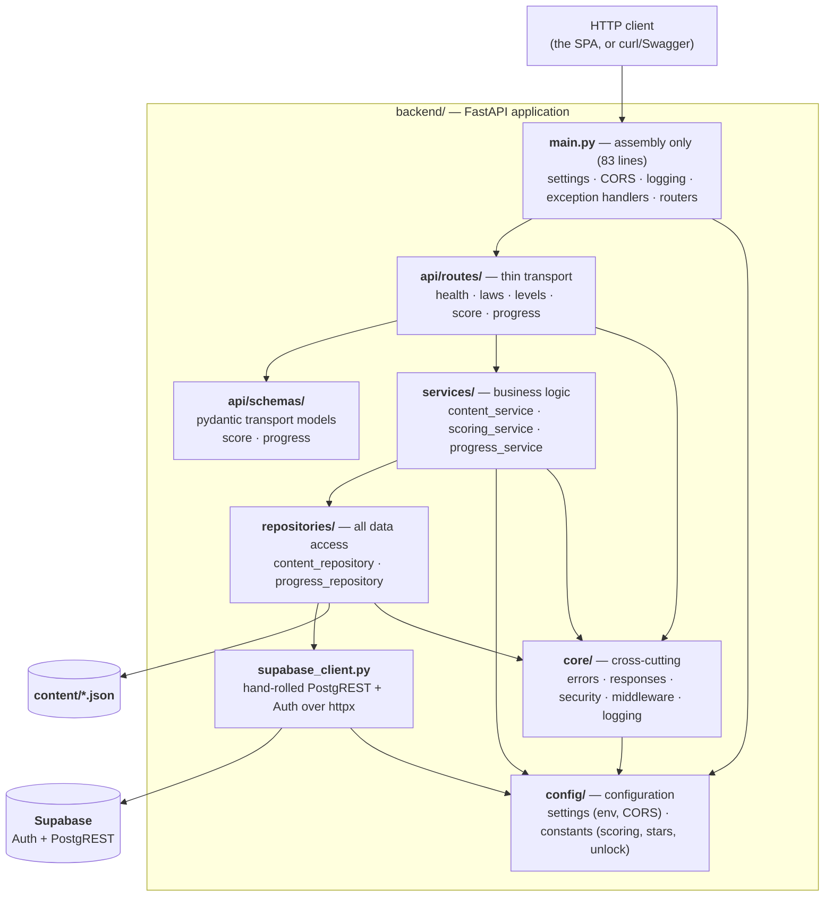
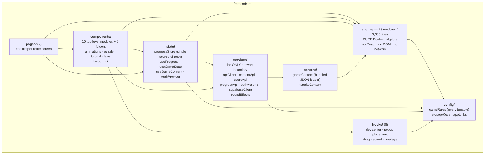
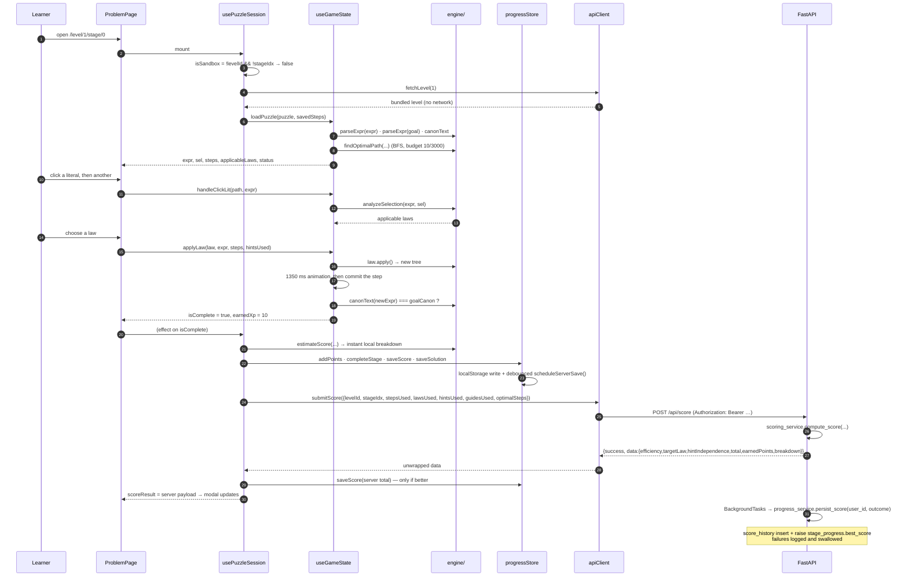

# SAD — Praxis System Architecture Description

**What this is.** A C4-style description of Praxis as it is actually built: who uses it, what
runs where, how the parts talk, and who owns which data. It is the 10-minute mental model —
read it before [SDD.md](SDD.md), which goes module by module.

**Who it's for.** A developer or ops engineer joining the project, and anyone who needs to
know *where a change belongs* before making it. Everything here is verifiable against the
tree; claims carry `file:line` citations.

---

## Contents

1. [How to read this document](#1-how-to-read-this-document)
2. [Level 1 — System context](#2-level-1--system-context)
3. [Level 2 — Containers](#3-level-2--containers)
4. [Level 3 — Backend components](#4-level-3--backend-components)
5. [Level 3 — Frontend components](#5-level-3--frontend-components)
6. [The engine contract](#6-the-engine-contract)
7. [Data ownership boundaries](#7-data-ownership-boundaries)
8. [Cross-cutting concerns](#8-cross-cutting-concerns)
9. [Runtime flows](#9-runtime-flows)
10. [Architectural invariants](#10-architectural-invariants)
11. [Where the diagrams live](#11-where-the-diagrams-live)
12. [Known discrepancies affecting this document](#12-known-discrepancies-affecting-this-document)

---

## 1. How to read this document

The description uses the four C4 levels, adapted to a system this size:

| Level | Question it answers | Section |
|---|---|---|
| 1 — Context | Who uses Praxis, and what does it depend on that we do not control? | §2 |
| 2 — Containers | What independently deployable/runnable pieces exist? | §3 |
| 3 — Components | What are the modules inside each container, and which layer owns what? | §4, §5 |
| 4 — Code | What does each function do? | [SDD.md](SDD.md) |

Two structural facts make Praxis unusual for its size and are the key to reading everything
below:

1. **The client is the computer.** All Boolean algebra, all game state and all progression
   decisions happen in the browser. The API is a small content-and-persistence service:
   **28 Python modules / 1,241 lines** against a frontend engine of **23 modules / 3,303
   lines** (30 files / 4,664 lines including its 7 test files). Do not expect the backend to
   hold business logic — it deliberately holds almost none.
2. **There is exactly one Boolean engine, and it is not in Python.** This is called the
   *engine contract* (§6) and it constrains every design decision in the project.

## 2. Level 1 — System context

Praxis is a single-user web learning tool. There is no admin console, no teacher role and no
machine-to-machine consumer. The only human actor is a **learner**; the only external systems
are **Supabase** (database + identity) and two hosting platforms.



**Reading the lines.**

- The learner's browser reaches Supabase **directly** for authentication
  (`frontend/src/services/supabaseClient.js:10`) and the backend reaches Supabase directly for
  data (`backend/supabase_client.py:102`). The two paths are independent.
- The API origin is not baked into the frontend source: in development Vite proxies `/api`
  (`frontend/vite.config.js:30`); in production Vercel rewrites `/api/*` to the Render host
  (`frontend/vercel.json:3-6`). The SPA always calls **relative** paths
  (`frontend/src/services/apiClient.js:63`), which is why the same build works in both.
- The survey is an outbound link only — the app never reads anything back
  (`frontend/src/config/appLinks.js:9`).

**Trust boundaries.** The learner's browser is untrusted: it may fabricate a score, a
progress snapshot or a sandbox expression. The API trusts a valid Supabase JWT for *identity*
but does not verify the *content* of submitted scores or snapshots. This is a deliberate,
recorded trade-off with consequences listed in
[known-limitations.md](../07-explanation/known-limitations.md).

## 3. Level 2 — Containers

Five runnable units, plus two static artefacts that are shipped inside them.



### Container responsibilities

| Container | Technology | Responsibility | Boundary evidence |
|---|---|---|---|
| **SPA** | React 19, Vite 8, Tailwind v3, Framer Motion, Sonner, React Router 7 | All algebra, all game state, all progression decisions, all rendering; auth client | `frontend/package.json:12-19`, `frontend/src/App.jsx:30-57` |
| **API** | Python 3, FastAPI, Uvicorn, httpx, pydantic, python-dotenv | Serve content, compute the authoritative score, store/return progress, liveness probe | `backend/requirements.txt:1-5`, `backend/main.py:79-83` |
| **Supabase Auth** | Supabase platform | Issue sessions; verify a bearer token server-side | `backend/supabase_client.py:87-98` |
| **Supabase PostgreSQL** | Supabase platform (PostgREST) | Persist progress and score history | `database/init.sql:7-42` |
| **`content/`** | Two JSON files | The single source of levels and laws for **both** consumers | `backend/repositories/content_repository.py:16`, `frontend/vite.config.js:16` |
| **Browser storage** | `localStorage` + `sessionStorage` | Fast-path progress, session-scoped flags | `frontend/src/config/storageKeys.js:10-28` |
| **`.e2e/`** | Node `.mjs` browser suites | Verification only — never shipped, never imported by app code | `.e2e/_harness.mjs`, `.e2e/run-all-suites.sh` |

**Deployment shape.** `render.yaml` defines exactly **one** service — the Python API
(`render.yaml:1-16`, `rootDir: backend`, `uvicorn main:app`). The SPA is **not** in
`render.yaml`; `frontend/vercel.json` plus the `FRONTEND_URL` value in `render.yaml:11` show
it is hosted on Vercel [D19]. A consequence worth stating plainly: **the API's build context
is the repository root**, which is the only reason `content/` is reachable from the backend
at runtime (`backend/repositories/content_repository.py:16` resolves `parents[2]`).

## 4. Level 3 — Backend components

The backend is a strict five-layer stack with two cross-cutting packages. A layer may call
**only** the layer directly below it.



### Layer contracts

| Layer | May import | Must never | Files |
|---|---|---|---|
| `main.py` | `api.routes`, `config`, `core` | any service, repository or query | `backend/main.py:15-20` |
| `api/routes/*` | `api.schemas`, `services`, `core` | a repository, `httpx`, or SQL; hold `if` logic about scoring | `backend/api/routes/score.py:27-35` |
| `api/schemas/*` | `pydantic` only | runtime behaviour | `backend/api/schemas/score.py:13-29` |
| `services/*` | `repositories`, `config`, `core` | `fastapi` request objects (`Request`, `Depends`) | `backend/services/scoring_service.py:11-12` |
| `repositories/*` | `supabase_client`, `core`, stdlib | business rules; deciding HTTP status codes | `backend/repositories/progress_repository.py:21-26` |
| `core/*` | `config` | `services` or `repositories` | `backend/core/security.py:13-14` |
| `config/*` | `os`, `pathlib`, `dotenv` | anything project-specific | `backend/config/settings.py:8-11` |

**Why `core/security.py` imports `supabase_client`.** It is the one deliberate exception: the
auth dependency must verify a token against Supabase, and `supabase_client` is the module that
speaks to Supabase. The alternative — routing token verification through a service and then a
repository — would add two pass-through layers for a single upstream call
(`backend/core/security.py:14`, `:27`).

### Component detail

| Component | Owns | Public surface |
|---|---|---|
| `main.py` | App assembly and the error taxonomy's HTTP rendering | `app` (`backend/main.py:25`); four exception handlers (`:39`, `:50`, `:60`, `:69`) |
| `core/errors.py` | The closed set of error codes and the `AppError` hierarchy | `ErrorCode`, `AppError`, `NotFoundError`, `ContentUnavailableError`, `UpstreamError`, `UnauthorizedError` |
| `core/responses.py` | The envelope, in one place | `Envelope`, `ErrorBody`, `success()`, `failure()`, `error_response()`, `internal_error_response()` |
| `core/security.py` | Turning a bearer header into a user dict, or a 401 | `get_current_user`, `optional_user` |
| `core/middleware.py` | Request correlation and one access-log line per request | `RequestContextMiddleware`, `REQUEST_ID_HEADER` |
| `core/logging.py` | One-JSON-object-per-line logging and the request-id context variable | `configure_logging`, `get_logger`, `log_fields`, `set_request_id`/`reset_request_id` |
| `config/settings.py` | Environment loading, CORS origin construction, fail-fast on missing credentials | `settings` (an import-time singleton), `build_cors_origins`, `require_env` |
| `config/constants.py` | Every scoring weight, penalty, bonus, rounding rule and progression threshold | nine module-level constants |
| `api/routes/health.py` | The plain liveness probe Render reads | `GET /` |
| `api/routes/levels.py` | Level summaries and one full level | `GET /api/levels`, `GET /api/levels/{level_id}` |
| `api/routes/laws.py` | Law reference cards | `GET /api/laws` |
| `api/routes/score.py` | Score one finished puzzle; optionally persist in the background | `POST /api/score` |
| `api/routes/progress.py` | Authenticated progress read/write | `GET /api/progress`, `POST /api/progress/save` |
| `services/content_service.py` | Not-found semantics for content | `list_level_summaries`, `list_laws`, `get_level`, `get_puzzle` |
| `services/scoring_service.py` | The scoring algorithm; returns a frozen `ScoreOutcome` | `compute_score`, `ScoreOutcome` |
| `services/progress_service.py` | Merging stored rows into a snapshot, writing a snapshot, recording a score | `load_progress`, `build_progress`, `save_progress`, `persist_score` |
| `repositories/content_repository.py` | Where content lives; caching; projection to summaries | `list_laws`, `list_levels`, `list_level_summaries`, `get_level` |
| `repositories/progress_repository.py` | Every Supabase statement, and transport-failure translation | five query functions + `_execute` |
| `supabase_client.py` | The PostgREST wire protocol and token verification | `SupabaseRESTClient`, `supabase` singleton |

## 5. Level 3 — Frontend components

The frontend has five architectural layers with a strict one-way dependency rule:
`engine/` ← `state/` ← `pages/`/`components/`, with `services/` beside them and `config/`
below everything.



### Layer responsibilities

| Layer | Responsibility | Rule enforced |
|---|---|---|
| `config/` | Every tunable number, every storage key, every outbound URL — in three small modules | A number a designer might change belongs here, never inline |
| `engine/` | Parsing, rendering, normalization, structural edits, equivalence, law detection, solving, scoring mirror, sandbox builders | Imports **only** `config/` and itself. Verified by import analysis: the only cross-folder imports are `../../config/gameRules.js` in `frontend/src/engine/scoring.js:18` and `frontend/src/engine/sandbox/input.js:36` |
| `services/` | The only place `fetch` happens, and the only place `supabase.auth` is mutated | Components never call `fetch`; they call one service module or a `state/` hook that wraps it |
| `state/` | The single source of truth for progress (module-level store) and for one puzzle session (a hook) | Components read state; they never mutate the expression tree or progress directly |
| `hooks/` | UI mechanics only: device tier, popup collision placement, drag gestures, overlays | No algebra, no network |
| `components/` | Presentation and local interaction; grouped by feature | Never import a page; import the engine only through its barrel (`engine/index.js`) |
| `pages/` | One file per route; composition roots | Owns layout wiring and transient UI state, not game rules |

### The seven pages and nine routes

| Route | Page | Gate stack |
|---|---|---|
| `/` | `LandingPage` | public |
| `/login` | `LoginPage` | public |
| `/register` | `RegisterPage` | public |
| `/levels` | `LevelSelectPage` | `ProtectedRoute` → `TutorialGate` |
| `/level/:levelId/stages` | `StageSelectorPage` | `ProtectedRoute` → `TutorialGate` |
| `/level/:levelId/stage/:stageIdx` | `ProblemPage` | `ProtectedRoute` → `TutorialGate` |
| `/sandbox` | `SandboxPage` | `ProtectedRoute` → `TutorialGate` |
| `/sandbox/play` | `ProblemPage` (sandbox mode) | `ProtectedRoute` → `TutorialGate` |
| `*` | redirect → `/` | — |

Routes are declared in `frontend/src/App.jsx:30-57`. Two gates wrap everything:
`ErrorBoundary` and `AuthProvider` outside the router (`:18-19`), and `OrientationGate`
inside it so it also covers public routes (`:25`).

> **Why `ProblemPage` appears twice.** `/level/:levelId/stage/:stageIdx` and `/sandbox/play`
> are the same component. Sandbox mode is not a flag or a prop — it is the **absence of route
> params**, read as `const isSandbox = !levelId && !stageIdx`
> (`frontend/src/components/puzzle/usePuzzleSession.js:40`). This is what keeps the sandbox
> playing the *real* workspace instead of a copy of it; the trade-off is recorded in
> [design-decisions.md](../07-explanation/design-decisions.md).

## 6. The engine contract

This is the single most important architectural rule in Praxis, and it is worth stating
precisely.

> **The frontend owns all Boolean algebra. The backend never re-implements it.**

```
┌──────────────────────────────────────────────────────────────────────────────┐
│  THE ENGINE CONTRACT                                                          │
├──────────────────────────────────────────────────────────────────────────────┤
│  Frontend owns                        │  Backend owns                         │
│  ────────────────────────────────     │  ────────────────────────────────     │
│  tokenising and parsing an expression │  serving content/laws.json,            │
│  rendering an expression tree         │    content/levels.json                 │
│  deciding which laws apply            │  deciding the not-found semantics      │
│  performing a rewrite                 │    (level/stage → 404)                 │
│  truth-table equivalence (used for    │  computing the score from submitted    │
│    law detection + sandbox checks,    │    numbers                             │
│    NOT for the win condition)         │                                        │
│  finding the optimal derivation (BFS) │    numbers                             │
│  validating sandbox input             │  persisting progress + score history   │
│  generating sandbox puzzles           │  verifying the bearer token            │
│  mirroring the score formula locally  │  the authoritative score               │
├──────────────────────────────────────────────────────────────────────────────┤
│  What crosses the wire, in both directions:  NUMBERS AND STRINGS.             │
│  Never an expression tree. Never a derivation. Never "is this valid?".        │
└──────────────────────────────────────────────────────────────────────────────┘
```

**How the contract is honoured in code.**

- Content stores expressions as **strings**: `{"expr": "x + xy", "goal": "x", …}`
  (`content/levels.json`). The Python side reads them as opaque values and never parses them
  (`backend/repositories/content_repository.py:19-31`).
- `POST /api/score` accepts `{levelId, stageIdx, stepsUsed, lawsUsed[], hintsUsed,
  guidesUsed, optimalSteps}` — numbers, a level index, and law **ids** (`backend/api/schemas/score.py:13-20`).
  It looks up the puzzle only to read `targetLaws` (`backend/services/scoring_service.py:43`, `:46`).
- The engine is a barrel-exported pure library (`frontend/src/engine/index.js:1-84`) with no
  React, DOM or network dependency, which is why its 81 tests run in plain Node.
- The only duplication the contract *allows* is arithmetic: the score formula exists twice —
  authoritatively in `backend/services/scoring_service.py:32` and as an instant local estimate
  in `frontend/src/engine/scoring.js:54` — and both read their numbers from their own config
  module. `frontend/src/engine/scoring.js:1-13` states the lockstep requirement explicitly.

**What the contract buys.** The two sides can never disagree about algebra, because only one
side does algebra. Adding a law is one engine change, not two. The sandbox can validate and
generate puzzles with zero network calls.

> **Known limitation — the win condition is textual, not semantic.** Completion is
> `canonText(newExpr) === goalCanonRef.current` (`frontend/src/state/useGameState.js:481`,
> goal canonicalised at `:84`). The exhaustive truth-table checker
> `frontend/src/engine/equivalence.js:45` is **not** on the win path: its only non-test
> consumers are law detection (`frontend/src/engine/laws/helpers.js:82`, `:112` — the absorption
> decisions and their Module 4 constant guards) and the
> sandbox builders (`frontend/src/engine/sandbox/generator.js:94`,
> `frontend/src/engine/sandbox/input.js:161`). Two consequences follow. First, step validity
> is *structural* rather than provational: the engine trusts its law implementations, backed
> by the property test `frontend/src/engine/__tests__/law-soundness.property.test.js`, and
> never re-proves a step. Second, a learner who reaches a terminal form that is logically
> equivalent to the goal but canonically different is **not** marked solved. Dead-end
> detection is likewise an empty `scanHints` result
> (`frontend/src/state/useGameState.js:62`, `:548`, `:606`) — a heuristic over the law
> registry, not a proof of unsolvability.

**What the contract costs.** The backend is authoritative for **scoring**, not for algebra.
It accepts `stepsUsed`, `lawsUsed`, `hintsUsed` and `optimalSteps` as submitted and never
re-derives the derivation, so `POST /api/score` can be called unauthenticated with arbitrary
numbers. That is a **trust boundary, not a verification boundary** — and it is the reason the
endpoint is safe to leave open (it computes a number from content plus inputs) while the two
progress routes are not. The rounding convention of the two score implementations also differs
at exact `.5` boundaries [D21]. Both consequences are documented in
[known-limitations.md](../07-explanation/known-limitations.md).

## 7. Data ownership boundaries

| Data | Owner (writer) | Readers | Durability | Notes |
|---|---|---|---|---|
| Levels and puzzles | a human editing `content/levels.json` | API via `content_repository`; SPA via the `@content` bundle | git | Cached with `lru_cache`; a content edit needs a process restart (`backend/repositories/content_repository.py:34`, `:40`) |
| Law reference cards | a human editing `content/laws.json` | same as above | git | 10 cards; the engine also has an 11th internal id (`distributive-expand`) not in the cards |
| Current expression tree | `state/useGameState.js` (in memory) | the workspace components | none — lost on navigation | Never sent to the server |
| Derivation steps | `state/useGameState.js` history | `StepHistoryPanel`, the score submission | indirectly: `stageSolutions` in progress | `stageSolutions` keeps the last solved derivation for replay |
| Progress snapshot | `state/progressStore.js` | every screen | `localStorage` + Supabase | The store is the only writer (`frontend/src/state/progressStore.js:60`) |
| Score (authoritative) | `backend/services/scoring_service.py` | the SPA, via `POST /api/score` | not stored by the endpoint itself | Persisted only via the background task, and only for a signed-in learner |
| Score history | `progress_service.persist_score` | nobody in the app | `score_history` | Read by analytics/reporting, not by the UI |
| Best score per stage | `progress_service.persist_score` (server) **and** `progressStore.saveScore` (client) | the stage matrix, gates | both | Two writers of the same concept — see §10.4 |
| Identity | Supabase Auth | the SPA, and the backend via `/auth/v1/user` | Supabase | The backend stores no user row beyond the FK |
| Sound preference | `services/soundEffects.js` | the toggle components | `localStorage` | Per browser, not per learner |
| Device tier / orientation | `hooks/useDeviceTier.js` | `OrientationGate`, `ProblemPage` | none (recomputed) | No User-Agent sniffing; width + pointer capability only |

## 8. Cross-cutting concerns

### 8.1 The error model

Two mirrored hierarchies, one on each side, with a stable code vocabulary in between.

| Concern | Backend | Frontend |
|---|---|---|
| Rule violation | `AppError` subclass with `code`, `message`, `detail`, `status` (`backend/core/errors.py:23-81`) | `ApiError` with `message`, `status`, `code`, `detail` (`frontend/src/services/apiClient.js:16-24`) |
| Transport shape | `{success, data, error}` (`backend/core/responses.py:32-43`) | `unwrap()` reads `data` or throws `ApiError` (`frontend/src/services/apiClient.js:33-45`) |
| Codes | 7 codes in `ErrorCode` (`backend/core/errors.py:11-21`) | Re-uses the server's code verbatim, or synthesizes `network_error` / `invalid_response` / `http_<status>` (`frontend/src/services/apiClient.js:70`, `:86`, `:101`) |
| Unhandled failure | Middleware catches, logs, renders `internal_error_response()` — never leaks internals (`backend/core/middleware.py:33-45`, `backend/core/responses.py:55-59`) | `ErrorBoundary` renders a fallback instead of a white screen (`frontend/src/components/ErrorBoundary.jsx`) |

### 8.2 Request correlation and logging

`RequestContextMiddleware` is added **inner-first** so CORS stays outermost and its headers
land even on the 500 it produces (`backend/main.py:27-36`). Per request it:

1. takes `X-Request-ID` from the request or mints `uuid4().hex`,
2. binds it to a `ContextVar` so every log line in the request carries it,
3. times the request and emits one JSON line (`request completed`, with `status` and
   `duration_ms`),
4. catches anything raised below it, logs with a stack, and answers the envelope 500,
5. always echoes `X-Request-ID` back.

Log records are single-line JSON on **stdout**: `ts, level, logger, message, request_id` plus
merged `fields` and an optional `exception` (`backend/core/logging.py:34-50`). The formatter
is installed idempotently on the root logger (`:56-66`).

### 8.3 Authentication

```
learner ──signInWithPassword──► Supabase Auth ──session(JWT)──► supabase-js (browser, cached)
                                                                      │
   any /api call ──apiRequest()──► authHeaders(): getSession().access_token
                                                                      │
                                            Authorization: Bearer <JWT>
                                                                      ▼
   FastAPI ──Depends(optional_user | get_current_user)──► GET {SUPABASE_URL}/auth/v1/user
                                                                      │
                                            200 → user dict · else None → 401
```

- `get_current_user` raises `UnauthorizedError` for a missing/malformed header, a rejected
  token, or a non-200 from Supabase; an `httpx.HTTPError` becomes `502 upstream_error`
  (`backend/core/security.py:17-35`).
- `optional_user` swallows **only** `UnauthorizedError`, which is what lets
  `POST /api/score` work signed-out while still persisting when signed-in
  (`backend/core/security.py:38-42`, `backend/api/routes/score.py:24`).
- Client-side gates (`ProtectedRoute`, `TutorialGate`) are UX, not security: both read client
  state (`frontend/src/components/TutorialGate.jsx:31-32`).

> **Known limitation (D22).** Because auth is expressed as `Depends(...)` and not as a
> security requirement, the generated OpenAPI document contains **no security scheme**.
> `/docs` therefore shows no Authorize button and cannot exercise the two progress routes.
> The bearer requirement is real and enforced; it is just invisible in the generated spec.

### 8.4 CORS

Origins are the three dev origins (`http://localhost:5173`, `http://127.0.0.1:5173`,
`http://localhost:3001`) plus `FRONTEND_URL` when the environment sets it, de-duplicated in
order (`backend/config/settings.py:23-27`, `:66-71`). Credentials are allowed and all methods
and headers are permitted. In production the browser does not need CORS at all, because Vercel
serves the SPA and the API from the same origin via a rewrite
(`frontend/vercel.json:3-6`).

> **Stale remnant (D3).** The origin list still contains `http://localhost:3001`, which
> belongs to a Better Auth server that **does not exist in this repository**.

### 8.5 Configuration

Two mirrored config modules are the only place a tunable lives:

| Frontend (`frontend/src/config/gameRules.js`) | Backend (`backend/config/constants.py`) | Must agree? |
|---|---|---|
| `SCORE_WEIGHTS {40,30,30}` `:14` | `EFFICIENCY_WEIGHT/TARGET_LAW_WEIGHT/HINT_INDEPENDENCE_WEIGHT` `:9-12` | **yes** |
| `SCORE_PENALTY {10,10}` `:21` | `STEP_PENALTY`, `ASSISTANCE_PENALTY` `:15-16` | **yes** |
| `SCORE_BONUS_MAX_POINTS` `:29` | `MAX_BONUS_POINTS` `:19` | **yes** |
| `STAR_THRESHOLDS {90,75,1}` `:38` | `STAR_THRESHOLDS (90.0, 75.0)` `:25` | yes (server has no `one` threshold; the client treats any completion as 1 star) |
| `UNLOCK_AVERAGE_SCORE = 80` `:49` | `UNLOCK_AVERAGE = 80.0` `:26` | **yes** |
| `STAGE_COMPLETION_XP = 10`, `GUIDE_COST_POINTS = 20` `:32-35` | — (server-side scoring never touches XP) | no |
| `TIMING`, `DRAG`, `SANDBOX`, `SOUND`, `SOLVER_BUDGET` `:58-181` | — | no |

`backend/config/settings.py:75` is an **import-time singleton**: a missing `SUPABASE_URL` or
`SUPABASE_SERVICE_KEY` raises while importing the app, so the process cannot boot — not even
to serve `GET /api/levels`.

### 8.6 Content delivery

`content/` is read twice, once at build time and once at runtime, from the same files:

- **SPA:** Vite aliases `@content` → `<repo>/content` (`frontend/vite.config.js:16`) and
  `frontend/src/content/gameContent.js:14-15` imports the JSON directly; `LEVEL_SUMMARIES` is
  derived at module load (`:22`). Levels and laws therefore render with **no network call**,
  and the app also works offline.
- **API:** `CONTENT_DIR = parents[2] / "content"` (`backend/repositories/content_repository.py:16`),
  read under `lru_cache`. A missing or malformed file becomes
  `503 content_unavailable` naming the path (`:24-31`).
- `contentApi.fetchLevel` prefers the bundle and only calls `GET /api/levels/{id}` for an id
  that is not bundled, de-duplicating concurrent requests with a pending map
  (`frontend/src/services/contentApi.js:36-60`).

## 9. Runtime flows

### 9.1 One graded puzzle, end to end



Note the ordering that matters: the modal opens **before** the network answers
(`TIMING.successModalDelayMs = 200`, `frontend/src/components/puzzle/usePuzzleSession.js:216`),
and the server value overwrites the local estimate when it arrives (`:208-213`). If the request
fails the local estimate simply stays — `submitScore` is `silent: true`.

### 9.2 The sandbox flow

```
/sandbox  (SandboxPage)
   │  learner types; validateSandboxInput() debounced 300 ms → live syntax verdict
   │  "Validate & Play" → buildSandboxPuzzle(raw)
   │       validate → parse → round-trip guards → findSimplestForm → findOptimalPath
   │       → workspace self-check (goal terminal? path replays through the UI move set?)
   │  ok:false → stay here, show the specific verdict
   ▼  ok:true
navigate('/sandbox/play', { state: { customPuzzle, exprText } })
   │  sessionStorage keeps the same expression across a refresh
   ▼
ProblemPage → usePuzzleSession
   isSandbox = true  →  no level fetch, no progress write, no POST /api/score
   completion → ScoreModal in unscored mode ("No points, stars, or progress were recorded")
```

The sandbox's whole contract lives in one module,
`frontend/src/components/puzzle/sandboxPuzzle.js:1-86`, and it deliberately reuses the graded
workspace rather than forking it.

### 9.3 Progress hydration

```
useProgress() mounts
   └─ store.setUser(userId)
        ├─ userId === 'guest'  → serverLoaded = true, done
        └─ otherwise
             ├─ progress = readLocal(userId) from localStorage   (instant, synchronous)
             ├─ publish()                                        (screens render now)
             └─ progressApi.loadProgress()  → GET /api/progress  (silent)
                    └─ mergeServerProgress(local, server)   ← merge, never overwrite
                       serverLoaded = true · persistLocal() · publish()
```

While `serverLoaded` is false the store neither schedules a server save nor reports
`hydrated`, which is exactly why `TutorialGate` waits for `progressHydrated` before deciding
(`frontend/src/state/useProgress.js:69`, `frontend/src/components/TutorialGate.jsx:47`): a
premature decision would bounce a returning learner to the tutorial on a fresh device.

## 10. Architectural invariants

These are the properties the architecture depends on. Breaking one is not a style violation —
it breaks a guarantee elsewhere.

1. **One engine.** No Python module may parse or rewrite algebra. If a third consumer ever
   needs the algebra, extract the engine into a shared package rather than porting it.
2. **One content source.** `content/*.json` is read by both consumers; no level or law may be
   hardcoded in either.
3. **One network boundary per side.** All frontend HTTP goes through
   `services/apiClient.js` (`frontend/src/services/apiClient.js:56`); all backend data access
   goes through `repositories/`. Nothing else opens a socket.
4. **One progress store.** `state/progressStore.js` is the only writer of progress; screens
   read it through `useProgress()`. This is what fixed the pre-refactor bug where each screen
   held a private copy and the points chip only updated on reload
   (`frontend/src/state/progressStore.js:1-23`).
5. **Server-envelope uniformity.** Every `/api/*` route answers `{success, data, error}`;
   only `GET /` is exempt, and only because Render reads its body verbatim
   (`backend/api/routes/health.py:1-3`).
6. **Fail-fast configuration.** The API refuses to boot without its credentials; the SPA
   cannot be configured at runtime (Vite inlines env at build time).
7. **Client degradation over client breakage.** Every non-essential call is `silent: true`,
   every storage access is wrapped, and the content bundle makes the app usable offline.
8. **The sandbox is the graded workspace.** Any change to `ProblemPage` or `useGameState`
   affects both modes; there is no separate sandbox implementation to keep in sync.

## 11. Where the diagrams live

The diagrams teammate owns the assembled set at `docs/09-diagrams/DIAGRAMS.md`
(12 diagrams in one place), built from Mermaid source supplied per domain. This document
carries the inline diagrams the architecture needs; the canonical versions, including the
C4 Level 1 and Level 2 renderings the devops writer supplies, are there.

The two diagrams this document's author supplied as source are the **puzzle-session state
diagram** and the **frontend data-flow diagram** — see
[`../_staging/diagram-input-product-arch.md`](../_staging/diagram-input-product-arch.md).

## 12. Known discrepancies affecting this document

The full register is D0–D23 in
[known-limitations.md](../07-explanation/known-limitations.md). Those that touch this
document directly:

| ID | This SAD describes | Proposal / brief claims | Resolution |
|---|---|---|---|
| D3 | Auth is Supabase Auth; the port-3001 CORS origin and `/api/auth` proxy are dead remnants. | Better Auth tables created by `npx auth migrate`. | Four remnant sites: `database/init.sql:4`, `frontend/vite.config.js:24-28`, `frontend/src/pages/LandingPage.jsx:21`, `frontend/src/pages/LevelSelectPage.jsx:142`. |
| D5 | Nine routes; `/` is the landing page; level selection is `/levels`. | Four routes with the carousel at `/`. | `frontend/src/App.jsx:30-57`. |
| D6 | Seven application endpoints (§3, §4). | Five. | Live-verified; see [SRS.md](../01-product/SRS.md) §5.1. |
| D17 | Backend layers are `backend/{main.py,config,core,api/routes,api/schemas,services,repositories}`. | `app/core`, `app/services`, `app/routers`, `app/schemas`. | There is no `backend/app/` package. |
| D18 | Frontend layers are `src/services` and `src/pages`. | `src/api`, `src/screens`. | Neither directory exists. |
| D19 | `render.yaml` declares one service; the SPA is on Vercel. | Render for the whole app. | `render.yaml:1-16`, `frontend/vercel.json:1-12`. |
| D20 | RLS is permissive and is documented as a limitation, not a control. | RLS as a safety feature. | `database/init.sql:56-58` is `FOR ALL USING (true)` for all roles. |
| D22 | The OpenAPI spec carries no security scheme (§8.3). | — | `Depends`-based auth emits `security=None`. |
