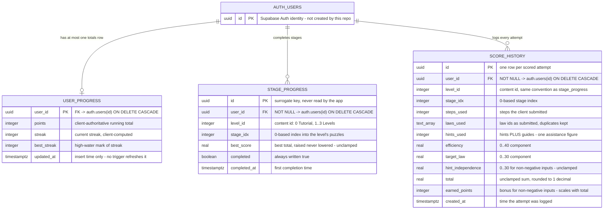
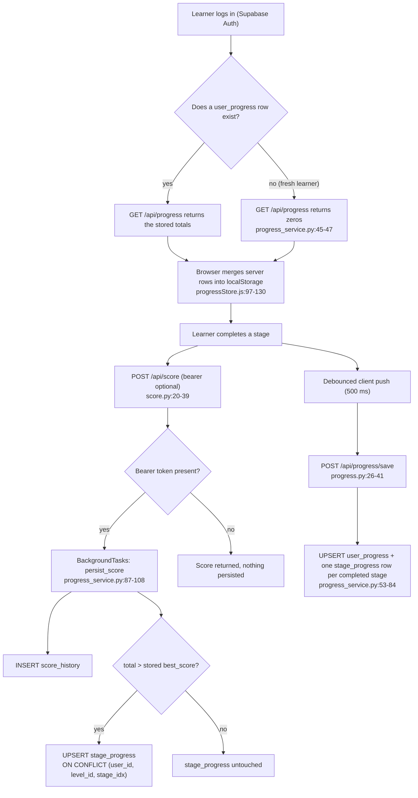

# ERD — the Praxis entity-relationship diagram

**What this is:** the whole Praxis database in one picture — three PostgreSQL tables in Supabase,
plus the `auth.users` table they hang off — with the cardinalities, a per-table narrative, and the
index convention (`level_id` / `stage_idx`) that trips up almost every newcomer.
**Who it's for:** anyone who needs to know *where a learner's progress actually lives* before
touching the score endpoint, the lock gates or the progress store. The column-by-column detail is in
[SCHEMA.md](SCHEMA.md).

## Contents

- [The diagram](#the-diagram)
- [Cardinalities in plain language](#cardinalities-in-plain-language)
- [The four entities](#the-four-entities)
- [The index convention: level_id and stage_idx](#the-index-convention-level_id-and-stage_idx)
- [Game content is NOT in the database](#game-content-is-not-in-the-database)
- [Life of a row](#life-of-a-row)
- [What the picture deliberately does not show](#what-the-picture-deliberately-does-not-show)
- [Cross-references](#cross-references)

---

## The diagram

The whole schema is 58 lines of SQL: `database/init.sql`. Three tables, all in the `public` schema,
all hanging off Supabase Auth's `auth.users`.

*(Every attribute, key and default in the diagram is read from `database/init.sql:7-42`. Attribute
types are written as single tokens for Mermaid — `text_array` is PostgreSQL `TEXT[]`, `integer` is
`INTEGER`, `bool` is `BOOLEAN`.)*

## Cardinalities in plain language

Mermaid's crow's-foot notation reads as `left-cardinality -- right-cardinality`:

| Mermaid | Symbol after the left entity | Cardality on the right | Meaning here |
|---|---|---|---|
| `\|\|--o\|` | exactly one → | zero or one | A learner has **at most one** `user_progress` row, because `user_id` is both the primary key and the foreign key (`database/init.sql:8`). |
| `\|\|--o{` | exactly one → | zero or more | A learner owns **any number** of `stage_progress` rows, but at most one per `(level_id, stage_idx)` thanks to `UNIQUE(user_id, level_id, stage_idx)` (`database/init.sql:24`). Today's ceiling is 40 rows (Tutorial 4 + Levels 1–3 × 12). |
| `\|\|--o{` | exactly one → | zero or more | A learner accumulates **any number** of `score_history` rows — one per scored attempt, replays included. There is no unique constraint on this table. |

Two absences are as important as the three relationships:

1. **There is no relationship between `stage_progress` and `score_history`.** They share the columns
   `(user_id, level_id, stage_idx)` and they are written by the same function
   (`backend/services/progress_service.py:110-122`), but no foreign key links them. `stage_progress`
   is the *summary* (best score per stage), `score_history` is the *log* (every attempt).
2. **Nothing references the game content.** There is no `levels` or `puzzles` table to point at, so
   `level_id` and `stage_idx` are unvalidated integers. See
   [The index convention](#the-index-convention-level_id-and-stage_idx).

## The four entities

### `AUTH_USERS` — Supabase Auth's table, not ours

- Created and managed by Supabase Auth; the `public` tables only reference it
  (`database/init.sql:8,18,30`).
- Verified fact: all three foreign keys are `REFERENCES auth.users(id) ON DELETE CASCADE`, so
  deleting a Supabase user erases that learner's totals, stage rows and score history in one
  statement.
- The repo never creates it: `grep -rn "CREATE TABLE" --include=*.sql .` returns exactly three
  matches, all in `database/init.sql:7,16,28`.
- The backend resolves the id from the bearer token, not from a local users table:
  `backend/api/routes/progress.py:21-23` passes `user["id"]` into the service, and
  `backend/supabase_client.py:87-98` validates the JWT against Supabase's `/auth/v1/user`.

### `USER_PROGRESS` — the learner's totals

The one-row-per-learner headline numbers: `points`, `streak`, `best_streak`. Written only by
`POST /api/progress/save` (`backend/services/progress_service.py:63-70`), read only by
`GET /api/progress` (`backend/repositories/progress_repository.py:29-34`).

Two things to know before trusting these numbers:

- **They are client-computed.** The server stores the snapshot the browser pushes; it never adds up
  points itself (`backend/api/schemas/progress.py:12`, `backend/services/progress_service.py:66`).
- **A missing row is normal, not an error.** A learner who signed up but never triggered a save has
  no row, and `build_progress` substitutes zeros (`backend/services/progress_service.py:45-47`).

### `STAGE_PROGRESS` — which stages are finished

One row per finished stage. This is the table the lock gates actually consult, by unioning the
completed `stage_idx` values per level (`frontend/src/state/progressStore.js:33-39`) and comparing
them against `TUTORIAL.stageIndexes = [0, 1, 2, 3]`
(`frontend/src/config/gameRules.js:82-85`).

- The UNIQUE constraint is load-bearing: it is the conflict target of every upsert
  (`backend/repositories/progress_repository.py:18,65-68`).
- `best_score` only ever rises: the background task reads the stored value first and upserts only
  when the new total is greater (`backend/services/progress_service.py:110-122`).
- `completed` is always written as `true` by both writers
  (`backend/services/progress_service.py:82,120`); a row's existence is the real signal.

### `SCORE_HISTORY` — the attempt log

One row per scored attempt, written in a FastAPI background task after the response has been sent
(`backend/api/routes/score.py:37-39`). It is append-only from the application's point of view: no
code path updates or deletes a row.

- The three components (`efficiency`, `target_law`, `hint_independence`) and their `total` are the
  server's authoritative arithmetic; see
  [scoring-and-rewards.md](../06-reference/scoring-and-rewards.md).
- `earned_points` is the **bonus only** (0–5 for non-negative inputs, but it scales with the
  unclamped `total`) and `hints_used` is **hints + guides**, not hints:
  `backend/services/scoring_service.py:51,55` and `backend/services/progress_service.py:101`.
  The range caveat is finding **M2** in `docs/verification-report.md` §2.4: `hintsUsed: -99` →
  `total 1060.0`, `earnedPoints 53`.
- `laws_used` is a `TEXT[]` of law ids as submitted, duplicates included
  (`backend/services/scoring_service.py:22,61`).
- Nothing in the application reads this table back — `grep -rn "score_history" backend --include=*.py`
  finds only the insert (`backend/repositories/progress_repository.py:57-59`). It exists for history
  and analytics.

## The index convention: level_id and stage_idx

This is the single most misread part of the schema. There are **two different numbering schemes** in
Praxis, and the database stores the first one.

| Scheme | Values | Where |
|---|---|---|
| **Content ids (0-based, what the DB stores)** | `0` = Tutorial, `1` = Level 1, `2` = Level 2, `3` = Level 3 — Boss | `content/levels.json`; `frontend/src/config/gameRules.js:82` pins `TUTORIAL.levelId = 0` |
| **UI labels** | "Tutorial", "Level 1", "Level 2", "Level 3" — four cards | `frontend/src/pages/LevelSelectPage.jsx:78-120` |

Consequences worth stating explicitly:

- **`stage_progress.level_id = 0` means the Tutorial.** A query that assumes `level_id = 1` is "the
  first level" is wrong; `1` is Level 1 *after* the Tutorial.
- **`stage_idx` is a 0-based index into that level's `puzzles` array**
  (`backend/services/content_service.py:39-42`), not a 1-based "stage number". Stage 1 in the UI is
  `stage_idx = 0`.
- **The upper bound differs per level.** Tutorial: `stage_idx` 0–3. Levels 1, 2 and 3: 0–11. A stage
  index of 11 is valid for Level 3 and a `404` for the Tutorial
  (`backend/services/content_service.py:40-41` rejects only `stage_idx >= len(puzzles)`).
- **The stage score key in the frontend is `"<level_id>:<stage_idx>"`**, exactly the same two
  numbers: `frontend/src/services/progressApi.js:19-24` ships `stageScores` as `{ "1:0": 87.5 }`
  (`backend/api/schemas/progress.py:18`).
- Because ids are content ids, **renumbering a level in `content/levels.json` silently orphans
  existing rows**. There is no foreign key to catch it and no migration tooling in the repo.

> ⚠️ **Input-validation hole.** `stage_idx` is only rejected when it is too large. A negative index
> resolves Python-style, so `POST /api/score` with `stageIdx: -1` scores the **last** puzzle of the
> level instead of failing. Verified by execution: `compute_score(level_id=1, stage_idx=-1, …)` →
> returns a score with `optimalSteps` from Level 1's last puzzle, while `stage_idx=12` raises
> `NotFoundError`. The same hole does not exist in `stage_progress` writes, which accept any integer.

## Game content is NOT in the database

The most important structural fact about this schema: **the game itself is not in the database.**

| Question | Answer | Evidence |
|---|---|---|
| Where do levels and puzzles live? | `content/levels.json` — 4 levels, 40 puzzles total: the Tutorial (id 0) has 4 stages and Levels 1–3 have 12 each. | `content/levels.json`; counted by execution (`sum(len(l["puzzles"]) for l in levels)` → 40) |
| Where do the law reference cards live? | `content/laws.json` — 10 laws. | `content/laws.json` |
| Who serves them? | The FastAPI backend, straight off disk, cached in memory with `functools.lru_cache`. | `backend/repositories/content_repository.py:16,34-43` |
| Is there a `levels` table? | No. Three tables exist and none of them is content. | `database/init.sql` (58 lines) |
| Why does that matter? | `stage_progress.level_id` and `.stage_idx` cannot be foreign keys, so the database cannot tell a real stage from `level_id = 99, stage_idx = -4`. | `database/init.sql:19-20` — bare `INTEGER NOT NULL` |

The backend therefore **scores submitted numbers against JSON content it read from disk**
(`backend/services/scoring_service.py:43` calls `content_service.get_puzzle`), and the database only
ever stores the results. If `content/` is missing at runtime, every content route returns
`503 content_unavailable` (`backend/repositories/content_repository.py:24-31`) — a deployment
concern, but also a reminder that the database is not the source of truth for the game.

## Life of a row

*(All evidence lines are in the diagram; the debounce is
`frontend/src/config/gameRules.js:68`, `TIMING.progressSaveDebounceMs = 500`.)*

## What the picture deliberately does not show

| Not shown | Why |
|---|---|
| Any content entity (level, puzzle, hint, law) | Not in the database at all — see above. |
| Stars, level completion, `hasSeenTutorial`, saved derivations | Derived or browser-only; no columns exist. Stars are computed from `best_score` (`frontend/src/state/progressStore.js:281-285`), and `stageSolutions` is dropped by the save API's schema (`backend/api/schemas/progress.py:11-18`). |
| Auth sessions, refresh tokens, passwords | Supabase Auth's own tables in the `auth` schema, never touched by this repo. |
| Row-level ownership edges | The RLS policies do **not** enforce ownership (`FOR ALL USING (true)`), so drawing a "learner owns their rows" constraint would be a lie. See [SCHEMA.md](SCHEMA.md). |

## Cross-references

- [SCHEMA.md](SCHEMA.md) — every column, constraint, index and policy, quoted verbatim.
- [scoring-and-rewards.md](../06-reference/scoring-and-rewards.md) — what the numbers stored in
  `score_history` mean, and how they are computed.
- `database/init.sql` — the entire schema, 58 lines.
- `docs/context.md` — the historical proposal; `docs/context.md:29-30` still claims the database is
  not integrated and auth does not exist. The code contradicts it (register rows D2 and D7 in
  `docs/_staging/GROUND-TRUTH.md`).
