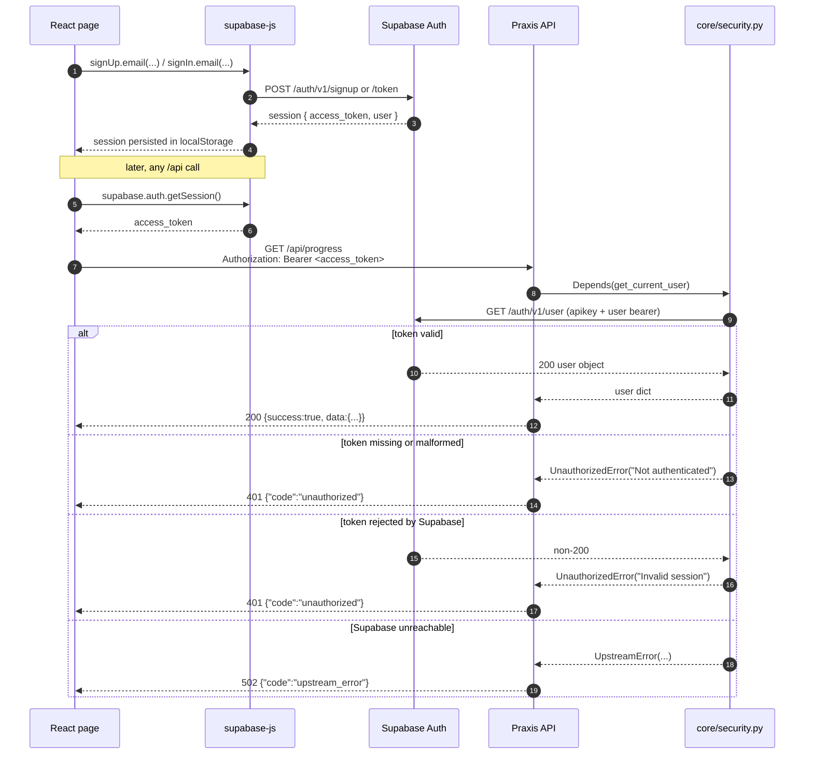
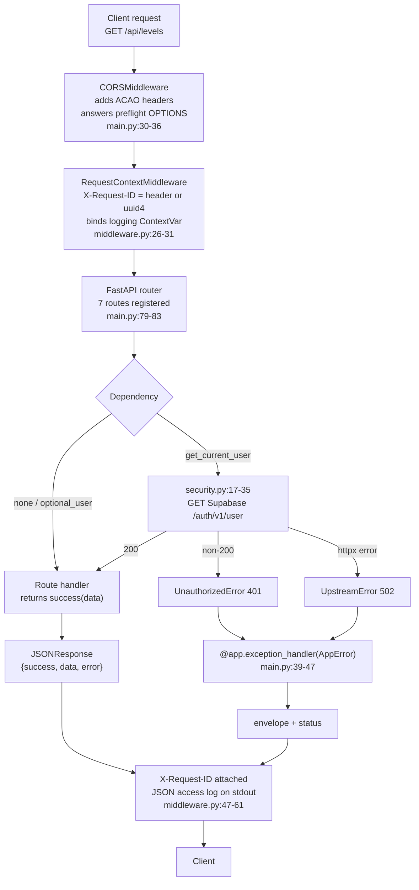

# Praxis API Reference

**What this is.** The complete reference for the Praxis HTTP API — a small FastAPI service
that serves the static game content (levels and Boolean law cards) and scores submitted
puzzle derivations. It is **7 application endpoints**, plus the documentation routes FastAPI
adds for free.

**Who it is for.** Anyone integrating with the API (frontend developer, QA, third-party
client) and anyone asked to "change how the API behaves". Every response body below was
observed by executing the app, not copied from the proposal. Where the proposal disagrees
with the code, the code wins and the disagreement is flagged.

> **Ground rule for reading this file:** the API is the backend only. The Boolean algebra
> itself — parsing, law application, validation of a step, the sandbox — lives entirely in
> `frontend/src/engine/` and never crosses the network. There is **no** `/api/sandbox/*`
> endpoint (see [§8.1](#81-there-is-no-apisandbox-endpoint)).

---

## Contents

- [1. The API at a glance](#1-the-api-at-a-glance)
- [2. Conventions every endpoint shares](#2-conventions-every-endpoint-shares)
  - [2.1 The `{success, data, error}` envelope](#21-the-success-data-error-envelope)
  - [2.2 The one route outside the envelope: `GET /`](#22-the-one-route-outside-the-envelope-get-)
  - [2.3 `X-Request-ID` on every response](#23-x-request-id-on-every-response)
  - [2.4 Authentication: Supabase bearer tokens](#24-authentication-supabase-bearer-tokens)
  - [2.5 Request format rules and the `Content-Type` trap](#25-request-format-rules-and-the-content-type-trap)
  - [2.6 CORS](#26-cors)
  - [2.7 Error codes](#27-error-codes)
  - [2.8 Level and stage numbering](#28-level-and-stage-numbering)
  - [2.9 FastAPI's built-in routes](#29-fastapis-built-in-routes)
  - [2.10 How this reference was verified](#210-how-this-reference-was-verified)
- [3. Endpoint reference](#3-endpoint-reference)
  - [3.1 `GET /`](#31-get-)
  - [3.2 `GET /api/levels`](#32-get-apilevels)
  - [3.3 `GET /api/levels/{level_id}`](#33-get-apilevelslevel_id)
  - [3.4 `GET /api/laws`](#34-get-apilaws)
  - [3.5 `POST /api/score`](#35-post-apiscore)
  - [3.6 `GET /api/progress`](#36-get-apiprogress)
  - [3.7 `POST /api/progress/save`](#37-post-apiprogresssave)
- [4. Data shapes](#4-data-shapes)
- [5. Request lifecycle](#5-request-lifecycle)
- [6. Frontend client reference](#6-frontend-client-reference)
- [7. Content inventory served by these endpoints](#7-content-inventory-served-by-these-endpoints)
- [8. Known discrepancies and traps](#8-known-discrepancies-and-traps)
- [9. Quick reference card](#9-quick-reference-card)

---

## 1. The API at a glance

### 1.1 Where the API lives

| Environment | Base URL | How a browser reaches it |
|---|---|---|
| Local development | `http://127.0.0.1:8000` | Vite dev server proxies `/api` → `http://127.0.0.1:8000` (`frontend/vite.config.js:29-34`) |
| Local port override | `http://127.0.0.1:<port>` | set `VITE_API_TARGET` before `npm run dev` (`frontend/vite.config.js:8`) |
| Production | one Render web service, `praxis-backend` | Vercel rewrites `/api/(.*)` → `https://praxis-backend-5302.onrender.com/api/$1` (`frontend/vercel.json:3-6`) |

Because both hops are same-origin rewrites, the deployed single-page app never makes a
cross-origin request to the API. CORS is therefore mostly relevant to direct callers, the
Swagger UI, and local development (see [§2.6](#26-cors)).

The service is started with `uvicorn main:app` from the `backend/` directory
(`render.yaml:7-8`); there is no `backend/app/` package.

### 1.2 The 7 endpoints

| # | Method | Path | Auth | Purpose | Success |
|---|---|---|---|---|---|
| 1 | `GET` | `/` | none | Liveness probe for Render | `200` plain JSON |
| 2 | `GET` | `/api/levels` | none | Level metadata for the level-select screen | `200` envelope |
| 3 | `GET` | `/api/levels/{level_id}` | none | One level including all its puzzles | `200` envelope |
| 4 | `GET` | `/api/laws` | none | The 10 Boolean law reference cards | `200` envelope |
| 5 | `POST` | `/api/score` | **optional** | Score a completed puzzle | `200` envelope |
| 6 | `GET` | `/api/progress` | **required** | The learner's saved progress snapshot | `200` envelope |
| 7 | `POST` | `/api/progress/save` | **required** | Overwrite the learner's progress snapshot | `200` envelope |

"Optional" auth means the route works signed-out and does extra work when a valid bearer
token is present. "Required" means a missing or unusable token is a `401` before any
business logic runs.

Router wiring is four lines in `backend/main.py:79-83`; the OpenAPI document exposes exactly
these seven paths and nothing else (verified — see [§2.9](#29-fastapis-built-in-routes)).

### 1.3 What this API deliberately is not

| Not present | Reality | Evidence |
|---|---|---|
| `/api/sandbox/validate` | The sandbox validates in the browser | `frontend/src/engine/sandbox/validate.js`, `frontend/src/pages/SandboxPage.jsx` |
| `/api/auth`, `/api/login`, `/api/register` | Auth is Supabase Auth called **directly from the browser**; no auth route exists on this service | `frontend/src/services/supabaseClient.js:5-10`, `frontend/src/services/authActions.js:9-31` |
| A Better Auth server on port 3001 | No Better Auth anywhere in the repo; the `/api/auth` Vite proxy entry and the `init.sql` header comment are dead remnants | `frontend/vite.config.js:24-28`, `database/init.sql:4` |
| Any endpoint that evaluates Boolean algebra | The engine is client-side; the API scores submitted numbers | `frontend/src/engine/index.js`, `backend/services/scoring_service.py` |

> **Known discrepancy (D17).** Older briefs describe the backend as
> `app/core`, `app/services`, `app/repositories`, `app/routers`, `app/schemas`. The real
> paths are `backend/core`, `backend/services`, `backend/repositories`, `backend/api/routes`,
> `backend/api/schemas`, `backend/config`. There is no `backend/app/`.
>
> **Known discrepancy (D18).** Frontend layering is `frontend/src/services` (not `src/api`)
> and `frontend/src/pages` (not `src/screens`).

---

## 2. Conventions every endpoint shares

### 2.1 The `{success, data, error}` envelope

Every `/api/*` route declares `response_model=Envelope` and returns the result of
`core.responses.success(...)` (`backend/core/responses.py:24-34`). The envelope has exactly
three top-level keys, always present:

| Key | Type | On success | On failure |
|---|---|---|---|
| `success` | boolean | `true` | `false` |
| `data` | any \| `null` | the payload | `null` |
| `error` | object \| `null` | `null` | `{code, message, detail}` |

The `error` object is `ErrorBody` (`backend/core/responses.py:16-21`):

| Key | Type | Meaning | Safe to show a learner? |
|---|---|---|---|
| `code` | string | stable machine code from `ErrorCode` (`backend/core/errors.py:11-20`) | yes (used for branching) |
| `message` | string | short human-readable summary | **yes** — written for end users |
| `detail` | any \| `null` | developer detail: pydantic errors, or an upstream exception string | **no** — log it, do not render it |

Success and failure are the only two shapes. A raw payload is never returned from `/api/*`,
and an error is never signalled by HTTP status alone.

```json
{"success":true,"data":{"status":"ok"},"error":null}
```

All envelope responses are `Content-Type: application/json` and serialized as a single line
(the examples in this file are pretty-printed for reading; object key order and the single-line
wire format are the only differences).

### 2.2 The one route outside the envelope: `GET /`

`GET /` returns a **plain** payload on purpose:

```json
{"message":"Praxis API is running","docs":"/docs"}
```

Render's health check reads this body verbatim, so it must not change shape
(`backend/api/routes/health.py:15-18`). Do not "fix" it into the envelope.

### 2.3 `X-Request-ID` on every response

`RequestContextMiddleware` (`backend/core/middleware.py:23-62`) sets an `X-Request-ID`
response header on **every** response it produces, including `404`, `422`, `500` and `503`:

| Situation | Header value |
|---|---|
| Client sent `X-Request-ID: abc123deadbeef` | echoed verbatim — verified: `X-Request-ID: abc123deadbeef` |
| Client sent nothing | a fresh `uuid4().hex` — verified: `ea2b5d6daff7484f97288a065d8aa298` |

The same value is attached to every JSON log line for that request
(`backend/core/middleware.py:48-57`, formatter in `backend/core/logging.py:34-50`), so a bug
report containing an `X-Request-ID` can be traced to the exact log line and duration:

```json
{"ts":"2026-09-28T05:39:52.152Z","level":"INFO","logger":"praxis.request","message":"request completed","request_id":"100aa492f2c24f8290d44a0e25a39079","method":"GET","path":"/api/levels","status":200,"duration_ms":2.75}
```

**Exception:** the CORS preflight response produced by Starlette's `CORSMiddleware`
short-circuits the chain, so `OPTIONS` preflights carry **no** `X-Request-ID` (verified). Every
other response does.

Send your own `X-Request-ID` (a client trace id) whenever you can — it makes the server log
joinable with your client log.

### 2.4 Authentication: Supabase bearer tokens

Auth is **Supabase Auth**. The browser signs the learner in against Supabase directly, and
the API validates the resulting access token by asking Supabase who it belongs to:



Copy-pasteable source for this diagram lives in
`docs/_staging/diagram-input-backend-api.md`.

**Request header**

```text
Authorization: Bearer <supabase-access-token>
```

The parser is strict and case-sensitive (`backend/core/security.py:19-24`):

| Header sent to `GET /api/progress` | Result (observed) |
|---|---|
| *(absent)* | `401` `{"code":"unauthorized","message":"Not authenticated"}` |
| `token abc` | `401` `Not authenticated` — the `Bearer ` prefix is required, uppercase B |
| `bearer fake-valid-token` | `401` `Not authenticated` — lowercase is rejected |
| `Bearer` (no space) | `401` `Not authenticated` |
| ` Bearer fake-valid-token` (leading space) | `401` `Not authenticated` |
| `Bearer  fake-valid-token` (two spaces) | **`502`** `Authentication service is unavailable` — `split(" ")[1]` is empty, so this takes the same path as the trap below (verified live) |
| `Bearer <expired-or-wrong-token>` | `401` `{"code":"unauthorized","message":"Invalid session"}` (live Supabase returned `403` for the bogus token) |
| `Bearer <valid-supabase-access-token>` | `200` with the progress snapshot |

> **Trap: an empty token returns `502`, not `401`.** Both `Authorization: Bearer ` (trailing
> space, no token) and `Authorization: Bearer  <token>` (two spaces) pass the
> `startswith("Bearer ")` check, so `auth_header.split(" ")[1]` yields the empty string;
> `httpx` then refuses to build the request and raises inside `supabase.get_user`, which
> `core/security.py:28-29` converts to an upstream error. **Observed live for both spellings:**
> ```json
> {"success":false,"data":null,"error":{"code":"upstream_error","message":"Authentication service is unavailable","detail":"Illegal header value b'Bearer '"}}
> ```
> A `502` on a request with no token is therefore an auth-parsing artefact, not a Supabase
> outage. Note the contrasting row above: a *non-empty* wrong token takes the real network path
> and returns `401 Invalid session`.

**How the token is checked.** `supabase_client.SupabaseRESTClient.get_user`
(`backend/supabase_client.py:87-98`) performs `GET {SUPABASE_URL}/auth/v1/user` with
`apikey: <service-role-key>` and `Authorization: Bearer <user-token>`, with a **5-second**
timeout. Any non-`200` answer becomes `None`, which `core/security.py:31-32` turns into
`401 Invalid session`. A transport failure (`httpx.HTTPError`) becomes `502 upstream_error`
(`backend/core/security.py:28-29`). There is no local JWT verification, no token caching and
no session table — every authenticated request costs one call to Supabase.

**Two dependency flavours**

| Dependency | Used by | Missing token | Bad token |
|---|---|---|---|
| `get_current_user` (`backend/core/security.py:17-35`) | `GET /api/progress`, `POST /api/progress/save` | `401` | `401` |
| `optional_user` (`backend/core/security.py:38-43`) | `POST /api/score` | request proceeds with `user = None` | request proceeds with `user = None` |

**Consequence for signed-in scoring.** `POST /api/score` accepts a bearer token but never
requires one. When a valid token is present, the route schedules `progress_service.persist_score`
as a FastAPI `BackgroundTask` (`backend/api/routes/score.py:38-39`); when it is absent — or when
the token is invalid — scoring still succeeds and simply does not persist. A request with a
**bogus** bearer therefore still returns `200` (verified).

One caveat: `optional_user` swallows only `UnauthorizedError` (`backend/core/security.py:38-43`),
not `UpstreamError`. So a request that *does* carry a token fails with `502 upstream_error` if
Supabase Auth cannot be reached, while the identical request **without** a token returns `200`
(verified — the token-free path never calls Supabase at all).

> **Known discrepancy (D7).** The stale proposal states that `POST /api/score` "does NOT save
> to DB". It **does**, for signed-in learners: a background task inserts into `score_history`
> and raises `stage_progress.best_score` when the new total beats the stored best
> (`backend/services/progress_service.py:87-127`). Persistence failures are logged and
> swallowed so a storage problem can never fail a score response
> (`backend/services/progress_service.py:123-127`).

> **Known discrepancy (D22) — no Authorize button in `/docs`.** Because auth is a hand-rolled
> `Depends(...)` that reads the `Authorization` header directly, FastAPI emits **no security
> scheme**: `/openapi.json` has no `components.securitySchemes` and **no operation carries a
> `security` field** (verified: all seven operations report `security=ABSENT`, and the
> document has no root-level `security`). The practical effect is that the Swagger UI at
> `/docs` renders **no "Authorize" button**, so an integrator cannot exercise
> `GET /api/progress`, `POST /api/progress/save` or the authenticated half of
> `POST /api/score` from the docs page — even though those routes accept and (for the two
> progress routes) require `Authorization: Bearer <supabase-access-token>`. Use `curl` or the
> frontend instead. This is a developer-experience defect, not a security hole: the routes
> still enforce auth at runtime.

> **Known discrepancy (D3).** A comment in `frontend/vite.config.js:24` and the header of
> `database/init.sql:4` mention a "Better Auth server" and `npx auth migrate`. **There is no
> Better Auth in this repository** — no `auth-server/` directory, no port-3001 service.
> `VITE_AUTH_URL` is vestigial. Auth is Supabase Auth only.

### 2.5 Request format rules and the `Content-Type` trap

- Bodies are JSON only. There is no form or multipart route.
- `POST` routes require `Content-Type: application/json`. Omitting it while sending a JSON
  body does **not** produce a clean parse — FastAPI receives the raw string as `body`, and
  pydantic reports `model_attributes_type`:

  ```json
  {"success":false,"data":null,"error":{"code":"validation_error","message":"Request validation failed","detail":[{"type":"model_attributes_type","loc":["body"],"msg":"Input should be a valid dictionary or object to extract fields from","input":"{\"levelId\": 1, ... }"}]}}
  ```

- Unknown extra body fields are **ignored**, not rejected (verified: posting
  `{"...valid...","bogus":"ignored"}` returned `200`). Pydantic's default `extra="ignore"`
  applies — there is no `model_config` override in `backend/api/schemas/`.
- Query strings are ignored by all seven routes (no query parameters exist).
- No route accepts a request body on `GET`.

### 2.6 CORS

CORS is configured with explicit origins, credentials allowed, every method and every header
(`backend/main.py:30-36`):

| Setting | Value | Evidence |
|---|---|---|
| Allowed origins | `http://localhost:5173`, `http://127.0.0.1:5173`, `http://localhost:3001`, plus `FRONTEND_URL` when set and not already listed | `backend/config/settings.py:23-27`, `:66-71` |
| `allow_credentials` | `true` | `backend/main.py:33` |
| `allow_methods` / `allow_headers` | `*` | `backend/main.py:34-35` |
| Preflight cache | `access-control-max-age: 600` | observed preflight response |
| Middleware order | CORS is added **last** so it is outermost — its headers land even on the `500` envelope | `backend/main.py:27-36` |

Observed preflight (`OPTIONS /api/levels`, `Origin: http://localhost:5173`,
`Access-Control-Request-Method: GET`):

```text
HTTP/1.1 200 OK
vary: Origin
access-control-allow-methods: DELETE, GET, HEAD, OPTIONS, PATCH, POST, PUT
access-control-max-age: 600
access-control-allow-credentials: true
access-control-allow-origin: http://localhost:5173
access-control-allow-headers: authorization,content-type
```

Three behaviours worth knowing:

1. **A disallowed origin fails the preflight with `400` and a plain-text body.** Observed:
   `OPTIONS /api/levels` with `Origin: https://evil.example` → `400`,
   `Content-Type: text/plain; charset=utf-8`, body `Disallowed CORS origin`. This is
   Starlette's `CORSMiddleware` short-circuit, so it is **not** in the
   `{success,data,error}` envelope and carries no `X-Request-ID`. A browser client from an
   unlisted origin will therefore see an opaque CORS failure, never a JSON error.
2. **`OPTIONS` without an `Origin` header is not a preflight** and falls through to the
   router: observed `405` with the `http_error` envelope
   (`{"code":"http_error","message":"Method Not Allowed"}`).
3. **Simple cross-origin requests do receive `access-control-allow-origin`.** Observed on
   `GET /api/levels` with `Origin: http://127.0.0.1:5173`:
   `ACAO='http://127.0.0.1:5173'`, `ACAC='true'`, `Vary='Origin'`. No
   `access-control-expose-headers` is sent, so a browser script **cannot read
   `X-Request-ID`** from a cross-origin response — only same-origin callers and non-browser
   clients can.

> **Known discrepancy (D13).** The stale proposal lists only `localhost:5173` and
> `127.0.0.1:5173`. The code also allows `http://localhost:3001` and appends `FRONTEND_URL`
> when it is set (verified in `backend/config/settings.py:66-71`; production sets
> `FRONTEND_URL: https://praxis-seven-puce.vercel.app` in `render.yaml:10-11`).

### 2.7 Error codes

Every failure carries a machine code in `error.code`. The full catalogue — trigger, status,
exact envelope, what the learner sees, what to check first — is in
[error-codes.md](../06-reference/error-codes.md). Summary:

| `error.code` | HTTP | Raised by | Typical cause |
|---|---|---|---|
| `not_found` | `404` | `NotFoundError` (`backend/core/errors.py:52-57`) | unknown level id or stage index |
| `content_unavailable` | `503` | `ContentUnavailableError` (`backend/core/errors.py:60-65`) | `content/*.json` missing or unreadable at runtime |
| `upstream_error` | `502` | `UpstreamError` (`backend/core/errors.py:68-73`) | Supabase Auth or PostgREST transport failure |
| `unauthorized` | `401` | `UnauthorizedError` (`backend/core/errors.py:76-81`) | missing/invalid bearer token on a protected route |
| `validation_error` | `422` | `RequestValidationError` handler (`backend/main.py:60-66`) | malformed body, wrong type, bad path parameter |
| `http_error` | `404` / `405` / any | `StarletteHTTPException` handler (`backend/main.py:50-57`) | unknown route, wrong method |
| `internal_error` | `500` | `internal_error_response()` (`backend/core/responses.py:55-59`) | unhandled exception inside a route |

`code` values are declared once in `ErrorCode` (`backend/core/errors.py:11-20`) and shared
with the frontend by convention, not by a generated client.

### 2.8 Level and stage numbering

This is the most common source of confusion in this project. There are **two** numbering
schemes and only one of them appears on the wire.

| Concept | Value | Where it is defined |
|---|---|---|
| Level id **on the wire** (`levelId`, `level_id`, `/api/levels/{level_id}`) | `0` = Tutorial, `1` = Level 1, `2` = Level 2, `3` = Level 3 — Boss | `content/levels.json`, served verbatim |
| What the UI calls them | "Tutorial", "Level 1", "Level 2", "Level 3 — Boss" (four visible cards) | `frontend/src/config/gameRules.js` (`TUTORIAL.levelId = 0`) |
| Stage index (`stageIdx`, `stage_idx`) | **0-based** within a level | `backend/services/content_service.py:32-42` |
| `stage_progress.level_id` in the database | the 0-based content id — so Tutorial rows have `level_id = 0` | `database/init.sql:19`, `backend/services/progress_service.py:72-75` |

There is **no** offset conversion anywhere: the API, the database and `content/levels.json`
all use the same 0-based ids. Only the display names differ.

> **Trap: a negative `stageIdx` silently scores the wrong puzzle.** `get_puzzle` only rejects
> an index that is `>= len(puzzles)` (`backend/services/content_service.py:40-41`), so a
> negative index keeps Python's negative-indexing semantics. Verified by execution:

| Request | Observed result |
|---|---|
| `{"levelId":1,"stageIdx":99,...}` | `404` `{"code":"not_found","message":"Stage 99 not found"}` |
| `{"levelId":999,"stageIdx":0,...}` | `404` `{"code":"not_found","message":"Level 999 not found"}` |
| `{"levelId":1,"stageIdx":-1,...}` | **`200`** — scores stage 11, the *last* puzzle of Level 1 (`(x' + y)'(x + y')'(x + y)`) |
| `{"levelId":1,"stageIdx":-12,...}` | **`200`** — scores stage 0, the *first* puzzle (a 12-puzzle level accepts `-1`…`-12`) |
| `{"levelId":1,"stageIdx":-13,...}` | **`500`** `internal_error` — `IndexError` escapes the guard; verified for `-13` and `-100` |

Observed `500` for `stageIdx: -13` (`raise_server_exceptions=False`, so the traceback stayed
server-side):

```json
{"success":false,"data":null,"error":{"code":"internal_error","message":"Internal server error","detail":null}}
```

So `stageIdx: -1` is accepted, scores a different puzzle than the caller named, and reports a
`200`; one step further out it becomes a `500` rather than a `404`. **Request-validation defect
— clients must validate `0 <= stageIdx < puzzleCount` themselves before submitting.** The API
cannot be relied on to reject a bad stage index.

### 2.9 FastAPI's built-in routes

`FastAPI(title="Praxis API", version="1.0.0")` (`backend/main.py:25`) adds four routes that are
not application endpoints:

| Route | Status | Content-Type | Notes |
|---|---|---|---|
| `GET /docs` | `200` | `text/html; charset=utf-8` | Swagger UI. **No Authorize button** — see D22 above |
| `GET /redoc` | `200` | `text/html; charset=utf-8` | ReDoc rendering of the same document |
| `GET /openapi.json` | `200` | `application/json` | `{"info":{"title":"Praxis API","version":"1.0.0"}, ...}`; paths are exactly the seven in [§1.2](#12-the-7-endpoints) |
| `GET /docs/oauth2-redirect` | `200` | `text/html; charset=utf-8` | Swagger's OAuth2 redirect shim; unused because there are no OAuth2 schemes |

The document declares **seven** `components.schemas`: `Envelope`, `ErrorBody`, `ProgressData`,
`SaveProgressRequest`, `ScoreRequest`, `ValidationError` and `HTTPValidationError`. It declares
**no** `securitySchemes`, no tags, and only the status codes
FastAPI can infer (`200`, plus `422` where a path or body parameter is validated). Documented
error bodies (`401`, `404`, `500`, `502`, `503`) are **not** in the OpenAPI document —
`response_model=Envelope` is declared without `responses={...}`, so `/docs` shows a success
shape only. Treat this file as the authoritative error reference.

`ScoreResponse` (`backend/api/schemas/score.py:23-29`) exists as a Pydantic model but is **not**
in the document, because the route declares `response_model=Envelope` and dumps the model into
`data` (`backend/api/routes/score.py:20,41-48`).

Note also that `GET /openapi.json`, `/docs` and `/redoc` are **unauthenticated and always
public**, in every environment. On the free Render plan that is the intended behaviour, but
be aware that the full route list and schemas are exposed.

### 2.10 How this reference was verified

Every body quoted in this file was produced by running the real app in-process; nothing was
copied from a design document. From `backend/`:

```bash
./venv/bin/python -c "
from fastapi.testclient import TestClient
from main import app
c = TestClient(app)
r = c.get('/api/levels'); print(r.status_code, r.text)
"
```

Requests were issued with `fastapi.testclient.TestClient` (which runs the full ASGI stack,
including both middlewares), `raise_server_exceptions=False` for the `500` probe. Two paths
that need a **real Supabase session** were exercised with the data layer stubbed and are
labelled as such in place: `GET /api/progress` and `POST /api/progress/save` successes, plus
the `POST /api/score` background-persistence path. Their envelopes, field names and
serialization are the real route output; only the data source was substituted. Every
failure body (`404`, `401`, `422`, `500`, `502`, `503`) was produced by really triggering
the fault — `503` by pointing the content loader at a missing directory, `502` by injecting
an `httpx` transport error, `500` by raising inside a route.

`backend/.env` (gitignored) must exist with `SUPABASE_URL` and `SUPABASE_SERVICE_KEY`, because
`config/settings.py:74-75` builds the `Settings` singleton at import time and the app cannot
boot without them — not even to serve `/api/levels`. Values are never reproduced in docs;
see [configuration-guide.md](../08-devops/configuration-guide.md).

---

## 3. Endpoint reference

### 3.1 `GET /`

Liveness probe. Render reads the body verbatim, so it is deliberately plain JSON with no
envelope.

| | |
|---|---|
| **Path** | `/` (`backend/api/routes/health.py:15-18`) |
| **Auth** | none |
| **Request body** | none |
| **Query parameters** | none |
| **Success** | `200 application/json` |

**Success response — observed verbatim**

```json
{"message":"Praxis API is running","docs":"/docs"}
```

| Field | Type | Value |
|---|---|---|
| `message` | string | `"Praxis API is running"` |
| `docs` | string | `"/docs"` |

**Errors**

| Status | Code | When |
|---|---|---|
| `405` | `http_error` | any method other than `GET` — verified `HEAD /` → `405` `{"code":"http_error","message":"Method Not Allowed"}` |
| `500` | `internal_error` | the process is running but the handler raised (not expected) |

**curl**

```bash
curl -i http://127.0.0.1:8000/
```

```powershell
Invoke-RestMethod -Uri http://127.0.0.1:8000/ | ConvertTo-Json
```

**Frontend equivalent**

None. The frontend never calls `/`; the Vite dev proxy only forwards `/api/*`
(`frontend/vite.config.js:29-34`), and the deployed SPA is served by Vercel, not by this
service.

**Notes**

- The response is `HTTP/1.1 200 OK` with `X-Request-ID` and `content-type: application/json`.
- `docs` is a *path*, not an absolute URL. Behind the Vercel rewrite the docs live at
  `https://<frontend-host>/docs` only if the rewrite forwards it — it does not, because
  `vercel.json` rewrites only `/api/(.*)`. Use the Render host directly for `/docs`.

---

### 3.2 `GET /api/levels`

Level metadata for the level-select screen: no puzzle detail, one entry per level in
authoring order.

| | |
|---|---|
| **Path** | `/api/levels` (`backend/api/routes/levels.py:18-21`) |
| **Auth** | none |
| **Request body** | none |
| **Query parameters** | none |
| **Success** | `200` envelope, `data` = array of 4 level summaries |

**Success response — observed verbatim (pretty-printed; the wire form is one line)**

```json
{
  "success": true,
  "data": [
    {
      "id": 0,
      "name": "Tutorial",
      "desc": "Interactive Fundamentals & System Orientation",
      "varCount": 2,
      "puzzleCount": 4
    },
    {
      "id": 1,
      "name": "Level 1",
      "desc": "Two-variable expressions (SOP & POS Dual Pairs)",
      "varCount": 2,
      "puzzleCount": 12
    },
    {
      "id": 2,
      "name": "Level 2",
      "desc": "Three-variable expressions (SOP & POS Dual Pairs)",
      "varCount": 3,
      "puzzleCount": 12
    },
    {
      "id": 3,
      "name": "Level 3 — Boss",
      "desc": "Four-variable challenge (SOP & POS Dual Pairs)",
      "varCount": 4,
      "puzzleCount": 12
    }
  ],
  "error": null
}
```

Observed summary values: `ids = [0,1,2,3]`, `puzzleCount = [4,12,12,12]`, total **40 puzzles**.

`data[]` items are a projection, not raw level JSON — the `puzzles` array is replaced by its
length (`backend/repositories/content_repository.py:46-57`):

| Field | Type | Meaning |
|---|---|---|
| `id` | integer | content level id — `0` is the Tutorial (see [§2.8](#28-level-and-stage-numbering)) |
| `name` | string | display name, e.g. `"Level 3 — Boss"` (a real em dash, U+2014) |
| `desc` | string | one-line description shown under the name |
| `varCount` | integer | number of distinct literals in the level's expressions (2, 2, 3, 4) |
| `puzzleCount` | integer | number of stages in the level; use it to bound `stageIdx` |

**Errors**

| Status | Code | When |
|---|---|---|
| `503` | `content_unavailable` | `content/levels.json` is missing or unparseable — see below |
| `405` | `http_error` | non-`GET` method — verified `DELETE /api/levels` → `405` |
| `500` | `internal_error` | unhandled exception |

Observed `503` (content directory pointed at a missing path):

```json
{"success":false,"data":null,"error":{"code":"content_unavailable","message":"Game content is unavailable","detail":"Game content is missing or unreadable: /home/xris/Documents/GitHub/Praxis/content/definitely-missing/levels.json. The content/ directory must be shipped alongside the backend."}}
```

**curl**

```bash
curl -s http://127.0.0.1:8000/api/levels | python -m json.tool
```

```powershell
(Invoke-RestMethod -Uri http://127.0.0.1:8000/api/levels).data | Format-Table id,name,varCount,puzzleCount
```

**Frontend equivalent**

```js
import { getLevelSummaries } from '../services/contentApi.js'

const levels = getLevelSummaries()   // synchronous, returns data directly
```

`getLevelSummaries()` (`frontend/src/services/contentApi.js:22-24`) returns the bundled
projection `LEVEL_SUMMARIES` from `frontend/src/content/gameContent.js:26-31` and **never
touches the network** — it is not an async call and it does not consume this endpoint.

**Notes**

- `content_repository.list_levels()` is memoised with `functools.lru_cache`
  (`backend/repositories/content_repository.py:40-43`), so the first **successful** request reads
  the file and every later request in the process serves the cached list. Editing or deleting
  `content/levels.json` after that has no effect until the backend restarts. A **failed** load
  is not cached — verified: two consecutive requests with the file missing both returned `503`
  with `misses` incrementing, and the next request after restoring the file returned `200`
  without a restart.
- `CONTENT_DIR` is resolved as `parents[2] / "content"` relative to the repository file
  (`backend/repositories/content_repository.py:16`), i.e. `<repo>/content`. The `content/`
  directory must ship beside `backend/`.
- **This endpoint has no frontend caller.** Verified by `grep -rn "apiRequest" frontend/src`:
  the only four call sites are `contentApi.js:49`, `progressApi.js:12`, `progressApi.js:20`
  and `scoreApi.js:31`. The SPA reads the same JSON at build time through the `@content`
  Vite alias, which is why both stay in sync without a fetch
  (`frontend/vite.config.js:13-17`).

---

### 3.3 `GET /api/levels/{level_id}`

One level with its full puzzle array — everything needed to play every stage of that level.

| | |
|---|---|
| **Path** | `/api/levels/{level_id}` (`backend/api/routes/levels.py:24-27`) |
| **Auth** | none |
| **Path parameter** | `level_id` — integer, required (`/api/levels/{level_id}`, `in: path`) |
| **Request body** | none |
| **Success** | `200` envelope, `data` = one full level object |

**Success response — the real response for `level_id=1` with the `puzzles` array cut to its
first two entries (`… ` marks the elision; the full body is 4 693 bytes and 12 puzzles)**

```json
{
  "success": true,
  "data": {
    "id": 1,
    "name": "Level 1",
    "desc": "Two-variable expressions (SOP & POS Dual Pairs)",
    "varCount": 2,
    "puzzles": [
      {
        "expr": "x + xy",
        "goal": "x",
        "targetLaws": ["absorption"],
        "hints": [
          "x is shorter than xy.",
          "x absorbs xy because xy contains x.",
          "Absorption Law: A + AB = A — select x and xy to apply it."
        ],
        "optimalSteps": 1,
        "optimalHint": "Did you take a longer route? The Absorption Law (A + AB = A) can solve this in a single step."
      },
      {
        "expr": "x(x + y)",
        "goal": "x",
        "targetLaws": ["absorption"],
        "hints": [
          "Notice the standalone literal x multiplied by the clause (x + y).",
          "A standalone literal absorbs a longer sum clause containing it.",
          "Dual Absorption: A(A + B) = A — select x and (x + y) to apply it."
        ],
        "optimalSteps": 1,
        "optimalHint": "Dual Absorption (A(A + B) = A) simplifies maxterm clauses in 1 direct step."
      }
    ]
  }
}
```

Top-level keys, in wire order: `id`, `name`, `desc`, `varCount`, `puzzles`
(`backend/repositories/content_repository.py:60-62` returns the `content/levels.json` object
unchanged). Every puzzle object has exactly these six keys, in this order:
`expr`, `goal`, `targetLaws`, `hints`, `optimalSteps`, `optimalHint` — see
[§4.3](#43-puzzle-object).

**Errors**

| Status | Code | Message | When |
|---|---|---|---|
| `404` | `not_found` | `Level 999 not found` | no level has that id (`backend/services/content_service.py:26-28`) |
| `404` | `not_found` | `Level -1 not found` | negative ids are not special-cased either — verified |
| `422` | `validation_error` | `Request validation failed` | the path segment is not an integer |
| `503` | `content_unavailable` | `Game content is unavailable` | content missing on disk |
| `500` | `internal_error` | `Internal server error` | unhandled exception |

Observed `404` for `GET /api/levels/999`:

```json
{"success":false,"data":null,"error":{"code":"not_found","message":"Level 999 not found","detail":null}}
```

Observed `422` for `GET /api/levels/abc` (note `loc` is `["path","level_id"]`):

```json
{"success":false,"data":null,"error":{"code":"validation_error","message":"Request validation failed","detail":[{"type":"int_parsing","loc":["path","level_id"],"msg":"Input should be a valid integer, unable to parse string as an integer","input":"abc"}]}}
```

**curl**

```bash
curl -s http://127.0.0.1:8000/api/levels/1 | python -m json.tool
curl -s -o /dev/null -w '%{http_code}\n' http://127.0.0.1:8000/api/levels/999   # 404
```

```powershell
Invoke-RestMethod -Uri http://127.0.0.1:8000/api/levels/1
```

**Frontend equivalent**

```js
import { fetchLevel } from '../services/contentApi.js'

const level = await fetchLevel(1)   // full level, puzzles included
```

`fetchLevel` (`frontend/src/services/contentApi.js:36-61`) is **bundled-first**: it returns
`LEVELS` from `frontend/src/content/gameContent.js` immediately if the id is bundled (all four
are), and only falls back to the network for an id the bundle does not contain:

```js
const level = await apiRequest(`/api/levels/${levelId}`, { auth: false })   // contentApi.js:49
```

In the shipped app, this endpoint is effectively a fallback path — but it is the *only*
programmatic way to fetch level data from the API, and it is called with `auth: false`, so no
token is ever attached. Callers: `frontend/src/components/puzzle/usePuzzleSession.js:111` and
`frontend/src/pages/StageSelectorPage.jsx:43`.

**Notes**

- In-flight requests are de-duplicated per id (`frontend/src/services/contentApi.js:47-60`),
  and successful responses are cached in a module-level `Map` — including under both the
  numeric and string key (`:14-17`, `:50-51`).
- `-1` is not treated as "the last level": `get_level` is an equality search, so `-1` is a
  plain `404` (unlike `stageIdx`, which does use Python indexing — see
  [§2.8](#28-level-and-stage-numbering)).

---

### 3.4 `GET /api/laws`

All ten Boolean law reference cards, in authoring order. This is the payload the law panel
renders.

| | |
|---|---|
| **Path** | `/api/laws` (`backend/api/routes/laws.py:18-21`) |
| **Auth** | none |
| **Request body** | none |
| **Success** | `200` envelope, `data` = array of 10 law cards |

**Success response — observed verbatim (complete; the wire form is one line)**

```json
{
  "success": true,
  "data": [
    {
      "id": "complement",
      "name": "Complement Law",
      "formulas": ["A + A' = 1", "A · A' = 0"],
      "desc": "A variable OR its complement is 1; AND with its complement is 0."
    },
    {
      "id": "idempotent",
      "name": "Idempotent Law",
      "formulas": ["A + A = A", "A · A = A"],
      "desc": "Duplicate terms or maxterm clauses can be merged."
    },
    {
      "id": "absorption",
      "name": "Absorption Law",
      "formulas": ["A + AB = A", "A(A+B) = A"],
      "desc": "A shorter term or literal absorbs a longer clause containing it."
    },
    {
      "id": "identity",
      "name": "Identity Law",
      "formulas": ["A + 0 = A", "A · 1 = A"],
      "desc": "OR with 0 or AND with 1 preserves the original expression."
    },
    {
      "id": "annulment",
      "name": "Annulment Law",
      "formulas": ["A + 1 = 1", "A · 0 = 0"],
      "desc": "OR with 1 is always 1; AND with 0 is always 0."
    },
    {
      "id": "distributive",
      "name": "Distributive (Factoring & Dual)",
      "formulas": ["AB + AC = A(B+C)", "(A+B)(A+C) = A + BC"],
      "desc": "Factor out common variables from terms or maxterm clauses."
    },
    {
      "id": "double-neg",
      "name": "Double Negation",
      "formulas": ["(A')' = A"],
      "desc": "Negating a value twice returns the original."
    },
    {
      "id": "demorgan-and",
      "name": "De Morgan's (AND→OR)",
      "formulas": ["(AB)' = A' + B'"],
      "desc": "The complement of a product equals the sum of complements."
    },
    {
      "id": "demorgan-or",
      "name": "De Morgan's (OR→AND)",
      "formulas": ["(A+B)' = A'B'"],
      "desc": "The complement of a sum equals the product of complements."
    },
    {
      "id": "associative",
      "name": "Associative Law",
      "formulas": ["A+(B+C) = (A+B)+C", "A(BC) = (AB)C"],
      "desc": "Terms or factors can be regrouped freely."
    }
  ],
  "error": null
}
```

Observed id order: `complement`, `idempotent`, `absorption`, `identity`, `annulment`,
`distributive`, `double-neg`, `demorgan-and`, `demorgan-or`, `associative` — the authoring
order of `content/laws.json`.

**Errors**

| Status | Code | When |
|---|---|---|
| `503` | `content_unavailable` | `content/laws.json` missing or unparseable |
| `405` | `http_error` | non-`GET` method |
| `500` | `internal_error` | unhandled exception |

Observed `503`:

```json
{"success":false,"data":null,"error":{"code":"content_unavailable","message":"Game content is unavailable","detail":"Game content is missing or unreadable: /home/xris/Documents/GitHub/Praxis/content/definitely-missing/laws.json. The content/ directory must be shipped alongside the backend."}}
```

**curl**

```bash
curl -s http://127.0.0.1:8000/api/laws | python -c "import json,sys; print([l['id'] for l in json.load(sys.stdin)['data']])"
```

```powershell
(Invoke-RestMethod -Uri http://127.0.0.1:8000/api/laws).data.id
```

**Frontend equivalent**

```js
import { getLaws } from '../services/contentApi.js'

const laws = getLaws()   // synchronous, returns data directly
```

`getLaws()` (`frontend/src/services/contentApi.js:27-29`) returns the bundled `LAWS` array
from `frontend/src/content/gameContent.js:22` and **never touches the network**. Like
`GET /api/levels`, this endpoint currently has **no frontend caller**; the browser and the
server simply read the same `content/laws.json`.

**Notes**

- `list_laws()` is `lru_cache`d (`backend/repositories/content_repository.py:34-37`).
- `formulas` always has 1–2 entries and uses ASCII/Unicode maths notation as authored:
  `·` (U+00B7) for AND, `+`, `'` for complement, `→` (U+2192) in one law's *name*.
- The engine knows one further internal law id, `distributive-expand`, which is the reverse
  direction of `distributive` and is **not** one of these ten cards. Do not expect it from
  this endpoint; see [boolean-laws.md](../06-reference/boolean-laws.md).

---

### 3.5 `POST /api/score`

Score one completed puzzle stage. The backend is authoritative for the number; the frontend
computes a local breakdown for instant feedback and reconciles with this endpoint.

| | |
|---|---|
| **Path** | `/api/score` (`backend/api/routes/score.py:20-49`) |
| **Auth** | **optional** — `Depends(optional_user)` (`backend/api/routes/score.py:24`) |
| **Request body** | `ScoreRequest` (JSON) |
| **Success** | `200` envelope, `data` = `ScoreResponse` |

**Request headers**

| Header | Required | Value |
|---|---|---|
| `Content-Type` | yes | `application/json` |
| `Authorization` | no | `Bearer <supabase-access-token>` — presence enables persistence |

**Request body — `ScoreRequest` (`backend/api/schemas/score.py:13-20`)**

| Field | Type | Required | Default | Meaning |
|---|---|---|---|---|
| `levelId` | integer | **yes** | — | content level id (`0`–`3`) |
| `stageIdx` | integer | **yes** | — | 0-based stage index within the level. **Not validated** beyond the upper-bound check — see the negative-index trap in [§2.8](#28-level-and-stage-numbering) |
| `stepsUsed` | integer | **yes** | — | number of derivation steps the learner took; **no lower bound** — negatives are accepted and do not inflate the score (see [§8.11](#811-score-fields-have-no-lower-bound-so-the-documented-ranges-are-conditional)) |
| `lawsUsed` | string[] | **yes** | — | law ids applied, in step order; duplicates are allowed and harmless |
| `hintsUsed` | integer | **yes** | — | number of hints revealed; **no lower bound** — a negative value inflates `hintIndependence` without limit (see [§8.11](#811-score-fields-have-no-lower-bound-so-the-documented-ranges-are-conditional)) |
| `guidesUsed` | integer \| null | no | `0` | number of guides consumed (a point spend in the UI, a score deduction here); **no lower bound**, same caveat as `hintsUsed` |
| `optimalSteps` | integer \| null | no | `null` | client-supplied optimum override; used **only when `> 0`** |

The five required fields are exactly the ones pydantic reports when you post `{}` — verified:

```json
{"success":false,"data":null,"error":{"code":"validation_error","message":"Request validation failed","detail":[{"type":"missing","loc":["body","levelId"],"msg":"Field required","input":{}},{"type":"missing","loc":["body","stageIdx"],"msg":"Field required","input":{}},{"type":"missing","loc":["body","stepsUsed"],"msg":"Field required","input":{}},{"type":"missing","loc":["body","lawsUsed"],"msg":"Field required","input":{}},{"type":"missing","loc":["body","hintsUsed"],"msg":"Field required","input":{}}]}}
```

**Success response — observed verbatim**

Request `{"levelId":1,"stageIdx":0,"stepsUsed":1,"lawsUsed":["absorption"],"hintsUsed":0}`:

```json
{"success":true,"data":{"efficiency":40.0,"targetLaw":30.0,"hintIndependence":30.0,"total":100.0,"earnedPoints":5,"breakdown":{"stepsUsed":1,"optimalSteps":1,"targetLawsRequired":["absorption"],"targetLawsUsed":["absorption"],"hintsUsed":0,"guidesUsed":0,"totalAssistance":0}},"error":null}
```

| Field | Type | Range | Meaning |
|---|---|---|---|
| `efficiency` | number | 0–40 | `40` at or below the optimum, else `40 - 10 × (steps over)` |
| `targetLaw` | number | 0–30 | `30 × \|required ∩ used\| / \|required\|`; **full 30 when the puzzle declares no target laws** |
| `hintIndependence` | number | 0–30 | `30 - 10 × (hintsUsed + guidesUsed)`, floored at 0 |
| `total` | number | 0–100 for every non-negative input; **unvalidated** — a negative `hintsUsed`/`guidesUsed` inflates `hintIndependence` without limit (verified: `hintsUsed:-99` → `total 1060.0`, `earnedPoints 53`) | the three components added, rounded to 1 decimal |
| `earnedPoints` | integer | 0–5 for every non-negative input; scales with the unclamped `total` | `round(total / 100 × 5)` — bonus points **on top of** the frontend's base 10 per stage |
| `breakdown` | object | — | echo of the inputs plus the resolved optimum (see below) |

`breakdown` keys, exactly: `stepsUsed`, `optimalSteps`, `targetLawsRequired[]`,
`targetLawsUsed[]`, `hintsUsed`, `guidesUsed`, `totalAssistance`
(`backend/services/scoring_service.py:68-76`).

**Worked examples, all observed**

| Request (over the Level 1 defaults) | `efficiency` | `targetLaw` | `hintIndependence` | `total` | `earnedPoints` |
|---|---|---|---|---|---|
| `stepsUsed:1, lawsUsed:["absorption"], hintsUsed:0` | `40.0` | `30.0` | `30.0` | `100.0` | `5` |
| `+ guidesUsed:1, optimalSteps:1, stepsUsed:3, hintsUsed:1` | `20.0` | `30.0` | `10.0` | `60.0` | `3` |
| `stepsUsed:40` (39 steps over the optimum) | `0.0` | `30.0` | `30.0` | `60.0` | `3` |
| `lawsUsed:[]` (no target law applied) | `40.0` | `0.0` | `30.0` | `70.0` | `4` |
| `stageIdx:-1` (scores the level's **last** puzzle) | `40.0` | `0.0` | `30.0` | `70.0` | `4` |

Observed response for the second row:

```json
{"success":true,"data":{"efficiency":20.0,"targetLaw":30.0,"hintIndependence":10.0,"total":60.0,"earnedPoints":3,"breakdown":{"stepsUsed":3,"optimalSteps":1,"targetLawsRequired":["absorption"],"targetLawsUsed":["absorption"],"hintsUsed":1,"guidesUsed":1,"totalAssistance":2}},"error":null}
```

**How `optimalSteps` is resolved** (`backend/services/scoring_service.py:80-88`):

1. use the request's `optimalSteps` when it is present **and greater than 0**;
2. otherwise use the puzzle's own `optimalSteps` from `content/levels.json`;
3. then take `min(that, stepsUsed)` — **a solution shorter than the recorded optimum lowers
   the bar to what the learner actually used**. A client cannot be punished for beating the
   stored optimum, but it also cannot claim a lower optimum than it walked.

**Side effects — persistence for signed-in learners**

| Condition | Effect |
|---|---|
| No `Authorization` header (or an invalid token) | none — score returned, nothing written |
| Valid `Authorization: Bearer <token>` | a `BackgroundTask` calls `progress_service.persist_score(user_id, outcome)` **after** the response is sent (`backend/api/routes/score.py:38-39`) |

`persist_score` (`backend/services/progress_service.py:87-127`) then:

1. inserts one row into `score_history` with `user_id, level_id, stage_idx, steps_used,
   laws_used, hints_used, efficiency, target_law, hint_independence, total, earned_points`;
2. reads `stage_progress.best_score` for that stage;
3. upserts `stage_progress` **only if** the new `total` beats the stored best, with
   `completed: true`.

Verified with a stubbed auth hop and a recording stub for the background task: posting a valid
score with `Authorization: Bearer <token>` invoked `persist_score` with
`{"level_id":1,"stage_idx":0,"steps_used":1,"laws_used":["absorption"],"assistance_used":0,"total":100.0,"earned_points":5}`.

> **Data-modelling quirk:** the `score_history.hints_used` column receives
> `outcome.assistance_used`, which is `hintsUsed + guidesUsed`
> (`backend/services/progress_service.py:101`, computed at
> `backend/services/scoring_service.py:51`). Guides are therefore indistinguishable from hints
> in the history table, even though the API response keeps them separate in `breakdown`.

Any exception in this background work is caught and logged
(`backend/services/progress_service.py:123-127`), so a Supabase outage silently loses the
attempt rather than failing the request. If you are debugging "my score did not save", look for
the log line `failed to save score to database`, not for an HTTP error.

**Errors**

| Status | Code | Message | When |
|---|---|---|---|
| `404` | `not_found` | `Level {id} not found` | unknown `levelId` |
| `404` | `not_found` | `Stage {idx} not found` | `stageIdx >= puzzleCount` |
| `422` | `validation_error` | `Request validation failed` | missing/invalid body field, or a body that is not a JSON object |
| `503` | `content_unavailable` | `Game content is unavailable` | content missing on disk — scoring needs the puzzle |
| `502` | `upstream_error` | `Authentication service is unavailable` | **only when a bearer token is sent and Supabase Auth is unreachable** — verified; without a token the request never calls Supabase and returns `200` |
| `500` | `internal_error` | `Internal server error` | unhandled exception — verified for `stageIdx: -13` (`IndexError`) |

Observed `422` for a body missing `stepsUsed`, `lawsUsed`, `hintsUsed`
(`input` shows the fields that *were* provided):

```json
{"success":false,"data":null,"error":{"code":"validation_error","message":"Request validation failed","detail":[{"type":"missing","loc":["body","stepsUsed"],"msg":"Field required","input":{"levelId":1,"stageIdx":0}},{"type":"missing","loc":["body","lawsUsed"],"msg":"Field required","input":{"levelId":1,"stageIdx":0}},{"type":"missing","loc":["body","hintsUsed"],"msg":"Field required","input":{"levelId":1,"stageIdx":0}}]}}
```

Observed `422` for a wrong scalar type:

```json
{"success":false,"data":null,"error":{"code":"validation_error","message":"Request validation failed","detail":[{"type":"int_parsing","loc":["body","stepsUsed"],"msg":"Input should be a valid integer, unable to parse string as an integer","input":"one"}]}}
```

Observed `422` for `lawsUsed` sent as a string rather than an array:

```json
{"success":false,"data":null,"error":{"code":"validation_error","message":"Request validation failed","detail":[{"type":"list_type","loc":["body","lawsUsed"],"msg":"Input should be a valid list","input":"absorption"}]}}
```

Observed `422` for a body that is not valid JSON:

```json
{"success":false,"data":null,"error":{"code":"validation_error","message":"Request validation failed","detail":[{"type":"json_invalid","loc":["body",0],"msg":"JSON decode error","input":{},"ctx":{"error":"Expecting value"}}]}}
```

Observed `422` for a completely absent body:

```json
{"success":false,"data":null,"error":{"code":"validation_error","message":"Request validation failed","detail":[{"type":"missing","loc":["body"],"msg":"Field required","input":null}]}}
```

Observed `404` for `stageIdx: 99`:

```json
{"success":false,"data":null,"error":{"code":"not_found","message":"Stage 99 not found","detail":null}}
```

Observed `404` for `levelId: 999`:

```json
{"success":false,"data":null,"error":{"code":"not_found","message":"Level 999 not found","detail":null}}
```

**curl**

```bash
# signed out — scores, does not persist
curl -s -X POST http://127.0.0.1:8000/api/score \
  -H 'Content-Type: application/json' \
  -d '{"levelId":1,"stageIdx":0,"stepsUsed":1,"lawsUsed":["absorption"],"hintsUsed":0}' \
  | python -m json.tool

# signed in — scores and schedules persistence
curl -s -X POST http://127.0.0.1:8000/api/score \
  -H 'Content-Type: application/json' \
  -H "Authorization: Bearer $SUPABASE_ACCESS_TOKEN" \
  -d '{"levelId":1,"stageIdx":0,"stepsUsed":3,"lawsUsed":["absorption","idempotent"],"hintsUsed":1,"guidesUsed":1,"optimalSteps":1}' \
  | python -m json.tool
```

```powershell
$body = @{ levelId = 1; stageIdx = 0; stepsUsed = 1; lawsUsed = @('absorption'); hintsUsed = 0 } | ConvertTo-Json
Invoke-RestMethod -Method Post -Uri http://127.0.0.1:8000/api/score -ContentType 'application/json' -Body $body
```

**Frontend equivalent**

```js
import { submitScore } from '../services/scoreApi.js'

const result = await submitScore({
  levelId, stageIdx, stepsUsed, lawsUsed, hintsUsed, guidesUsed, optimalSteps,
})
// result is the unwrapped `data` object, or null when the call failed
```

`submitScore` (`frontend/src/services/scoreApi.js:22-36`) POSTs the body with
`silent: true`. Callers: `frontend/src/components/puzzle/usePuzzleSession.js:200` and `:237`,
exposed through `frontend/src/state/useGameContent.js:15,23`.

Because it is `silent`, an API failure returns `null` rather than throwing: the learner keeps
the locally computed breakdown and the server simply never learns about the attempt. There is
no retry queue — a score earned offline or during an outage is **not** reconciled later.

`guidesUsed` defaults to `0` in the client signature (`frontend/src/services/scoreApi.js:28`)
but `optimalSteps` is sent as-is, so the server falls back to the puzzle's own optimum when it
is `undefined` (it serializes as an absent field, and `null`/absent both mean "use the
puzzle's").

**Notes**

- `targetLawsRequired` and `targetLawsUsed` are built from Python `set`s
  (`backend/services/scoring_service.py:46-47` and `:71-72`), so **their element order is not
  guaranteed** to match `content/levels.json` and may differ between processes. Two runs of the
  same request (`stageIdx: -1`, Level 1 stage 11, whose content declares
  `["demorgan-or","complement","annulment"]`) returned `["complement","annulment","demorgan-or"]`
  and later `["annulment","demorgan-or","complement"]`. Treat both arrays as unordered.
- `lawsUsed` keeps duplicates in `score_history` but is de-duplicated by the scoring maths
  (it is compared as a set), so submitting the same law twice neither helps nor hurts.
- A signed-out caller gets exactly the same score payload as a signed-in one; auth changes
  only the side effect.
- **The score is not bounded.** `stepsUsed`, `hintsUsed` and `guidesUsed` are plain `int` with
  no `ge=0` (`backend/api/schemas/score.py:13-20`), so **negative assistance inflates the
  result without limit** — verified: `hintsUsed:-99` returns `total 1060.0` and
  `earnedPoints 53`, and `guidesUsed:-10` returns `total 170.0`. The response table above
  therefore reads `0–100`/`0–5` **for non-negative inputs only**; see
  [§8.11](#811-score-fields-have-no-lower-bound-so-the-documented-ranges-are-conditional).

---

### 3.6 `GET /api/progress`

The learner's full progress snapshot, assembled from two Supabase tables.

| | |
|---|---|
| **Path** | `/api/progress` (`backend/api/routes/progress.py:20-23`) |
| **Auth** | **required** — `Depends(get_current_user)` (`backend/api/routes/progress.py:21`) |
| **Request body** | none (a body is ignored) |
| **Success** | `200` envelope, `data` = progress snapshot |

**Request headers**

| Header | Required | Value |
|---|---|---|
| `Authorization` | yes | `Bearer <supabase-access-token>` |

**Success response**

> **Verification note.** This success body cannot be produced with an arbitrary token — it
> requires a real Supabase account. It was observed by issuing the request through the real
> route with the two repository reads stubbed (`get_user_progress_row`,
> `list_stage_progress_rows`) and a well-formed fake user. The envelope, field names, types
> and serialization below are the real route output; only the row data was substituted.

```json
{"success":true,"data":{"points":42,"streak":3,"bestStreak":5,"stageProgress":{"1":[0],"0":[0]},"stageScores":{"1:0":87.5,"0:0":100.0}},"error":null}
```

A brand-new user with no rows yet (also observed):

```json
{"success":true,"data":{"points":0,"streak":0,"bestStreak":0,"stageProgress":{},"stageScores":{}},"error":null}
```

| Field | Type | Meaning |
|---|---|---|
| `points` | integer | lifetime points; `0` when no `user_progress` row exists |
| `streak` | integer | current streak; `0` when no row exists |
| `bestStreak` | integer | best streak ever; `0` when no row exists |
| `stageProgress` | object | `{ "<levelId>": [stageIdx, …] }` — only stages whose row has `completed: true` |
| `stageScores` | object | `{ "<levelId>:<stageIdx>": bestScore }` — only stages whose `best_score` is `> 0` |

The assembly is `build_progress` (`backend/services/progress_service.py:25-50`):

- `stageProgress` keys are the **0-based content level ids as strings** (`"0"` is the
  Tutorial), and values are ascending-ish arrays of completed stage indices — a stage index is
  appended only if not already present (`:38-39`).
- `stageScores` keys are `"<levelId>:<stageIdx>"` and values are the `REAL` `best_score` from
  `stage_progress` (`:41-42`). Note that `best_score` is only reported when strictly `> 0`, so a
  completed stage scoring exactly `0` appears in `stageProgress` but **not** in `stageScores`.
- Key insertion order follows the order the rows come back from PostgREST, which is **not
  specified**. Do not depend on the order of keys in either object.
- Decimal values survive as JSON numbers (`87.5`), not strings.

**Errors**

| Status | Code | Message | When |
|---|---|---|---|
| `401` | `unauthorized` | `Not authenticated` | no `Authorization` header / wrong prefix |
| `401` | `unauthorized` | `Invalid session` | header present but Supabase rejected the token |
| `502` | `upstream_error` | `Authentication service is unavailable` | Supabase Auth unreachable (or the empty-token trap) |
| `502` | `upstream_error` | `Progress storage is unavailable` | Supabase PostgREST unreachable while reading rows (`backend/repositories/progress_repository.py:21-26`) |
| `500` | `internal_error` | `Internal server error` | unhandled exception |

Observed `401`, no auth header:

```json
{"success":false,"data":null,"error":{"code":"unauthorized","message":"Not authenticated","detail":null}}
```

Observed `401` for a syntactically-fine but invalid token (a live call to Supabase returned
`403`):

```json
{"success":false,"data":null,"error":{"code":"unauthorized","message":"Invalid session","detail":null}}
```

Observed `502` with the Supabase transport failure injected:

```json
{"success":false,"data":null,"error":{"code":"upstream_error","message":"Authentication service is unavailable","detail":"simulated transport failure"}}
```

**curl**

```bash
curl -s http://127.0.0.1:8000/api/progress \
  -H "Authorization: Bearer $SUPABASE_ACCESS_TOKEN" | python -m json.tool

# no token -> 401
curl -s -o /dev/null -w '%{http_code}\n' http://127.0.0.1:8000/api/progress
```

```powershell
Invoke-RestMethod -Uri http://127.0.0.1:8000/api/progress -Headers @{ Authorization = "Bearer $env:SUPABASE_ACCESS_TOKEN" }
```

**Frontend equivalent**

```js
import * as progressApi from '../services/progressApi.js'

const snapshot = await progressApi.loadProgress()   // unwrapped data, or null
```

`loadProgress` (`frontend/src/services/progressApi.js:11-13`) is `apiRequest('/api/progress',
{ silent: true })` with `auth` left at its default of `true`, so `apiClient.authHeaders()`
attaches the Supabase access token (`frontend/src/services/apiClient.js:27-31`). The single
caller is `progressStore.setUser` (`frontend/src/state/progressStore.js:158`), which merges
the snapshot into local state instead of overwriting it —
`mergeServerProgress` (`:97-134`) takes `max` for points/bestStreak and per-stage scores, and
unions the completed-stage lists. Local solutions win, so a device that played offline is not
wiped by the server snapshot.

> **Known gap: three fields the client merges are never returned.** `mergeServerProgress`
> reads `server.stageSolutions` (`frontend/src/state/progressStore.js:119`),
> `server.levelsCompleted` (`:121`) and `server.hasCompletedTutorial` (`:125`), but this
> endpoint's payload contains only `points`, `streak`, `bestStreak`, `stageProgress` and
> `stageScores` (`backend/services/progress_service.py:44-50`). Those three therefore always
> fall back to the local values (`|| {}` / `|| []` / `false`). Progress restore across devices
> works for points, streaks, completed stages and best scores only; saved derivations
> (`stageSolutions`) are never restored from the server. There is no error — the fields are
> simply absent.

**Notes**

- Reads are **synchronous** `httpx` calls inside an `async def` route
  (`backend/supabase_client.py:69`, `backend/repositories/progress_repository.py:21-26`), so
  each request blocks the event loop for the duration of two PostgREST round-trips. This is a
  real scalability limitation of the current design; do not issue progress reads in a tight
  polling loop.
- The backend uses the **service-role** key, so these queries bypass RLS entirely and are
  scoped only by the explicit `.eq("user_id", user_id)` filters
  (`backend/repositories/progress_repository.py:29-42`).
- Query strings are ignored — `GET /api/progress?x=1` behaves identically (verified: `401`).

---

### 3.7 `POST /api/progress/save`

Overwrite the learner's progress snapshot: one totals row plus one row per completed stage.

| | |
|---|---|
| **Path** | `/api/progress/save` (`backend/api/routes/progress.py:26-41`) |
| **Auth** | **required** — `Depends(get_current_user)` (`backend/api/routes/progress.py:29`) |
| **Request body** | `SaveProgressRequest` (JSON) |
| **Success** | `200` envelope, `data` = `{"status":"ok"}` |

**Request headers**

| Header | Required | Value |
|---|---|---|
| `Authorization` | yes | `Bearer <supabase-access-token>` |
| `Content-Type` | yes | `application/json` |

**Request body — `SaveProgressRequest` (`backend/api/schemas/progress.py:21-22`)**

The body has exactly one required key, `progress`, which is a `ProgressData` object
(`backend/api/schemas/progress.py:11-18`):

| Field | Type | Required | Default | Meaning |
|---|---|---|---|---|
| `progress` | object | **yes** | — | the snapshot |
| `progress.points` | integer | no | `0` | lifetime points |
| `progress.streak` | integer | no | `0` | current streak |
| `progress.bestStreak` | integer | no | `0` | best streak |
| `progress.stageProgress` | object | no | `{}` | `{ "<levelId>": [stageIdx, …] }` — stages considered **completed** |
| `progress.stageScores` | object | no | `{}` | `{ "<levelId>:<stageIdx>": score }` — each value an integer or a float |

Both maps are free-form (`dict[str, list[int]]` / `dict[str, int | float]`), so the server does
**not** validate that a stage index exists, that a level id is real, or that a key is a
number. A client can write arbitrary `level_id`/`stage_idx` pairs for itself, which matters for
the sign-in trust model: progress is what the *client claims*, not what the server verified.
The one thing the server does enforce is type: `{"progress":{"points":"many"}}` is a `422`.

**Success response — observed with a valid session and a stubbed repository**

```json
{"success":true,"data":{"status":"ok"},"error":null}
```

`data` has exactly one key, `status`, always the string `"ok"` (`backend/api/routes/progress.py:41`).
Nothing about what was written is echoed back.

**What it actually writes — observed record payloads**

Request body used:

```json
{"progress":{"points":10,"streak":1,"bestStreak":2,"stageProgress":{"1":[0,1],"0":[0]},"stageScores":{"1:0":87.5,"1:1":60}}}
```

Repository calls the route made (captured by stubbing the two repository functions):

```json
[
  ["user_progress", {"user_id": "<uuid>", "points": 10, "streak": 1, "best_streak": 2}],
  ["stage_progress", {"user_id": "<uuid>", "level_id": 1, "stage_idx": 0, "best_score": 87.5, "completed": true}],
  ["stage_progress", {"user_id": "<uuid>", "level_id": 1, "stage_idx": 1, "best_score": 60, "completed": true}],
  ["stage_progress", {"user_id": "<uuid>", "level_id": 0, "stage_idx": 0, "best_score": 0, "completed": true}]
]
```

Rules visible in `save_progress` (`backend/services/progress_service.py:53-84`):

1. exactly one `user_progress` upsert, keyed on the primary key `user_id`;
2. one `stage_progress` upsert per `(level, stage)` pair listed in `stageProgress`, always with
   `completed: true`;
3. `best_score` is looked up in `stageScores` under `"<levelId>:<stageIdx>"` and **defaults to
   `0`** when the key is missing (see the Tutorial row above, which had no `stageScores` entry);
4. the upsert conflicts on `user_id,level_id,stage_idx`
   (`backend/repositories/progress_repository.py:18`, `.on_conflict(...)` at `:62-68`).

> **`best_score` is last-write-wins, not max.** The route passes the client's number straight
> into `upsert_stage_progress`; on conflict PostgREST merges duplicates, overwriting the
> existing `best_score` with whatever the client sent. A client that sends a *lower* score than
> the stored best will lower it. (The `POST /api/score` background path is the one that guards
> with `if outcome.total > current_best` — `backend/services/progress_service.py:110-122`.)
> Nothing in the route protects against this.

**Errors**

| Status | Code | Message | When |
|---|---|---|---|
| `401` | `unauthorized` | `Not authenticated` | no/invalid `Authorization` header — checked **before** the body |
| `401` | `unauthorized` | `Invalid session` | Supabase rejected the token |
| `422` | `validation_error` | `Request validation failed` | body present but malformed **and** the token was valid |
| `502` | `upstream_error` | `Authentication service is unavailable` | Supabase Auth unreachable |
| `502` | `upstream_error` | `Progress storage is unavailable` | PostgREST rejected or could not be reached during a write (`backend/repositories/progress_repository.py:21-26`) |
| `500` | `internal_error` | `Internal server error` | unhandled exception |

Auth is resolved **before** body validation, which produces a counter-intuitive ordering:
without a token, **every** body shape returns `401`, including a completely absent body
(verified: `{}`, `{"progress":{}}` and `{"progress":{"points":"many"}}` all returned `401
Not authenticated`). With a valid token the same bad body returns `422`.

**curl**

```bash
curl -s -X POST http://127.0.0.1:8000/api/progress/save \
  -H 'Content-Type: application/json' \
  -H "Authorization: Bearer $SUPABASE_ACCESS_TOKEN" \
  -d '{"progress":{"points":10,"streak":1,"bestStreak":2,"stageProgress":{"1":[0]},"stageScores":{"1:0":87.5}}}' \
  | python -m json.tool
```

```powershell
$body = @{ progress = @{ points = 10; streak = 1; bestStreak = 2; stageProgress = @{ '1' = @(0) }; stageScores = @{ '1:0' = 87.5 } } } | ConvertTo-Json -Depth 5
Invoke-RestMethod -Method Post -Uri http://127.0.0.1:8000/api/progress/save -ContentType 'application/json' -Headers @{ Authorization = "Bearer $env:SUPABASE_ACCESS_TOKEN" } -Body $body
```

**Frontend equivalent**

```js
import * as progressApi from '../services/progressApi.js'

await progressApi.saveProgress(progress)   // sends { progress }
```

`saveProgress` (`frontend/src/services/progressApi.js:19-25`) wraps the snapshot in
`{ progress }` and is `silent: true` — failures return `null` and are swallowed. It is called
from `progressStore.scheduleServerSave` (`frontend/src/state/progressStore.js:86-92`), which
**debounces** writes by `TIMING.progressSaveDebounceMs` and skips entirely when the learner is
a guest (`userId === GUEST_USER_ID`) or the first server load has not finished. So the API is
written at most once per debounce window, not once per point change.

**Notes**

- The write path is fully synchronous per row: one `user_progress` upsert plus **one HTTP
  request per completed stage** (`backend/services/progress_service.py:72-84`). A learner with
  40 completed stages triggers 41 sequential PostgREST calls inside one request. Expect this
  route to be slow as progress accumulates.
- Because the client sends the whole snapshot, this is a *replace*, not a patch. There is no
  partial update, no delete, and no conflict resolution beyond the upsert key.
- The tutorial is level `0`: a `stageProgress` entry of `{"0":[…]}` writes
  `stage_progress.level_id = 0`.

---

## 4. Data shapes

### 4.1 Level summary object

Returned by `GET /api/levels` (`backend/repositories/content_repository.py:46-57`).

| Field | Type | Nullable | Example |
|---|---|---|---|
| `id` | integer | no | `3` |
| `name` | string | no | `"Level 3 — Boss"` |
| `desc` | string | no | `"Four-variable challenge (SOP & POS Dual Pairs)"` |
| `varCount` | integer | no | `4` |
| `puzzleCount` | integer | no | `12` |

### 4.2 Level object

Returned by `GET /api/levels/{level_id}`.

| Field | Type | Nullable | Notes |
|---|---|---|---|
| `id` | integer | no | 0-based content id |
| `name` | string | no | display name |
| `desc` | string | no | one-line description |
| `varCount` | integer | no | distinct literals used |
| `puzzles` | array\<Puzzle\> | no | ordered stages; never empty in the shipped content |

### 4.3 Puzzle object

Every puzzle has exactly six keys, in this order (verified for all 40 puzzles).

| Field | Type | Nullable | Meaning |
|---|---|---|---|
| `expr` | string | no | the starting expression, in the engine's surface syntax |
| `goal` | string | no | the target expression to reach |
| `targetLaws` | string[] | no | law ids whose use earns `targetLaw` credit; **may be empty**, in which case the API awards the full 30 |
| `hints` | string[] | no | the hint texts, revealed one at a time by the UI; 37 of the 40 puzzles ship 3 hints — Tutorial stages 0, 2 and 3 ship 2 |
| `optimalSteps` | integer | no | the reference derivation length used by the scorer |
| `optimalHint` | string | no | the message shown when the learner finishes over the optimum |

### 4.4 Law card object

Returned by `GET /api/laws`.

| Field | Type | Nullable | Example |
|---|---|---|---|
| `id` | string | no | `"demorgan-and"` — the **law id**, used verbatim in `lawsUsed` and `targetLaws` |
| `name` | string | no | `"De Morgan's (AND→OR)"` |
| `formulas` | string[] | no | 1–2 formula strings, e.g. `["(AB)' = A' + B'"]` |
| `desc` | string | no | one-sentence plain-language description |

### 4.5 Score payload object

Returned as `data` by `POST /api/score` (`backend/api/schemas/score.py:23-29`).

| Field | Type | Range |
|---|---|---|
| `efficiency` | number | `0.0`–`40.0` |
| `targetLaw` | number | `0.0`–`30.0` |
| `hintIndependence` | number | `0.0`–`30.0` |
| `total` | number | `0.0`–`100.0` |
| `earnedPoints` | integer | `0`–`5` |
| `breakdown` | object | `stepsUsed:int`, `optimalSteps:int`, `targetLawsRequired:string[]`, `targetLawsUsed:string[]`, `hintsUsed:int`, `guidesUsed:int`, `totalAssistance:int` |

### 4.6 Progress snapshot object

`data` of `GET /api/progress` and the `progress` member of the `POST /api/progress/save`
request. One shape, two directions — but note the request accepts three fields the response
never produces (`stageSolutions`, `levelsCompleted`, `hasCompletedTutorial` are silently ignored
by pydantic's `extra="ignore"` and never read by `save_progress`).

| Field | Type | Direction | Notes |
|---|---|---|---|
| `points` | integer | both | default `0` |
| `streak` | integer | both | default `0` |
| `bestStreak` | integer | both | default `0` |
| `stageProgress` | object of integer arrays | both | `{ "1": [0,1,2] }`, keys are level ids as strings |
| `stageScores` | object of numbers | both | `{ "1:0": 87.5 }` |
| `stageSolutions` | object | client-only | never sent by the server, never stored (`frontend/src/state/progressStore.js:37,119`) |
| `levelsCompleted` | integer[] | client-only | never sent by the server (`:34,121`) |
| `hasCompletedTutorial` | boolean | client-only | never sent by the server (`:123-127`) |
| `hasSeenTutorial` | boolean | client-only | never sent by the server (`:38`) |

---

## 5. Request lifecycle

Every request passes through the same five stages.



Notes on the two exception paths that bypass the handlers:

- A `RequestValidationError` is turned into a `422` **envelope** by the handler at
  `backend/main.py:60-66` (`jsonable_encoder(exc.errors())` becomes `error.detail`).
- A `StarletteHTTPException` — unknown route, wrong method — is turned into an envelope whose
  code is `http_error` and whose message is the framework's own (`"Not Found"`,
  `"Method Not Allowed"`) at `backend/main.py:50-57`.
- An **unhandled** exception inside a route is caught by `RequestContextMiddleware`
  (`backend/core/middleware.py:33-45`), which logs `unhandled exception` with a full traceback
  and answers `500 {"code":"internal_error","message":"Internal server error"}`. Observed
  exactly this. The `@app.exception_handler(Exception)` at `backend/main.py:69-76` is a second
  line of defence for exceptions raised outside the middleware; it would answer with
  `message: "Unexpected error"` (the `AppError()` default, `backend/core/errors.py:32`), which
  is why a `500` seen by a client is always the middleware's `"Internal server error"` string.
- Response headers are stamped **after** the handler runs, so even the `500` envelope carries
  `X-Request-ID` (verified).

---

## 6. Frontend client reference

All `/api/*` traffic funnels through one function.

### 6.1 `apiClient.js` — the single entry point

`apiRequest(path, { method, body, auth, silent })` (`frontend/src/services/apiClient.js:56-105`):

| Option | Default | Effect |
|---|---|---|
| `method` | `'GET'` | HTTP verb |
| `body` | `undefined` | serialized with `JSON.stringify`; also triggers `Content-Type: application/json` |
| `auth` | `true` | when `true`, awaits `supabase.auth.getSession()` and attaches `Authorization: Bearer <access_token>` if a session exists |
| `silent` | `false` | when `true`, returns `null` instead of throwing for network errors, non-2xx responses and unreadable bodies |

Behaviour worth knowing:

- `fetch(path, ...)` uses a **relative** path, so dev (Vite proxy) and production (Vercel
  rewrite) both work without an API base URL constant.
- `204` returns `null`.
- The envelope is unwrapped by `unwrap()` (`:33-45`): `success: true` returns `data`;
  `success: false` throws `ApiError(error.message, {code: error.code, detail})`; a body with
  **no** `success` key is returned as-is for backwards compatibility with the pre-envelope API.
- On a non-2xx response the client tries to parse the JSON body and prefers
  `body.error.message`, then `body.detail`, then a generic `Request failed (<status>)`. The
  code becomes `body.error.code` when present, otherwise the synthetic `` `http_<status>` ``
  (`:84-88`).
- `ApiError` fields: `message` (safe to show), `status`, `code`, `detail`
  (`frontend/src/services/apiClient.js:16-24`).

### 6.2 The four real call sites

| Endpoint | Frontend function | File:line | `auth` | `silent` |
|---|---|---|---|---|
| `GET /api/levels` | *(none — bundled)* `getLevelSummaries()` | `frontend/src/services/contentApi.js:22-24` | n/a | n/a |
| `GET /api/levels/{id}` | `fetchLevel(levelId)` fallback | `frontend/src/services/contentApi.js:36-61`, request at `:49` | `false` | `false` |
| `GET /api/laws` | *(none — bundled)* `getLaws()` | `frontend/src/services/contentApi.js:27-29` | n/a | n/a |
| `POST /api/score` | `submitScore(submission)` | `frontend/src/services/scoreApi.js:22-36` | `true` (default) | **`true`** |
| `GET /api/progress` | `loadProgress()` | `frontend/src/services/progressApi.js:11-13` | `true` (default) | **`true`** |
| `POST /api/progress/save` | `saveProgress(progress)` | `frontend/src/services/progressApi.js:19-25` | `true` (default) | **`true`** |

`grep -rn "apiRequest" frontend/src` returns exactly four call sites — `contentApi.js:49`,
`progressApi.js:12`, `progressApi.js:20`, `scoreApi.js:31` — which is the complete list of
places the browser talks to this API.

### 6.3 Consumer wiring

| Service | Re-exported by | Consumed by |
|---|---|---|
| `getLevelSummaries`, `getLaws` | `frontend/src/state/useGameContent.js:11,18-19` | level-select and law-panel components |
| `fetchLevel` | `frontend/src/state/useGameContent.js:22` | `usePuzzleSession.js:111`, `StageSelectorPage.jsx:43` |
| `submitScore` | `frontend/src/state/useGameContent.js:15,23` | `usePuzzleSession.js:200,237` |
| `loadProgress`, `saveProgress` | `frontend/src/services/progressApi.js` directly | `frontend/src/state/progressStore.js:92,158` |

### 6.4 Client-side error surface

Because `submitScore`, `loadProgress` and `saveProgress` are all `silent: true`, **no API
failure reaches the learner as a message** on the gameplay path. The failure surfaces only in:

- the console (nothing is logged by `apiClient.js` — silence means silence);
- the absence of the effect (points not synced, score not persisted);
- the server's own JSON log lines, joinable by `X-Request-ID` if the caller sent one (the
  client does not).

The one path that *does* throw is `fetchLevel`'s network fallback (`silent` defaults to
`false`), which is only reached for an id that is not bundled — impossible with the shipped
four levels.

See [error-codes.md](../06-reference/error-codes.md) for the full client-code catalogue
(`network_error`, `invalid_response`, `http_<status>`).

---

## 7. Content inventory served by these endpoints

Read from the live API: 4 levels, **40 puzzles**, 10 laws.

| Level id | Name | `varCount` | Puzzles | First puzzle |
|---|---|---|---|---|
| `0` | Tutorial | 2 | 4 | `x + xy` → `x` (absorption, 1 step) |
| `1` | Level 1 | 2 | 12 | `x + xy` → `x` (absorption, 1 step) |
| `2` | Level 2 | 3 | 12 | `xy'z + xyz` → `xz` (distributive, complement, identity; 3 steps) |
| `3` | Level 3 — Boss | 4 | 12 | `wxyz + wxz + wyz + w` → `wxz + w` (absorption, 2 steps) |

Level 1's twelve stages, in wire order (`GET /api/levels/1`):

| `stageIdx` | `expr` | `goal` | `targetLaws` | `optimalSteps` |
|---|---|---|---|---|
| 0 | `x + xy` | `x` | `absorption` | 1 |
| 1 | `x(x + y)` | `x` | `absorption` | 1 |
| 2 | `x'y + xy + xy` | `y` | `idempotent`, `distributive`, `complement` | 3 |
| 3 | `(x' + y)(x + y)(x + y)` | `y` | `idempotent`, `distributive`, `complement` | 3 |
| 4 | `(x + y')' + x'y` | `x'y` | `demorgan-or`, `idempotent` | 1 |
| 5 | `(xy')'(x' + y)` | `x' + y` | `demorgan-and`, `idempotent` | 1 |
| 6 | `(xy)' + x'y` | `x' + y'` | `demorgan-and`, `absorption` | 2 |
| 7 | `(x + y)'(x' + y)` | `x'y'` | `demorgan-or`, `absorption` | 2 |
| 8 | `x + x'y + xy` | `x + y` | `distributive`, `complement` | 2 |
| 9 | `x(x' + y)(x + y)` | `xy` | `distributive`, `complement` | 2 |
| 10 | `(x'y)' + (xy')' + xy` | `1` | `demorgan-and`, `complement`, `annulment` | 4 |
| 11 | `(x' + y)'(x + y')'(x + y)` | `0` | `demorgan-or`, `complement`, `annulment` | 4 |

Tutorial stages (`GET /api/levels/0`):

| `stageIdx` | `expr` | `goal` | `targetLaws` | `optimalSteps` |
|---|---|---|---|---|
| 0 | `x + xy` | `x` | `absorption` | 1 |
| 1 | `x'y + z + xy` | `y + z` | `distributive`, `complement`, `identity` | 2 |
| 2 | `(x + y)' + x'y'` | `x'y'` | `demorgan-or`, `idempotent` | 1 |
| 3 | `x + x'y + xy` | `x + y` | `distributive`, `complement`, `identity` | 2 |

Every puzzle in the shipped content has exactly 3 hints.

> **Known discrepancy (D10).** The stale proposal describes "3 levels … 6 puzzles each" with
> Level 3 empty. The shipped content is 4 levels and **40** puzzles (4 + 12 + 12 + 12), and
> Level 3 is fully playable.
>
> **Note on an earlier count.** An internal ground-truth draft said "4 levels × 12 stages =
> 48 puzzles". That was an arithmetic slip: the Tutorial has **4** stages, not 12. The live
> `GET /api/levels` returns `puzzleCount` `[4,12,12,12]`, so the correct total is **40**. The
> per-level counts in that draft were already right; only the total was wrong.

---

## 8. Known discrepancies and traps

Each item is a place where a reader is likely to be misled. They are repeated in
[known-limitations.md](../07-explanation/known-limitations.md), which is the canonical
discrepancy register.

### 8.1 There is no `/api/sandbox/*` endpoint

The task brief that commissioned this documentation suite implied a `POST /sandbox/validate`
sequence diagram. **No such endpoint exists** — not in the router list, not in
`/openapi.json`, nowhere in `backend/`. The sandbox is 100% client-side:

| Concern | Where it really lives |
|---|---|
| Sandbox expression validation | `frontend/src/engine/sandbox/validate.js` |
| Sandbox puzzle generation | `frontend/src/engine/sandbox/generator.js` |
| Generated-puzzle pool | `frontend/src/engine/sandbox/pool.js` |
| Sandbox UI | `frontend/src/pages/SandboxPage.jsx`, `ProblemPage` in sandbox mode |

The backend neither generates nor validates a sandbox puzzle, and a sandbox session produces
no `POST /api/score` call (the sandbox is free play with no stage index). If you need the flow
documented, draw it as an in-browser flow — see
`docs/_staging/diagram-input-backend-api.md`.

### 8.2 The `GET /` payload is deliberately not an envelope

Already covered in [§2.2](#22-the-one-route-outside-the-envelope-get-). Do not "harmonise" it.

### 8.3 `POST /api/score` persists for signed-in learners

Covered in [§3.5](#35-post-apiscore). The proposal (D7) says the opposite.

### 8.4 No OpenAPI security scheme ⇒ no Authorize button

Covered in [§2.4](#24-authentication-supabase-bearer-tokens) (D22).

### 8.5 The empty-`Bearer` `502`

Covered in [§2.4](#24-authentication-supabase-bearer-tokens).

### 8.6 Negative `stageIdx` is accepted

Covered in [§2.8](#28-level-and-stage-numbering). `stageIdx: -1` scores the last puzzle and
returns `200`.

### 8.7 `best_score` on `/api/progress/save` is last-write-wins

Covered in [§3.7](#37-post-apiprogresssave).

### 8.8 Two endpoints have no frontend caller

`GET /api/levels` and `GET /api/laws` are served but unused by the SPA, which bundles the same
JSON files through the `@content` Vite alias. They remain the contract for the shared content
files and for external consumers; do not delete them on the grounds that "nothing calls them".

### 8.9 Paths and naming (D17, D18)

Covered in [§1.3](#13-what-this-api-deliberately-is-not).

### 8.10 Logging is stdout-only and unstructured from an ops point of view

One JSON object per line on stdout, keys `ts, level, logger, message, request_id` plus merged
`fields` and an optional `exception` (`backend/core/logging.py:34-50`). There is no log
aggregator, no sampling and no redaction of query parameters — though note that no secret is
ever logged, because credentials live only in request headers that are not logged.

### 8.11 Score fields have no lower bound, so the documented ranges are conditional

`ScoreRequest` declares plain `int` fields with **no** `ge=` constraint
(`backend/api/schemas/score.py:13-20`), and `_hint_independence` only clamps at the bottom
(`backend/services/scoring_service.py:110-115`). The consequence is that the score is **not**
bounded by `MAX_SCORE`:

| Request | Observed response |
|---|---|
| `{"levelId":1,"stageIdx":0,"stepsUsed":1,"lawsUsed":[],"hintsUsed":-99}` | `200` — `hintIndependence 1020.0`, `total 1060.0`, `earnedPoints 53` |
| `{"levelId":1,"stageIdx":0,"stepsUsed":1,"lawsUsed":[],"hintsUsed":0,"guidesUsed":-10}` | `200` — `hintIndependence 130.0`, `total 170.0`, `earnedPoints 8` |
| `{"levelId":1,"stageIdx":0,"stepsUsed":-5,"lawsUsed":["absorption"],"hintsUsed":0}` | `200` — `efficiency 40.0`, `total 100.0` (a negative `stepsUsed` does **not** inflate: `min(optimal, stepsUsed)` floors the optimum too) |

So `total` is `0–100` and `earnedPoints` is `0–5` **for every non-negative input only**; a
client that sends a negative `hintsUsed` or `guidesUsed` rewards itself without limit. The
frontend never does this (`frontend/src/services/scoreApi.js:22-36` takes the counters from the
puzzle session), but an API client can. A code-level fix would be
`Field(ge=0)` on `stepsUsed`/`hintsUsed`/`guidesUsed` in `backend/api/schemas/score.py` —
**not applied**, and outside this document's scope.

The same false bound is asserted in the code comment `backend/api/schemas/score.py:27`
(`total: float  # 0–100`); that comment is also wrong for negative inputs and would need the
same code change. The suite-wide limitation is recorded in
`docs/06-reference/scoring-and-rewards.md` §"Known limitations" and the canonical register.

---

## 9. Quick reference card

```bash
BASE=http://127.0.0.1:8000

curl -s $BASE/                                                   # plain health payload
curl -s $BASE/api/levels                                         # 4 level summaries
curl -s $BASE/api/levels/1                                       # full level + 12 puzzles
curl -s $BASE/api/laws                                           # 10 law cards
curl -s -X POST $BASE/api/score -H 'Content-Type: application/json' \
     -d '{"levelId":1,"stageIdx":0,"stepsUsed":1,"lawsUsed":["absorption"],"hintsUsed":0}'
curl -s $BASE/api/progress -H "Authorization: Bearer $TOKEN"
curl -s -X POST $BASE/api/progress/save -H 'Content-Type: application/json' \
     -H "Authorization: Bearer $TOKEN" \
     -d '{"progress":{"points":10,"streak":1,"bestStreak":2,"stageProgress":{"1":[0]},"stageScores":{"1:0":87.5}}}'

curl -s $BASE/openapi.json | python -m json.tool | head -40
```

| Question | Answer |
|---|---|
| Response shape? | `{"success":bool,"data":any,"error":null\|{code,message,detail}}` — except `GET /` |
| Trace id? | response header `X-Request-ID` (not on CORS preflights, not readable cross-origin) |
| How do I authenticate? | `Authorization: Bearer <supabase-access-token>` — required on both `/api/progress*`, optional on `/api/score` |
| Which endpoints need auth? | only `GET /api/progress` and `POST /api/progress/save` |
| Does scoring save my score? | yes, if you send a valid bearer token; it happens after the response |
| How many endpoints? | 7 application routes + 4 FastAPI built-ins |
| Where are the error codes? | [error-codes.md](../06-reference/error-codes.md) |
| Where is the Boolean maths? | in the browser — `frontend/src/engine/` |

---

**Related reading**

| Document | Why |
|---|---|
| [error-codes.md](../06-reference/error-codes.md) | every machine code, trigger, status and first thing to check |
| [SCHEMA.md](../03-database/SCHEMA.md) | the three Supabase tables these routes read and write |
| [scoring-and-rewards.md](../06-reference/scoring-and-rewards.md) | the full scoring algorithm and star/unlock rules |
| [SAD.md](../02-architecture/SAD.md) | how the backend, frontend and Supabase fit together |
| [known-limitations.md](../07-explanation/known-limitations.md) | the canonical discrepancy register |
| [DIAGRAMS.md](../09-diagrams/DIAGRAMS.md) | the auth sequence diagram and system views |
| [glossary.md](../10-project/glossary.md) | literal, term, clause, law id, engine contract |
| [configuration-guide.md](../08-devops/configuration-guide.md) | `SUPABASE_URL`, `SUPABASE_SERVICE_KEY`, `FRONTEND_URL` |

> All links in this file are relative to `docs/04-api/` and were checked against the files on
> disk at publication.
