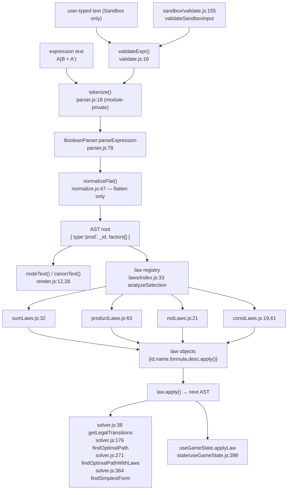
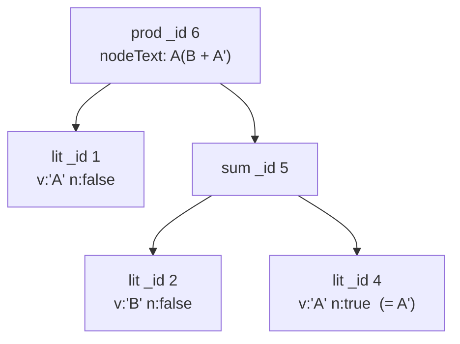
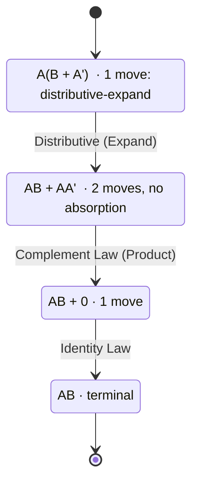

# Understanding the engine — a walkthrough of `A(B + A')`

**What this is.** One expression, traced through every layer of the Boolean engine with the real
output each layer produces. You will see the token stream the parser builds, the AST node objects,
the normalised forms, the validation verdicts, the law the Sandbox offers, and the exact sequence of
intermediate states that reaches a terminal form.

**Who it's for.** A new teammate who wants to understand how Praxis actually computes, and any
learner who wants to know why the app does what it does. Read it start to finish once; afterwards it
works as a lookup for "which module does this again?".

> Every code block marked **verified output** was produced by running the engine at commit
> `3838343`. Nothing here is paraphrased engine behaviour.

## Contents

1. [Run the engine yourself](#1-run-the-engine-yourself)
2. [The engine contract](#2-the-engine-contract)
3. [The real call graph](#3-the-real-call-graph)
4. [Stage 1 — tokenizing](#4-stage-1--tokenizing)
5. [Stage 2 — parsing into an AST](#5-stage-2--parsing-into-an-ast)
6. [Stage 3 — rendering: `nodeText` vs `canonText`](#6-stage-3--rendering-nodetext-vs-canontext)
7. [Stage 4 — normalising: `normalize` vs `normalizeFlat`](#7-stage-4--normalising-normalize-vs-normalizeflat)
8. [Stage 5 — validation, and what is *not* validated](#8-stage-5--validation-and-what-is-not-validated)
9. [Stage 6 — semantics: the truth table](#9-stage-6--semantics-the-truth-table)
10. [Stage 7 — discovering the applicable laws](#10-stage-7--discovering-the-applicable-laws)
11. [Stage 8 — choosing and applying a law](#11-stage-8--choosing-and-applying-a-law)
12. [Stage 9 — the derivation to a terminal form](#12-stage-9--the-derivation-to-a-terminal-form)
13. [Stage 10 — terminal form, dead ends, and the canonical-text limitation](#13-stage-10--terminal-form-dead-ends-and-the-canonical-text-limitation)
14. [What happens after a terminal form](#14-what-happens-after-a-terminal-form)
15. [The whole walkthrough as one script](#15-the-whole-walkthrough-as-one-script)
16. [The module map and the tests](#16-the-module-map-and-the-tests)
17. [Known discrepancies](#17-known-discrepancies)

---

## 1. Run the engine yourself

The engine is plain ES modules with **no build step**. Node 22 is what this project was verified
with (`node --version` → `v22.23.1`).

```bash
cd frontend
node --input-type=module -e "
import { parseExpr } from './src/engine/parser.js'
console.log(JSON.stringify(parseExpr(\"A(B + A')\"), null, 2))
"
```

For anything longer than one line, pipe a script into `node` on stdin — no temp file needed:

```bash
cd frontend && node --input-type=module <<'EOF'
import { parseExpr } from './src/engine/parser.js'
import { nodeText } from './src/engine/render.js'
console.log(nodeText(parseExpr("A(B + A')")))
EOF
```

> **Windows note.** The heredoc form is POSIX shell. In PowerShell, pass the same body with
> `@' ... '@ | node --input-type=module`.

All the code in this document uses imports from the **barrel** `frontend/src/engine/index.js` where
possible — that is the supported surface (`frontend/src/engine/index.js:12-13`: "Consumers should
import from this barrel, not from the deep modules"). A few blocks import a deep module on purpose
because the symbol is not re-exported.

## 2. The engine contract

`frontend/src/engine/` is the only Boolean algebra implementation in the repository, and it is
**pure**:

| Property | Evidence |
|---|---|
| No React | `frontend/src/engine/index.js:8-11` states the layering rule; verified by grep — no `react` import exists under `engine/` |
| No DOM, no network | verified by grep — no `document`, `window`, `fetch(`, `XMLHttpRequest`, `localStorage` under `engine/` |
| Only non-relative import | `frontend/src/config/gameRules.js` (numbers only), from `solver.js:1`, `sandbox/input.js:36`, `sandbox/generator.js:11`, `scoring.js:14-18` |
| Framework-free and testable | the 7 test files run with bare `node --test`, no bundler, no jsdom |
| Size | **23 non-test modules / 3,303 lines**, plus **7 test files / 1,361 lines** = 30 files / 4,664 lines |

Check purity yourself:

```bash
cd frontend && grep -rn "react\|document\.\|window\.\|fetch(\|localStorage" src/engine --include=*.js | grep -v __tests__
# expected: no output
```

**Why this matters (the engine contract).** The backend **never re-implements algebra**. It serves
content and scores submitted numbers (`backend/main.py:79-83`); every derivation, every law, every
optimal-path search happens in the browser in this pure module tree. The one place the client mirrors
server logic is the score *estimate* (`frontend/src/engine/scoring.js:1-13`), and the server value is
authoritative — see [§14](#14-what-happens-after-a-terminal-form).

## 3. The real call graph

The familiar stage names — parser → validator → normalizer → law registry → solver — are a useful
mental model, but the real call graph is not a clean chain. Two things are worth pinning down before
the walkthrough:

1. **The parser normalises internally.** `parseExpr` ends with `normalizeFlat`
   (`frontend/src/engine/parser.js:72-76,160-166`), so a freshly parsed tree is *already* flattened.
   There is no separate "normalise after parse" call in the app's hot path.
2. **Validation is a separate gate, not a pipeline stage.** `validateExpr` is a *string* checker
   called by the Sandbox UI before parsing (`frontend/src/engine/validate.js:16-77`); it never sees
   an AST.



The same diagram is supplied as copy-pasteable source for the diagrams teammate in
`docs/_staging/diagram-input-engine-guides.md`.

## 4. Stage 1 — tokenizing

Two scanners exist and they are **not** the same function:

| Scanner | Where | Exported? | Purpose |
|---|---|---|---|
| `tokenize(str)` | `frontend/src/engine/parser.js:18-56` | **no** (module-private) | feeds the parser; **silently skips unknown characters** |
| `scanTokens(raw)` | `frontend/src/engine/sandbox/validate.js:100-117` | yes | the validator's full-notation scanner; keeps `{ type, char, index }` |

The parser's tokenizer produces `{ type, val }` for variables/constants and `{ type }` for operators.
Because it is not exported, the token list below was observed by loading a byte-identical copy of
`parser.js` through a `data:` URL with one added `export` keyword — **no repository file was
modified**:

```bash
cd frontend && node --input-type=module <<'EOF'
import fs from 'node:fs'
const SRC = process.cwd() + '/src/engine/'
const src = fs.readFileSync(SRC + 'parser.js', 'utf8')
  .replaceAll("'./node.js'", `'file://${SRC}node.js'`)
  .replaceAll("'./normalize.js'", `'file://${SRC}normalize.js'`)
  .replace('function tokenize(str) {', 'export function tokenize(str) {')
const mod = await import('data:text/javascript;charset=utf-8,' + encodeURIComponent(src))
console.log(JSON.stringify(mod.tokenize("A(B + A')")))
EOF
```

**Verified output:**

```json
[{"type":"VAR","val":"A"},{"type":"LPAREN"},{"type":"VAR","val":"B"},{"type":"OR"},{"type":"VAR","val":"A"},{"type":"POST_NOT"},{"type":"RPAREN"}]
```

The exported validator scanner sees the same stream with source positions (whitespace skipped,
0-based indices into the untrimmed input):

```json
[{"type":"VAR","char":"A","index":0},{"type":"LPAREN","char":"(","index":1},{"type":"VAR","char":"B","index":2},
 {"type":"OR","char":"+","index":4},{"type":"VAR","char":"A","index":6},{"type":"POST_NOT","char":"'","index":7},
 {"type":"RPAREN","char":")","index":8}]
```

**Why two scanners?** `parser.js:11` says it plainly: unknown characters are skipped, which is
convenient for the parser but unacceptable for validation — a learner typing `A & B` should be told
about it, not have the character vanish. The Sandbox validator therefore has its own scanner and a
round-trip guard (`sandbox/input.js:130-149`) that refuses any input whose characters do not survive
tokenisation.

## 5. Stage 2 — parsing into an AST

The grammar is documented at `frontend/src/engine/parser.js:4-9`:

```text
Expression -> Term ( (OR | '+') Term )*
Term       -> Factor ( (AND | implicit_AND) Factor )*
Factor     -> PRE_NOT* Primary POST_NOT*
Primary    -> VAR | CONST | '(' Expression ')'
```

`A(B + A')` has no operator between `A` and `(`, so it is an **implicit AND**: one `prod` with a
literal factor and a bracketed `sum` factor.

**Verified output** — `parseExpr("A(B + A')")` in a fresh process where it is the *first* engine call:

```json
{
 "type": "prod",
 "_id": 6,
 "factors": [
  { "_id": 1, "type": "lit", "v": "A", "n": false },
  { "type": "sum", "_id": 5, "terms": [
      { "_id": 2, "type": "lit", "v": "B", "n": false },
      { "_id": 4, "type": "lit", "v": "A", "n": true } ] }
 ]
}
```



Three details of the node model are worth internalising (`frontend/src/engine/node.js:1-23`):

- **`n` is the complement flag.** `A'` is `{ type:'lit', v:'A', n:true }` — a *literal*, not a `not`
  node. That is why `analyzeNot` does not fire on it.
- **`_id` is a per-process monotonic counter** (`node.js:15-17`). The numbers above are reproducible
  only if `parseExpr` is the first engine call in the process; a long session produces large ids. The
  UI uses `_id` to track the same node across edits and to target animations, not as an identity you
  can persist.
- **Ids follow construction order, not tree order.** The literal `A` inside the brackets was built
  as id 3 and immediately replaced by the complemented copy id 4 (`parser.js:117-124` creates a new
  node rather than mutating), so the root ends up with the highest id, 6.

## 6. Stage 3 — rendering: `nodeText` vs `canonText`

`frontend/src/engine/render.js` exports exactly two renderings, with one purpose each
(`render.js:4-8`):

| Function | Line | Sort order | Used for |
|---|---|---|---|
| `nodeText` | `render.js:12-25` | stored order (order-sensitive) | everything the learner reads: the canvas, step history, hints |
| `canonText` | `render.js:28-46` | literals sorted, terms sorted | order-independent comparison: solver states, goal matching |

**Verified output for the same tree:**

```text
nodeText  = "A(B + A')"
canonText = "A(A'+B)"
```

`canonText` sorts the literals of a product (by variable, uncomplemented first) and sorts the terms
of a sum, so it is insensitive to the order a derivation happened to leave behind
(`render.js:32-43`). `nodeText` deliberately is not: it renders a `sum` factor inside a product with
brackets (`render.js:17`) and a `not` over a group as `(…)'` (`render.js:20-23`).

This split is load-bearing in two places:

- the win condition compares `canonText(newExpr)` with the canonicalised goal
  (`state/useGameState.js:84-85,481`);
- solver de-duplication keys states by `canonText` (`solver.js:50-52,195,225`).

## 7. Stage 4 — normalising: `normalize` vs `normalizeFlat`

Two canonicalisations exist (`frontend/src/engine/normalize.js:1-9`):

| Function | Flattens nesting | Drops identities | Folds constants | Collapses `not not` |
|---|---|---|---|---|
| `normalizeFlat` (`normalize.js:47-68`) | yes | no | no | no |
| `normalize` (`normalize.js:14-45`) | yes | `0` from sums, `1` from products | yes | yes |

`normalizeFlat` is the one the parser uses (`parser.js:75`), and the reason is a product decision: the
engine **must not pre-empt a law the learner should apply themselves**. If `parseExpr` ran the full
`normalize`, `y1 + z` would arrive as `y + z` and the Identity step would vanish from the derivation.

**Verified output for `A(B + A')`:**

```text
nodeText(ast)              = "A(B + A')"
nodeText(normalize(ast))   = "A(B + A')"
nodeText(normalizeFlat(ast)) = "A(B + A')"
```

Nothing to normalise here — the tree already has no nesting, no `0`/`1`, and no double negation. To
see the difference, use an expression that has them:

```text
parseExpr("A + (B + C)")   -> nodeText "A + B + C"    (nested sum spliced by normalizeFlat)
parseExpr("A + 0")         -> nodeText "A + 0"        (normalizeFlat keeps the 0, so Identity stays available)
normalize(parseExpr("A + 0")) -> nodeText "A"         (full normalize would remove it — never used on parse)
```

**Who calls the full `normalize`?** Only the law builders, and only *inside* `apply()` to clean up a
result — never on the parse path. Exhaustive list (verified by grep over `frontend/src`):

| Caller | Lines | Why |
|---|---|---|
| `laws/notLaws.js` | 39, 69, 99 | collapse a double negation / clean up a De Morgan result |
| `laws/constLaws.js` | 53, 95 | remove an annihilated constant |
| `laws/sumLaws.js` | 138, 156, 201, 228, 253 | identity, idempotent, absorption clean-up |
| `laws/productLaws.js` | 144, 165, 184 | the dual clean-ups |

That is the deliberate exception to "the learner never sees a fully normalised tree": parsing keeps
the `0`/`1` (so the Identity/Annulment step stays available), and the identity law's own `apply()`
removes it afterwards.

## 8. Stage 5 — validation, and what is *not* validated

There are three distinctly different "checks" in the engine, and conflating them is the classic
misreading of this codebase.

| # | Check | Function | Input | What it can *not* catch |
|---|---|---|---|---|
| 1 | string syntax (generated input) | `validateExpr` (`validate.js:16-77`) | raw text | anything about meaning |
| 2 | sandbox product rules | `validateSandboxInput` (`sandbox/validate.js:155-234`) | raw text | meaning, solvability |
| 3 | **soundness of a law** | the law implementations, guarded by a property test | AST | — |

### Two string gates, two callers — do not conflate them

There is no single "validator". The two gates are different functions with different callers, and
merging them mentally is the fastest way to waste an afternoon:

| Gate | Called by | Judges |
|---|---|---|
| `validateExpr` (`validate.js:16`) | `engine/sandbox/generator.js:84` — the **random puzzle generator** — plus its own tests | characters, parentheses, operator placement |
| `validateSandboxInput` (`sandbox/validate.js:155`) | `pages/SandboxPage.jsx:122` and `:124` — the **sandbox screen** — and `sandbox/input.js:113` inside `buildSandboxPuzzle` | the above **plus** the variable budget, operand structure and the stray-NOT rule |

The sandbox screen runs its gate **twice on purpose** (`pages/SandboxPage.jsx:116-126`): `live` uses
the debounced text so a learner mid-word is not scolded, `current` uses the raw text so the Play
button follows what is actually typed. The debounce is
`TIMING.sandboxValidationDebounceMs = 300` (`frontend/src/config/gameRules.js`).

**Check 1 — `validateExpr`.** Pure string rules: allowed alphabet (`validate.js:24`), balanced
parentheses (`:32-45`), at least one variable/constant (`:48`), no leading/trailing/repeated binary
operator (`:53-58`), no empty or dangling group content (`:61-75`). It returns a verdict object
instead of throwing because callers render the message verbatim (`validate.js:6-8`).

**Verified output:**

```json
{"valid":true,"error":null}
```

```text
validateExpr("A + (")   -> {"valid":false,"error":"Unbalanced parentheses — missing \")\"."}
validateExpr("A ++ B")  -> {"valid":false,"error":"Two operators in a row — check for typos like \"++\" or \"+·\"."}
```

**Check 2 — `validateSandboxInput`.** `sandbox/validate.js` adds a variable budget (default
`SANDBOX.maxVariables = 4`, `config/gameRules.js` `SANDBOX`), operator/operand structure and the
stray-NOT rule, with **exact user-facing messages** that are treated as product spec
(`sandbox/validate.js:5-8`). Its error codes fail in a fixed order: `empty → invalid-chars →
unbalanced → too-many-vars → double-operator → missing-operand → stray-not` (`:19-22`). It uses its
own full-notation scanner rather than the parser's, because the parser silently drops characters it
cannot read (`parser.js:11`) — exactly what validation must not do.

### The important part: no per-step semantic validation

**The game never verifies that a step preserved the meaning of the expression, and it never
semantically validates a solution.** The learner cannot type an arbitrary expression into a graded
puzzle: they select AST nodes and pick a law, and the law's own `apply()` computes the next tree.
Step validity is therefore **structural, not provational**. Concretely:

- the win condition is canonical-text equality:
  `canonText(newExpr) === goalCanonRef.current` (`frontend/src/state/useGameState.js:481`, goal
  canonicalised once at `:84-85`);
- "dead end" is an empty `scanHints` result (`state/useGameState.js:62`, `:548`, `:606`);
- `isEquivalent` — the truth-table checker — is **not on the per-step path at all**. Its only
  consumers are `laws/helpers.js:82` and `:112` (the two absorption decisions, each behind the Module 4
  constant guard), `sandbox/generator.js:94` and `sandbox/input.js:161` (refusing to ship a drifting
  puzzle).

So where does soundness come from? From the law implementations, and they are guarded by a property
test that re-parses every produced text and compares it with its source on **every** variable
assignment (`frontend/src/engine/__tests__/law-soundness.property.test.js:1-13,218-230`). That is the
mechanism, and it is the reason `equivalent` never needs to run while a learner is playing.

The visible consequence of canonical-text completion is a real limitation — see
[§13](#13-stage-10--terminal-form-dead-ends-and-the-canonical-text-limitation).

## 9. Stage 6 — semantics: the truth table

`frontend/src/engine/equivalence.js` is 58 lines and does one thing: exhaustive comparison.

| Function | Line | Behaviour |
|---|---|---|
| `extractVariables(node)` | `:11-22` | every distinct `lit.v`, sorted |
| `evalAST(node, env)` | `:25-42` | evaluate under `{ x: 0|1, … }` |
| `isEquivalent(a, b)` | `:45-57` | `2^n` rows over the union of variables |

**Verified output for `A(B + A')`:**

```text
extractVariables = ["A","B"]
  A=0 B=0 -> 0
  A=1 B=0 -> 0
  A=0 B=1 -> 0
  A=1 B=1 -> 1
```

The truth table is small because the product caps variables at 4 in the Sandbox and 4 in the boss
level, so `isEquivalent` is at most 16 rows in play and at most 64 rows for the property test's
generator (`helpers.js:61-63` notes the bound as "at most 2^6"). It is a decision procedure, which is
exactly why `absorbsInSum`/`absorbsInProduct` use it as the final authority instead of a syntactic
heuristic (`laws/helpers.js:56-84`) — and why the Module 4 guard can afford to ask it whether the
clause to be absorbed is a constant.

## 10. Stage 7 — discovering the applicable laws

Now the interesting part. The selection in the Sandbox is **the literal `A`** (path `R.0`, a factor of
the root product) **and the literal `A'`** (path `R.1.1`, inside the bracketed clause). That is the
gesture a learner makes: click `A`, click `A'`.

`analyzeSelection` (`laws/index.js:33-58`) first asks which structural parent the two paths share:

- `findCommonSum` — no shared `sum` ancestor here;
- `findCommonProd` — the deepest shared parent is the root `prod`, at factor indices 0 and 1.

```text
findCommonProd(expr, 'R.0', 'R.1.1') -> { prodPath: 'R', fi1: 0, fi2: 1 }
```

Only the product builder runs, so only POS-shaped laws are candidates.

**Verified output — graded move set (no options):**

```text
analyzeSelection(ast, [{path:'R.0',isTermSel:false},{path:'R.1.1',isTermSel:false}]) -> []
```

**Verified output — Sandbox (`{ allowExpand: true }`):**

```json
[
  {
    "id": "distributive-expand",
    "name": "Distributive (Expand)",
    "formula": "A(B + C) = AB + AC",
    "desc": "Distribute A over B + A' → AB + AA'",
    "animPaths": []
  }
]
```

**This is the single most important fact about `A(B + A')`:** in a graded level, the expression has
**no legal move at all**. It is only playable in the Sandbox, where the gated expansion law makes it
solvable. That is why the Sandbox exists and why `allowExpand` is set by exactly one module
(`sandbox/input.js:51,197`; consumed at `useGameState.js:15` and `usePuzzleSession.js:84`).

Two neighbouring selections confirm the shape rules:

```text
B (R.1.0) + A' (R.1.1) inside the sum, sandbox -> []            (complement needs two bare literal terms)
whole factors A (R.0) + (B + A') (R.1), sandbox -> [distributive-expand]   (the expand pair is found either way)
scanHints(ast, 'R')            -> []                             (graded: no hint, nothing to suggest)
scanHints(ast, 'R', {allowExpand:true}) -> [{"law":"distributive-expand","paths":["R.0","R.1"]}]
```

## 11. Stage 8 — choosing and applying a law

The law object is what `LawPanel` renders: `law.name`, `law.formula`, `law.desc`, and the button
carries `data-law-id={law.id}` (`frontend/src/components/puzzle/LawPanel.jsx:164-176`). `apply()` is
a closure over the selection and is **pure**: it clones the tree, edits the clone and returns it
(`laws/productLaws.js:38-47`), so calling it twice is safe and the source tree is untouched —
asserted by `laws.test.js:132-138`.

Verifying purity directly:

```bash
cd frontend && node --input-type=module <<'EOF'
import { parseExpr } from './src/engine/parser.js'
import { nodeText } from './src/engine/render.js'
import { analyzeSelection } from './src/engine/laws/index.js'
const t = parseExpr("A(B + A')")
const before = nodeText(t)
const [law] = analyzeSelection(t, [{path:'R.0',isTermSel:false},{path:'R.1.1',isTermSel:false}], { allowExpand: true })
console.log('before:', before, '-> after:', nodeText(law.apply()), '| source unchanged:', nodeText(t) === before)
EOF
```

**Verified output:**

```text
before: A(B + A') -> after: AB + AA' | source unchanged: true
```

Applying a law in the app is not instantaneous. `applyLaw` (`state/useGameState.js:398-503`) first
checks the step actually changed something (`:410-417`), then plays the law animation and only
records the step when the animation finishes:

```js
// frontend/src/state/useGameState.js:467-469
animationTimerRef.current = setTimeout(() => {
  animationTimerRef.current = null
  setHistory(h => [...h, { expr: newExpr, step: { law: law.name, from: before, to: after } }])
```

The delay is `TIMING.lawAnimationMs` (`:491`), which is **1350 ms**
(`frontend/src/config/gameRules.js` `TIMING`). The tutorial adds a `preLawHighlightMs = 1500` pause
before that (`useGameState.js:494-499`). A step that "does not appear for a second" is behaving
correctly.

## 12. Stage 9 — the derivation to a terminal form

Here is the full real trace, computed with the Sandbox move set. Every line is observed output; the
"moves" lists are the complete law panel for that state.

**State 0** — `A(B + A')`

```text
moves: [distributive-expand :: A(B + A')  ->  AB + AA']
```

**State 1** — after `Distributive (Expand)` → `AB + AA'` (canonical `AA'+AB`)

```text
moves:
  distributive  :: AB + AA'  ->  A(B + A')           (factor A back out — a legal reversal)
  complement    :: AB + AA'  ->  AB + 0              (A · A' = 0, selecting the two literals inside AA')
```

**Absorption is deliberately not on that list.** `AB + AA'` *is* equivalent to `AB`, but only because
`AA'` collapses to the constant `0`, and the proposal's Module 4 requires that constant to be rendered
as its own clickable intermediate state. The semantic fallback in `absorbsInProduct`
(`laws/helpers.js:104-112`) therefore refuses to absorb a clause that is equivalent to a constant, so
the only productive continuation is complement, then identity.

**The single route — three steps.** Select the two literals inside `AA'` (paths `R.1.0` and `R.1.1`):

```json
[{ "id": "complement", "name": "Complement Law (Product)", "desc": "A · A' = 0",
   "animPaths": ["R.1.0", "R.1.1"] }]
```

```text
state 2: "AB + 0"   canon "0+AB"
  moves: identity :: AB + 0 -> AB
state 3: "AB"       moves: []
```

Before the Module 4 guard this pair was swallowed by a single semantic absorption step; now every
intermediate state — including the `0` — is rendered, and the derivation is one step longer. That is
the proposal's requirement, not a regression:
[boolean-laws.md §5.3](../../06-reference/boolean-laws.md#53-absorption--absorption-law) documents the
shape rule. The constant is not cosmetic: it is the state the learner has to click through.



The solver agrees, and there is now one route. **Verified output:**

```text
findSimplestForm(ast, { allowExpand: true }) ->
  { text: "AB", canon: "AB", optimalSteps: 3, found: true,
    path: [ { law: "Distributive (Expand)",    from: "A(B + A')", to: "AB + AA'" },
            { law: "Complement Law (Product)", from: "AB + AA'", to: "AB + 0" },
            { law: "Identity Law",             from: "AB + 0",   to: "AB" } ] }

findOptimalPath(ast, "AB", { allowExpand: true }) -> optimalSteps: 3, found: true   (same path)
```

`findSimplestForm` returns the first state BFS reaches that has **zero** legal transitions
(`solver.js:389-399`), `findOptimalPath` returns the shortest path to a given canonical target
(`solver.js:208-234`), and `findOptimalPathWithLaws` returns the shortest path that *also* applies
every law id it is given (`solver.js:271-346`) — that last one is what graded scoring measures a
learner against. All three use `canonText` as the visited-set key, which is what makes differently
ordered but canonically equal states collapse into one.

## 13. Stage 10 — terminal form, dead ends, and the canonical-text limitation

A state is terminal when `getLegalTransitions(state).length === 0` (`solver.js:389-392`) and the UI's
dead-end test is the equivalent hint-level check, `scanHints(expr, 'R').length === 0`
(`state/useGameState.js:62-68`). For `AB`:

```text
getLegalTransitions(AB) -> []
scanHints(AB, 'R')      -> []
```

The UI then asks one more question: *is the terminal state the goal?* It compares canonical text, and
if it is not equal it shows the dead-end message (`state/useGameState.js:54-75`;
`state/hintText.js:10`):

> "This expression is simplified, but it isn't in its optimal state. A different law path can reach
> the target answer."

### ⚠️ Limitation: a semantically correct terminal form can be "not solved"

Because completion is **canonical-text equality** and not `isEquivalent`, a learner who reaches a
terminal state that is semantically the goal but canonically different is *not* marked solved. This
is reachable in real authored content.

**Verified, on Tutorial stage 0.3** (`content/levels.json`: `expr: "x + x'y + xy"`, `goal: "x + y"`):

```text
start: x + x'y + xy | goal canon: x+y

state reached by one legal absorption step (x + xy = x):  "x + x'y"
  canonText           : "x+x'y"
  goal canonText      : "x+y"
  canonically equal?  : false   <-- the app win condition (useGameState.js:481)
  semantically equal? : true    <-- isEquivalent, NOT on the per-step path
  scanHints           : []      <-- empty => DEAD END (useGameState.js:63-68)
  getLegalTransitions : []
```

`x + x'y` is a genuine minimal form — it cannot be simplified further by any law the engine offers —
and `x + x'y ≡ x + y` is a textbook identity (it is the consensus/combining step the puzzle expects
to happen *before* the last absorption). The learner is shown the dead-end message rather than
silence, and the guided path from the pre-selection exists, but the app cannot recognise the
expression as correct.

Reproduce it:

```bash
cd frontend && node --input-type=module <<'EOF'
import { parseExpr } from './src/engine/parser.js'
import { canonText, nodeText } from './src/engine/render.js'
import { isEquivalent } from './src/engine/equivalence.js'
import { scanHints } from './src/engine/laws/index.js'
const after = parseExpr("x + x'y")
console.log(nodeText(after), canonText(after) === canonText(parseExpr('x + y')),
            isEquivalent(after, parseExpr('x + y')), JSON.stringify(scanHints(after, 'R')))
EOF
# expected: x + x'y false true []
```

## 14. What happens after a terminal form

Reaching the goal triggers, in `useGameState.applyLaw` (`:436-446`): the solve cue, the completion
flag, and `earnedXp = STAGE_COMPLETION_XP` (10 points, `config/gameRules.js`). The page above it,
`usePuzzleSession`, then runs the scoring flow (`components/puzzle/usePuzzleSession.js:150-221`):

1. `lawsUsedFromSteps(steps)` maps each step's recorded law **name** to a law id
   (`engine/scoring.js:25-33`);
2. `effectiveOptimalSteps` prefers the client solver's answer, then the puzzle's authored
   `optimalSteps`, then what was used (`scoring.js:39-42`). That solver answer is the
   **objective-aware** optimum — the shortest route that also applies every `targetLaws` id
   (`solver.js:271-346`, wired at `useGameState.js:87-113`) — so a shortcut that skips a taught law
   still earns full efficiency but forfeits that law's target-law credit;
3. `estimateScore` renders the breakdown instantly (`scoring.js:54-97`);
4. `submitScore` posts to `POST /api/score` (`services/scoreApi.js:22-36`), and the server's value
   **overwrites** the local one when it arrives (`usePuzzleSession.js:208-213`).

> ⚠️ **The local estimate can be one bonus point off the server.** `engine/scoring.js:80` uses JS
> `Math.round` (half-up) while `backend/services/scoring_service.py:55` uses Python `round`
> (half-to-even). At `total = 90` the client shows `earnedPoints = 5` and the server returns `4`; at
> `total = 50` it is `3` vs `2`. Verified by running both. The server value is authoritative and
> replaces the estimate as soon as the response lands; if the request fails silently
> (`scoreApi.js:34`, `silent: true`) the estimate is what the learner keeps seeing.

## 15. The whole walkthrough as one script

Save nothing — pipe it in. This reproduces every quotation in §4–§13:

```bash
cd frontend && node --input-type=module <<'EOF'
import { parseExpr } from './src/engine/parser.js'
import { nodeText, canonText } from './src/engine/render.js'
import { normalize } from './src/engine/normalize.js'
import { validateExpr } from './src/engine/validate.js'
import { extractVariables, evalAST, isEquivalent } from './src/engine/equivalence.js'
import { analyzeSelection, scanHints } from './src/engine/laws/index.js'
import { getLegalTransitions, findOptimalPath, findSimplestForm } from './src/engine/solver.js'

const SRC = "A(B + A')"
const ast = parseExpr(SRC)                      // first engine call -> small, stable _ids
console.log('AST     :', JSON.stringify(ast))
console.log('nodeText:', nodeText(ast), '| canonText:', canonText(ast))
console.log('normalize:', nodeText(normalize(ast)))
console.log('validate:', JSON.stringify(validateExpr(SRC)))
console.log('vars    :', JSON.stringify(extractVariables(ast)), 'A=1,B=1 ->', evalAST(ast, {A:1,B:1}))

const sel = [{ path: 'R.0', isTermSel: false }, { path: 'R.1.1', isTermSel: false }]
console.log('graded  laws:', JSON.stringify(analyzeSelection(ast, sel).map(l => l.id)))
console.log('sandbox laws:', JSON.stringify(analyzeSelection(ast, sel, { allowExpand: true }).map(l => l.id)))
console.log('graded  hints:', JSON.stringify(scanHints(ast, 'R')))
console.log('sandbox hints:', JSON.stringify(scanHints(ast, 'R', { allowExpand: true })))

const S = { allowExpand: true }
let cur = ast
for (let step = 0; step < 5; step++) {
  const moves = getLegalTransitions(cur, S)
  console.log(`state ${step}: ${nodeText(cur)}  moves=${JSON.stringify(moves.map(m => `${m.lawId}->${m.to}`))}`)
  if (moves.length === 0) break
  // Walk the productive route: at state 1 the first listed move factors A straight back
  // out (a legal reversal), so prefer any other move when one exists.
  const forward = moves.find(m => m.lawId !== 'distributive' && m.lawId !== 'distributive-expand')
  cur = (forward || moves[0]).nextTree
}
console.log('simplest:', JSON.stringify(findSimplestForm(ast, S).path.map(s => `${s.law}: ${s.from} -> ${s.to}`)))
console.log('optimal :', JSON.stringify(findOptimalPath(ast, canonText(parseExpr('AB')), S).path.map(s => s.to)))
console.log('equivalent to AB:', isEquivalent(ast, parseExpr('AB')))
EOF
```

## 16. The module map and the tests

**23 non-test modules / 3,303 lines** (plus 7 test files / 1,361 lines):

| Module | Lines | Role |
|---|---|---|
| `node.js` | 49 | AST constructors, `cloneN`, `ensureNodeId` |
| `parser.js` | 166 | text → AST (calls `normalizeFlat`) |
| `render.js` | 46 | AST → text (`nodeText`, `canonText`) |
| `normalize.js` | 69 | `normalize` / `normalizeFlat` |
| `tree.js` | 150 | paths, traversal, structural edits |
| `equivalence.js` | 58 | truth-table semantics |
| `validate.js` | 78 | the string gate |
| `index.js` | 84 | the public barrel |
| `laws/definitions.js` | 85 | the one law identity table |
| `laws/index.js` | 70 | public law API + `allowExpand` |
| `laws/sumLaws.js` | 259 | six SOP laws |
| `laws/productLaws.js` | 224 | five POS laws + gated expand |
| `laws/notLaws.js` | 105 | double negation, De Morgan |
| `laws/constLaws.js` | 100 | identity / annulment on one constant |
| `laws/helpers.js` | 167 | shape predicates, the absorption decisions + the Module 4 constant guard |
| `laws/scanHints.js` | 135 | whole-expression hint scan |
| `solver.js` | 429 | transitions, BFS optimal path with laws, simplest form |
| `scoring.js` | 98 | client score mirror |
| `sandbox/validate.js` | 251 | notation, budget, product validation |
| `sandbox/input.js` | 206 | text → playable sandbox puzzle |
| `sandbox/generator.js` | 245 | inverse-law random puzzle generator |
| `sandbox/expand.js` | 182 | expansion rules for the generator |
| `sandbox/pool.js` | 47 | curated verified equations |

**Tests.** `frontend/package.json` defines one command:

```json
"test": "node --test src/engine/__tests__/*.test.js"
```

**Verified run** (`cd frontend && npm test`):

```text
# tests 81
# suites 0
# pass 81
# fail 0
# cancelled 0
# skipped 0
# todo 0
# duration_ms 12575.576694
```

A single file can be run directly — useful while iterating:

```bash
cd frontend && node --test src/engine/__tests__/laws.test.js
# # tests 10 / # pass 10 / # fail 0  (verified)
```

## 17. Known discrepancies

| # | Stale claim | Reality | Evidence |
|---|---|---|---|
| **D11** | "46 unit tests" (`docs/context.md`) | **81 tests, 81 pass** | `npm test`, shown above |
| **D12** | "triggers a 2.5 s animation" (`docs/context.md`) | `lawAnimationMs = 1350` ms | `config/gameRules.js`; applied at `state/useGameState.js:491` |
| **D21** | client score equals server score | JS half-up vs Python half-to-even differ by 1 point at totals ending in 5 | `engine/scoring.js:80` vs `backend/services/scoring_service.py:55` |
| **D1/D23** | a `POST /sandbox/validate` endpoint | **no such endpoint**; the sandbox validates entirely in the browser | `sandbox/validate.js`, `sandbox/input.js`; no route exists in `backend/api/routes/` |
| — | "parser → validator → normalizer" | `parseExpr` normalises internally; validation is a separate string gate | `parser.js:75`; `validate.js:16` |

**Related reading.** All ten laws, their duals and their errors:
[boolean-laws.md](../../06-reference/boolean-laws.md). Adding an eleventh law:
[add-a-new-law.md](../how-to/add-a-new-law.md) and
[first-contribution.md](first-contribution.md). When a click misbehaves:
[debug-a-failing-step.md](../how-to/debug-a-failing-step.md).
