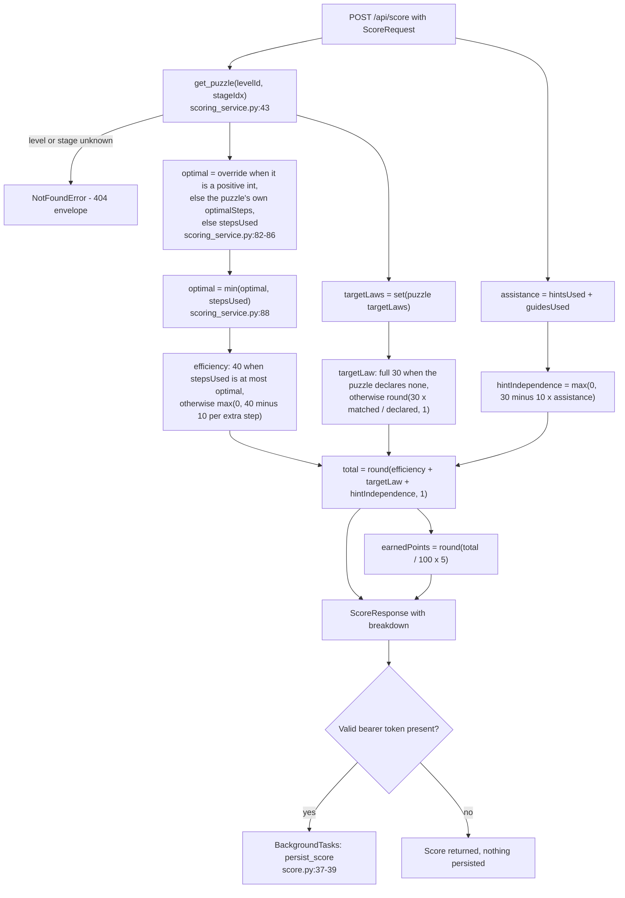
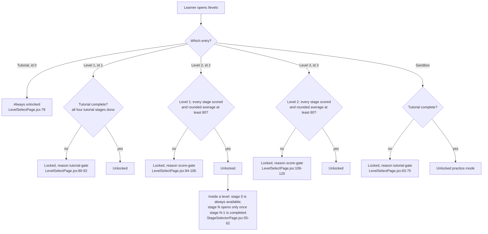

# Scoring and rewards

**What this is:** the complete, arithmetic-level reference for how Praxis turns one finished puzzle
into a score, stars, an unlock decision and points — every constant with its source line, every
formula, and eight worked examples whose numbers were produced by running the real scorer.
**Who it's for:** a new teammate who has to change a weight, explain a score to a learner, or debug
why two places disagree about the same total. The authoritative implementation is
`backend/services/scoring_service.py`; the UI mirror is `frontend/src/engine/scoring.js`.

## Contents

- [Where the rules live](#where-the-rules-live)
- [The algorithm, step by step](#the-algorithm-step-by-step)
- [The three components](#the-three-components)
- [The breakdown object](#the-breakdown-object)
- [Worked examples](#worked-examples)
- [The rounding trap](#the-rounding-trap)
- [Stars](#stars)
- [Unlocking the next level](#unlocking-the-next-level)
- [Hints and Guides](#hints-and-guides)
- [What the learner actually ends up with](#what-the-learner-actually-ends-up-with)
- [Limits and verification gaps](#limits-and-verification-gaps)
- [Known discrepancies](#known-discrepancies)
- [How to reproduce every number here](#how-to-reproduce-every-number-here)

---

## Where the rules live

Every tunable number lives in exactly two files — one per side of the wire — and they agree today.

| Constant | Value | Backend origin | Frontend origin | Meaning |
|---|---|---|---|---|
| `EFFICIENCY_WEIGHT` / `SCORE_WEIGHTS.efficiency` | `40.0` / `40` | `backend/config/constants.py:9` | `frontend/src/config/gameRules.js:15` | Maximum points for solving in at most the optimal number of steps. |
| `TARGET_LAW_WEIGHT` / `SCORE_WEIGHTS.targetLaw` | `30.0` / `30` | `backend/config/constants.py:10` | `frontend/src/config/gameRules.js:16` | Maximum points for applying the laws the puzzle wants. |
| `HINT_INDEPENDENCE_WEIGHT` / `SCORE_WEIGHTS.hintIndependence` | `30.0` / `30` | `backend/config/constants.py:11` | `frontend/src/config/gameRules.js:17` | Maximum points for solving unaided. |
| `MAX_SCORE` | `100.0` | `backend/config/constants.py:12` | — (implied by the weights summing to 100) | `40 + 30 + 30`. Used as the divisor for the bonus. |
| `STEP_PENALTY` / `SCORE_PENALTY.stepOverOptimal` | `10.0` / `10` | `backend/config/constants.py:15` | `frontend/src/config/gameRules.js:23` | Score points lost per step **beyond** the optimum, off the efficiency band. |
| `ASSISTANCE_PENALTY` / `SCORE_PENALTY.assistance` | `10.0` / `10` | `backend/config/constants.py:16` | `frontend/src/config/gameRules.js:25` | Score points lost per **hint or Guide**, off the hint-independence band. |
| `MAX_BONUS_POINTS` / `SCORE_BONUS_MAX_POINTS` | `5` / `5` | `backend/config/constants.py:19` | `frontend/src/config/gameRules.js:29` | Maximum bonus awarded on a perfect 100. |
| `SCORE_ROUNDING_DP` | `1` | `backend/config/constants.py:22` | `—` (frontend hardcodes `round1`, `frontend/src/engine/scoring.js:22`) | Decimals kept on every reported component. |
| `STAR_THRESHOLDS` | `(90.0, 75.0)` | `backend/config/constants.py:25` | `frontend/src/config/gameRules.js:38-43` | 3 stars at ≥ 90, 2 stars at ≥ 75, at least 1 star for any completion. |
| `MAX_STARS_PER_STAGE` | `3` | — | `frontend/src/config/gameRules.js:46` | Stars a single stage can hold. |
| `UNLOCK_AVERAGE` / `UNLOCK_AVERAGE_SCORE` | `80.0` / `80` | `backend/config/constants.py:26` | `frontend/src/config/gameRules.js:49` | Average stage score required to unlock the next level. |
| `STAGE_COMPLETION_XP` | `10` | — | `frontend/src/config/gameRules.js:32` | Flat points for finishing a stage, before the bonus. |
| `GUIDE_COST_POINTS` | `20` | — | `frontend/src/config/gameRules.js:35` | Points a Guide **costs** from the learner's balance. |
| `SCORE_RAMP.good` / `.fair` | `80` / `50` | — | `frontend/src/config/gameRules.js:52-55` | Progress-bar colour thresholds (cosmetic only). |

Two honest observations about this table:

- The backend's `STAR_THRESHOLDS` and `UNLOCK_AVERAGE` are **declarations only** — nothing in
  `backend/` reads them (`grep -rn "UNLOCK_AVERAGE\|STAR_THRESHOLDS" backend --include=*.py` returns
  only the two definition lines). The comment at `backend/config/constants.py:24` says so: the
  progression contract is "consumed by the frontend". Stars and locks are computed in the browser.
- The frontend mirror is deliberately kept in lockstep (`frontend/src/engine/scoring.js:1-13`) so the
  modal can render a breakdown with zero network latency. It is *almost* identical to the backend —
  the single exception is `earnedPoints` rounding, see [The rounding trap](#the-rounding-trap).

## The algorithm, step by step

`backend/services/scoring_service.py:32-77` is the whole thing. Request fields arrive from
`backend/api/schemas/score.py:13-20`:

| Field | Type | Required? | Default | Notes |
|---|---|---|---|---|
| `levelId` | `int` | yes | — | Content id: `0` = Tutorial … `3` = Boss. |
| `stageIdx` | `int` | yes | — | 0-based index into that level's puzzles. |
| `stepsUsed` | `int` | yes | — | How many law applications the learner made. |
| `lawsUsed` | `list[str]` | yes | — | Law **ids**; duplicates allowed and preserved. |
| `hintsUsed` | `int` | **yes** | — | Hints consumed this attempt. |
| `guidesUsed` | `int \| None` | no | `0` | Guides consumed; `null` is treated as `0`. |
| `optimalSteps` | `int \| None` | no | `None` | Client override of the optimum; used only when it is a positive integer. |



The eight numbered steps, with the exact code:

1. **Look the puzzle up.** `puzzle = content_service.get_puzzle(level_id, stage_idx)`
   (`backend/services/scoring_service.py:43`). Unknown level or stage raises `NotFoundError`, which
   the API renders as the 404 envelope.
2. **Resolve the optimum.**
   ```python
   optimal = (
       optimal_steps
       if (optimal_steps is not None and optimal_steps > 0)
       else puzzle.get("optimalSteps", steps_used)
   )
   return min(optimal, steps_used)
   ```
   (`backend/services/scoring_service.py:80-88`.) Three outcomes: the caller's positive override
   wins; otherwise the puzzle's authored `optimalSteps`; otherwise the steps actually used. Then —
   always — the result is clamped down to `steps_used`.
3. **Efficiency** (`backend/services/scoring_service.py:91-96`):
   `40` if `steps_used <= optimal`, else `max(0.0, 40 - (steps_used - optimal) * 10)`.
4. **Target laws** (`backend/services/scoring_service.py:99-107`):
   `30` if the puzzle declares no target laws, else `round(30 * |declared ∩ applied| / |declared|, 1)`.
5. **Assistance** (`backend/services/scoring_service.py:51`): `assistance = (hints_used or 0) + (guides_used or 0)`.
6. **Hint independence** (`backend/services/scoring_service.py:110-115`): `max(0.0, 30 - assistance * 10)`.
7. **Total** (`backend/services/scoring_service.py:54`): `round(efficiency + target_law + hint_independence, 1)`.
8. **Bonus** (`backend/services/scoring_service.py:55`): `earned_points = round((total / 100) * 5)`.

The response is assembled by `backend/api/routes/score.py:41-48` and, for authenticated learners
only, the same outcome is persisted in the background (`backend/api/routes/score.py:37-39`).

> **Terminology.** A "step" here is one law application — the same unit as a *derivation step*
> elsewhere in these docs. A reorder or drag is not a step: `swapTerms` records no law and no history
> entry (`frontend/src/state/useGameState.js:522-523`).

## The three components

### The optimal step count — `min(declared, used)`

The clamp at `backend/services/scoring_service.py:88` is the most counter-intuitive rule in the
system: **a solution shorter than the recorded optimum lowers the bar to what the learner actually
used.** It can only ever help the learner, and it means the "optimal steps" figure in a response is
sometimes *not* the figure in `content/levels.json`. Worked example
[W2](#worked-examples) shows exactly that.

This exists because the frontend solves the puzzle for real and sends its own optimum
(`frontend/src/components/puzzle/usePuzzleSession.js:166-170,207`), so the two can differ when the
solver finds a shorter derivation than the author recorded. Note that the frontend's
`effectiveOptimalSteps` (`frontend/src/engine/scoring.js:39-42`) does **not** clamp; the clamp is
server-side only. Scores still agree, because `stepsUsed <= optimal` holds on both sides; only the
`breakdown.optimalSteps` number differs, and the server's response overwrites the local one
(`frontend/src/components/puzzle/usePuzzleSession.js:208-213`).

### Efficiency

```
efficiency = 40                                   if stepsUsed <= optimal
efficiency = max(0, 40 - (stepsUsed - optimal)*10) otherwise
```

- Full marks are free once you are at or under the optimum, so being *better* than the optimum is
  never punished (and never rewarded beyond 40).
- Each extra step costs 10. Four steps over the optimum floors the band at 0, and further steps cost
  nothing more.
- The value is always one of `0, 10, 20, 30, 40` in practice.

### Target laws

```
targetLaw = 30                                     if the puzzle declares no target laws
targetLaw = round(30 * matched / declared, 1)      otherwise
```

- Matching is **set intersection on law ids**: `set(puzzle["targetLaws"]) & set(laws_used)`
  (`backend/services/scoring_service.py:46-47,103`). Duplicates in the request are harmless — a law
  applied twice counts once.
- Declaring 1 law → 30 or 0. Declaring 2 → 30, 15 or 0. Declaring 3 → 30, 20, 10 or 0.
- **No shipped puzzle omits `targetLaws`.** All 40 puzzles declare at least one (verified by
  executing a scan over `content/levels.json`). The "no target laws ⇒ full 30" branch at
  `backend/services/scoring_service.py:101-102` therefore cannot be reached through the shipped
  content; it is a guard for future or generated content. Example [W8](#worked-examples) exercises it
  by stubbing the content lookup.
- Law ids come from the engine's name→id map (`frontend/src/engine/scoring.js:25-28`,
  `frontend/src/engine/laws/definitions.js:63-65`). `content/laws.json` has 10 ids and none of them is
  `distributive-expand`, which the engine *does* emit
  (`frontend/src/engine/laws/definitions.js:44`). Expanding a product with
  `distributive-expand` therefore earns **no** target-law credit for a puzzle that asks for
  `distributive` — the reverse direction of the same law is a different id.

### Hint independence

```
assistance = (hintsUsed or 0) + (guidesUsed or 0)
hintIndependence = max(0, 30 - assistance * 10)
```

- A hint and a Guide destroy the same 10 score points. Three or more assistance events floor the band
  at 0; the counter keeps incrementing but the score no longer changes.
- The hint counter is unbounded and has no cap: every hint request increments it
  (`frontend/src/state/useGameState.js:501-520`), including repeats of the last static hint
  (`frontend/src/state/useGameState.js:515-518`).
- The two counters reset when a puzzle is loaded (`frontend/src/state/useGameState.js:136-137`), so a
  reset does not erase the assistance the learner already consumed within the session's attempt.

## The breakdown object

Every score response carries a `breakdown` map (`backend/services/scoring_service.py:68-76`,
mirrored at `frontend/src/engine/scoring.js:88-96`):

| Field | Type | Meaning | Evidence |
|---|---|---|---|
| `stepsUsed` | `int` | Echo of the submitted step count. | `backend/services/scoring_service.py:69` |
| `optimalSteps` | `int` | The **resolved, clamped** optimum actually used in the arithmetic — not necessarily the value in `content/levels.json`. | `backend/services/scoring_service.py:70` |
| `targetLawsRequired` | `string[]` | The puzzle's declared target laws, as a list. | `backend/services/scoring_service.py:71` |
| `targetLawsUsed` | `string[]` | The intersection of declared and applied — i.e. the ones that actually scored. | `backend/services/scoring_service.py:72` |
| `hintsUsed` | `int` | Hints submitted (`null` → 0). | `backend/services/scoring_service.py:73` |
| `guidesUsed` | `int` | Guides submitted (`null` → 0). | `backend/services/scoring_service.py:74` |
| `totalAssistance` | `int` | `hintsUsed + guidesUsed` — the figure multiplied by `ASSISTANCE_PENALTY`. | `backend/services/scoring_service.py:75` |

Ordinary response fields: `efficiency`, `targetLaw`, `hintIndependence`, `total`, `earnedPoints`
(`backend/api/schemas/score.py:23-29`).

## Worked examples

Every example below was executed against the real scorer. The exact command is in
[How to reproduce every number here](#how-to-reproduce-every-number-here); the values quoted are
copied from the program output, not hand-computed.

### W1 — a perfect one-step solve (Level 1, stage 0)

Puzzle: Level 1 (`levelId: 1`), stage 0 — `x + xy → x`, `targetLaws: ["absorption"]`,
`optimalSteps: 1`.

| Input | `stepsUsed: 1`, `lawsUsed: ["absorption"]`, `hintsUsed: 0`, `guidesUsed: 0`, no override |
|---|---|

| Step | Arithmetic | Result |
|---|---|---|
| optimal | `min(1, 1)` | `1` |
| efficiency | `1 <= 1` → full band | `40.0` |
| targetLaw | `1/1 × 30` | `30.0` |
| hintIndependence | `30 − 0 × 10` | `30.0` |
| total | `40 + 30 + 30` | **`100.0`** |
| earnedPoints | `round(100/100 × 5) = round(5.0)` | **`5`** |

This is the response quoted verbatim in `docs/_staging/GROUND-TRUTH.md` §2, and re-running it today
reproduces it exactly.

### W2 — `stepsUsed` **shorter than** the recorded optimum (the clamp)

Puzzle: Level 1 (`levelId: 1`), stage 2 — `x'y + xy + xy → y`, `targetLaws: ["idempotent",
"distributive", "complement"]`, `optimalSteps: 3` in `content/levels.json`.

| Input | `stepsUsed: 2` (fewer than the authored optimum), all three target laws applied, no hints, no Guides |
|---|---|

| Step | Arithmetic | Result |
|---|---|---|
| optimal | declared 3, but `min(3, 2)` | **`2`** ← the clamp |
| efficiency | `2 <= 2` → full band | `40.0` |
| targetLaw | `3/3 × 30` | `30.0` |
| hintIndependence | `30 − 0` | `30.0` |
| total | `40 + 30 + 30` | **`100.0`** |
| earnedPoints | `round(5.0)` | **`5`** |
| `breakdown.optimalSteps` | the clamped value | **`2`** — while the puzzle file says `3` |

The learner is **not** penalised for beating the recorded optimum, and the breakdown reports the
lowered bar. The same clamp applies to a caller-supplied override: submitting `optimalSteps: 5` with
`stepsUsed: 3` yields `breakdown.optimalSteps = 3` (verified).

### W3 — over the optimum, one hint, one Guide, partial target laws

Puzzle: Level 2 (`levelId: 2`), stage 0 — `xy'z + xyz → xz`, `targetLaws: ["distributive",
"complement", "identity"]`, `optimalSteps: 3`.

| Input | `stepsUsed: 5`, `lawsUsed: ["distributive"]`, `hintsUsed: 1`, `guidesUsed: 1` |
|---|---|

| Step | Arithmetic | Result |
|---|---|---|
| optimal | `min(3, 5)` | `3` |
| efficiency | 2 steps over → `40 − 2 × 10` | `20.0` |
| targetLaw | 1 of 3 matched → `round(10.0, 1)` | `10.0` |
| assistance | `1 + 1` | `2` |
| hintIndependence | `30 − 2 × 10` | `10.0` |
| total | `20 + 10 + 10` | **`40.0`** |
| earnedPoints | `round(2.0)` | **`2`** |

Note the double cost of the Guide: `−10` score points here **and** `−20` spendable points at
activation time (see [Hints and Guides](#hints-and-guides)).

### W4 — the 90.0 case where the two implementations disagree

Puzzle: Level 2, stage 0 (same puzzle as W3).

| Input | `stepsUsed: 3` (at the optimum), `lawsUsed: ["distributive","complement"]` (2 of 3), no hints |
|---|---|

| Step | Arithmetic | Result |
|---|---|---|
| efficiency | at the optimum | `40.0` |
| targetLaw | 2 of 3 → `round(20.0, 1)` | `20.0` |
| hintIndependence | unaided | `30.0` |
| total | `40 + 20 + 30` | **`90.0`** |
| earnedPoints — **server** | `round(4.5)` in Python → half-to-**even** | **`4`** |
| earnedPoints — **browser** | `Math.round(4.5)` in JS → half-**up** | **`5`** |

This is register row **D21**. See [The rounding trap](#the-rounding-trap).

### W5 — a 50.0 total, the second disagreement

Puzzle: Level 1, stage 2 (`optimalSteps: 3`, three target laws).

| Input | `stepsUsed: 5`, `lawsUsed: []`, no hints |
|---|---|

| Step | Arithmetic | Result |
|---|---|---|
| optimal | `min(3, 5)` | `3` |
| efficiency | 2 steps over | `20.0` |
| targetLaw | 0 of 3 | `0.0` |
| hintIndependence | unaided | `30.0` |
| total | `20 + 0 + 30` | **`50.0`** |
| earnedPoints — server | `round(2.5)` → half-to-even | **`2`** |
| earnedPoints — browser | `Math.round(2.5)` → half-up | **`3`** |

### W6 — every band floored at zero

Puzzle: Level 3, stage 10 — `wx'y'z + wx'yz + wxy'z + wxyz → wz`, `optimalSteps: 7`, three target
laws.

| Input | `stepsUsed: 15`, `lawsUsed: []`, `hintsUsed: 3`, `guidesUsed: 1` |
|---|---|

| Step | Arithmetic | Result |
|---|---|---|
| optimal | `min(7, 15)` | `7` |
| efficiency | 8 steps over → `40 − 80 = −40` → clamped | `0.0` |
| targetLaw | 0 of 3 | `0.0` |
| assistance | `3 + 1` | `4` |
| hintIndependence | `30 − 40 = −10` → clamped | `0.0` |
| total | `0 + 0 + 0` | **`0.0`** |
| earnedPoints | `round(0.0)` | **`0`** |

A total of `0.0` is still a completed stage: it is stored in `stage_progress` with
`best_score = 0`, and the learner still collects the 10-point base XP. Stars: see
[Stars](#stars) — a zero score earns one star, because any completion does.

### W7 — half credit, a mid-band total with one hint

Puzzle: Level 1, stage 6 — `(xy)' + x'y → x' + y'`, `targetLaws: ["demorgan-and", "absorption"]`
(2 laws), `optimalSteps: 2`.

| Input | `stepsUsed: 3`, `lawsUsed: ["demorgan-and"]`, `hintsUsed: 1` |
|---|---|

| Step | Arithmetic | Result |
|---|---|---|
| optimal | `min(2, 3)` | `2` |
| efficiency | 1 step over → `40 − 10` | `30.0` |
| targetLaw | 1 of 2 → `round(15.0, 1)` | **`15.0`** |
| hintIndependence | `30 − 10` | `20.0` |
| total | `30 + 15 + 20` | **`65.0`** |
| earnedPoints | `round(3.25)` | **`3`** |

`15.0` is why the target-law band is not always a multiple of 10, and `65.0` shows a total that is
not a multiple of 10 either.

### W8 — a puzzle that declares no `targetLaws` (full 30, by design)

No shipped puzzle has an empty `targetLaws` list, so this branch was exercised by replacing the
content lookup with a stub and calling the **real** `compute_score`:

```python
import services.content_service as cs
cs.get_puzzle = lambda level_id, stage_idx: {
    "expr": "a", "goal": "a", "targetLaws": [], "hints": [],
    "optimalSteps": 2, "optimalHint": "",
}
compute_score(level_id=1, stage_idx=0, steps_used=2, laws_used=[],
              hints_used=0, guides_used=0, optimal_steps=None)
```

| Step | Arithmetic | Result |
|---|---|---|
| optimal | `min(2, 2)` | `2` |
| efficiency | at the optimum | `40.0` |
| targetLaw | **empty declared set → the guard returns the full band** | **`30.0`** |
| hintIndependence | unaided | `30.0` |
| total | `40 + 30 + 30` | **`100.0`** |
| earnedPoints | `round(5.0)` | **`5`** |

Direct confirmation of the guard alone: `_target_law(set(), set())` → `30.0`
(`backend/services/scoring_service.py:99-102`). The same rule exists in the frontend mirror
(`frontend/src/engine/scoring.js:70-72`).

## The rounding trap

Register row **D21**. The two implementations of the same rule disagree, because they round halves
differently:

| | Server | Browser |
|---|---|---|
| Code | `round((total / constants.MAX_SCORE) * constants.MAX_BONUS_POINTS)` — `backend/services/scoring_service.py:55` | `Math.round((total / 100) * SCORE_BONUS_MAX_POINTS)` — `frontend/src/engine/scoring.js:80` |
| Rule | Python 3 `round()` is **half-to-even** (banker's rounding) | `Math.round()` is **half-up** |
| `round(4.5)` | `4` | `5` |
| `round(2.5)` | `2` | `3` |
| `round(0.5)` | `0` | `1` |

Because every component is a multiple of 5, the only totals that land exactly on `.5` after
`total / 100 × 5` are **10.0, 50.0 and 90.0**. Those are the only three scores where the two sides
disagree:

| `total` | Server `earnedPoints` | Browser `earnedPoints` | Divergence |
|---|---|---|---|
| `10.0` | `0` | `1` | +1 in the browser |
| `30.0` | `2` | `2` | none |
| `50.0` | `2` | `3` | +1 in the browser |
| `70.0` | `4` | `4` | none |
| `90.0` | `4` | `5` | +1 in the browser |
| `100.0` | `5` | `5` | none |

*(The full set of reachable totals was enumerated by combining the reachable component values —
efficiency `{0,10,20,30,40}`, target law `{0,10,15,20,30}`, hint independence `{0,10,20,30}` — and
rounding each one both ways. 19 totals are reachable: 0, 10, 15, 20, 25, 30, 35, 40, 45, 50, 55, 60,
65, 70, 75, 80, 85, 90 and 100. Exactly three of them diverge.)*

### Which number the learner ends up with

The learner keeps the **browser's higher** number, and the database keeps the **server's lower** one:

1. The stage is solved. The browser computes `immediateScore` locally
   (`frontend/src/components/puzzle/usePuzzleSession.js:166-180`).
2. It immediately credits `STAGE_COMPLETION_XP (10) + immediateScore.earnedPoints` — for a 90.0
   score that is `10 + 5 = 15` points (`frontend/src/components/puzzle/usePuzzleSession.js:190-192`).
   This local value is what lands in `localStorage` (`frontend/src/state/progressStore.js:69-75`) and,
   on the next debounced push, in `user_progress.points`
   (`frontend/src/state/progressStore.js:87-94`).
3. The server responds with `earnedPoints: 4`. The browser replaces its score result with the server's
   (`frontend/src/components/puzzle/usePuzzleSession.js:208-213`), so the success modal — which
   renders `earnedXp + scoreResult.earnedPoints` (`frontend/src/components/puzzle/ScoreModal.jsx:164`)
   — can flip from "+15 Points" to "+14 Points" on screen.
4. `score_history.earned_points` stores the server's `4`
   (`backend/services/progress_service.py:101-106`).

Net effect: the learner's balance is one point *higher* than the server's own log says it should be.
The bug is cosmetic on any single completion, but it is a permanent one-point disagreement between
`user_progress.points` (client-computed) and `score_history.earned_points` (server-computed) for
every 10.0, 50.0 and 90.0 score.

**Fix options** (not applied — the constants file is shared and the change must be made on both sides
at once): compute the bonus in integer arithmetic on both sides, or make the backend use
`math.floor(x + 0.5)` to match `Math.round`. Whichever is chosen, it must be changed in
`backend/services/scoring_service.py:55` **and** `frontend/src/engine/scoring.js:80` together.

A smaller related note: `SCORE_ROUNDING_DP = 1` (`backend/config/constants.py:22`) is currently a
no-op. With the shipped content, every component is already an exact multiple of 5 at one decimal
place, so `round(..., 1)` never changes a reported value. It is a contract guard, not an active rule.

## Stars

Stars are derived on the fly from a stored score — there is no `stars` column and no stored star
count.

| Threshold | Stars | Source |
|---|---|---|
| score ≥ `90` | 3 | `frontend/src/config/gameRules.js:39`, `frontend/src/state/progressStore.js:282` |
| score ≥ `75` | 2 | `frontend/src/config/gameRules.js:41`, `frontend/src/state/progressStore.js:283` |
| anything else, once the stage is done | 1 | `frontend/src/config/gameRules.js:42-43`, `frontend/src/state/progressStore.js:284` |

Details that matter:

- Thresholds are inclusive: exactly `75.0` is 2 stars, exactly `90.0` is 3 stars.
- A completed stage with **no numeric score** still awards 1 star
  (`frontend/src/state/progressStore.js:298`), and so does a score of `0.0`.
- The stage screen recomputes the same thresholds independently
  (`frontend/src/pages/StageSelectorPage.jsx:68-78`), with one extra rule: a stage marked completed but
  with a `null` score returns 1 star.
- `MAX_STARS_PER_STAGE = 3` (`frontend/src/config/gameRules.js:46`); the per-level maximum is
  `totalStages × 3` — 36 for Levels 1–3, 12 for the Tutorial
  (`frontend/src/state/progressStore.js:311`).
- The backend constant `STAR_THRESHOLDS = (90.0, 75.0)` (`backend/config/constants.py:25`) is unused
  server-side; it exists so the two sides can be compared at a glance.

## Unlocking the next level

The rule is "**every** stage of the previous level is scored **and** the level average is at least
80". It is implemented entirely in the browser.



The arithmetic behind the gate is `getLevelProgress`
(`frontend/src/state/progressStore.js:291-313`):

```js
const completed = scores.filter((score) => score !== null).length
const avgScore = completed === 0
  ? 0
  : Math.round(scores.reduce((sum, score) => sum + (score ?? 0), 0) / totalStages)
const allDone = completed === totalStages
return { completed, avgScore, allDone,
         unlocked: allDone && avgScore >= UNLOCK_AVERAGE_SCORE, … }
```

Five consequences a newcomer will otherwise get wrong:

1. **The average is divided by `totalStages`, not by the number of completed stages**
   (`frontend/src/state/progressStore.js:303`). Unfinished stages count as `0`.
2. **`avgScore` is rounded to a whole number before the comparison** (`Math.round`), so a true average
   of `79.5` becomes `80` and passes the gate. The comparison is `>= 80`
   (`frontend/src/config/gameRules.js:49`).
3. **`allDone` requires a numeric score for every stage**, not merely a `completed` flag: `completed`
   counts non-null scores (`frontend/src/state/progressStore.js:300`). A stage marked complete without
   a score does not satisfy the gate.
4. **`totalStages` comes from the API's `puzzleCount`** — `len(level["puzzles"])`
   (`backend/repositories/content_repository.py:54`) — so the Tutorial's gate is over 4 stages and
   Levels 1–3 over 12. `LevelSelectPage.jsx:96,110` fall back to `12` when the field is missing.
5. **The gate is a UI rule only.** `GET /api/levels/{level_id}` requires no authentication
   (`backend/api/routes/levels.py:24-27`), no server-side state records an unlock, and
   `POST /api/progress/save` accepts any stage for any user. A learner who knows the URL can open
   `/level/2/stage/5` directly. The lock is a design convention, not an enforcement point.

## Hints and Guides

Two different "20s" live in this system, and conflating them is the easiest mistake to make.

| | `GUIDE_COST_POINTS` | `ASSISTANCE_PENALTY` |
|---|---|---|
| Value | **20** (`frontend/src/config/gameRules.js:35`) | **10** (`backend/config/constants.py:16`, `frontend/src/config/gameRules.js:25`) |
| What it is | A **spend** from the learner's point balance | A **deduction** from the hint-independence score band |
| When it applies | When the Guide is activated on a graded level (`frontend/src/pages/ProblemPage.jsx:261-270`) | At scoring time, per hint **or** Guide consumed (`backend/services/scoring_service.py:110-115`) |
| Persisted where | `user_progress.points` via the client snapshot | `score_history.hint_independence` and `score_history.hints_used` |
| Sandbox | Free — `guideCost = 0` in the sandbox (`frontend/src/pages/ProblemPage.jsx:261`), and the sandbox is never scored | not applicable |
| Floor | Cannot go below 0 (`frontend/src/state/progressStore.js:178`) | Cannot go below 0.0 |

So one Guide costs the learner **30 points in total**: 20 taken from the balance and 10 off the
score. A hint costs only the 10 score points — hints are free to take. Activation is refused outright
when the balance is short: the learner needs `progress.points >= 20`
(`frontend/src/pages/ProblemPage.jsx:265-271`).

This is also why `score_history.hints_used` is misnamed: it stores hints **plus** Guides
(`backend/services/scoring_service.py:51`, `backend/services/progress_service.py:101`). See
[SCHEMA.md](../03-database/SCHEMA.md).

## What the learner actually ends up with

Per **first** completion of a stage, on a graded level:

| Effect | Amount | Evidence |
|---|---|---|
| Base XP | `+10` (`STAGE_COMPLETION_XP`) | `frontend/src/config/gameRules.js:32`; set at completion in `frontend/src/state/useGameState.js:439` |
| Score bonus | `+0 … +5` (`earnedPoints`, rounded) | `frontend/src/config/gameRules.js:29`; `backend/services/scoring_service.py:55` |
| Streak | `+1` on `streak`, and `best_streak` raised to the new high-water mark | `frontend/src/state/progressStore.js:170-175` |
| Guide spend | `−20` per Guide activated, floored at 0 | `frontend/src/pages/ProblemPage.jsx:261-270`; `frontend/src/state/progressStore.js:178` |
| Hints | no point cost | the only `deductPoints` call site in the app is the Guide activation (`frontend/src/pages/ProblemPage.jsx:268`); the hint path at `frontend/src/state/useGameState.js:501-520` never spends points |

Points are credited **only the first time** a stage is completed on that profile: the credit is
guarded by `if (isFirstTime)` (`frontend/src/components/puzzle/usePuzzleSession.js:190-192`). Replays
still update the stored best score but award nothing further.

So the maximum a perfect stage can be worth is **15 points** (10 + 5), and a stage solved with one
Guide is worth at most 25 points gross (10 + 5) minus 20 spent = **5 net**.

## Limits and verification gaps

Everything below is a real property of the code, not a hypothesis. Where I could not verify something,
it says so.

| # | Limitation | Evidence |
|---|---|---|
| 1 | **The whole score is client-trusted.** The request supplies `stepsUsed`, `lawsUsed`, `hintsUsed`, `guidesUsed` **and** `optimalSteps`. A caller can post `stepsUsed: 0`, `lawsUsed: ["distributive","complement","identity"]`, `hintsUsed: 0` for Level 2 stage 0 and receive `total: 100.0`, `earnedPoints: 5` — with no derivation at all. Verified by execution. The server cannot check a derivation because the algebra engine is frontend-only. | `backend/api/schemas/score.py:13-20`; `backend/services/scoring_service.py:45-55`; verified by running the scorer |
| 2 | **Efficiency is trivially maxable via the override.** `optimalSteps: 999` with `stepsUsed: 10` yields `optimal = min(999, 10) = 10` and therefore full 40 efficiency points (`total: 70.0` with no laws used). The clamp that protects honest learners also neutralises any attempt to raise the optimum above the steps taken. Verified by execution. | `backend/services/scoring_service.py:82-88` |
| 3 | **A non-positive override silently falls back to content.** `optimalSteps: 0` and `optimalSteps: -3` both resolve to the puzzle's authored `optimalSteps`. Not a bug, but a trap for anyone expecting `0` to mean "no optimum". | `backend/services/scoring_service.py:83-86`; verified by execution |
| 4 | **Negative `stageIdx` scores the wrong puzzle.** `content_service.get_puzzle` rejects only `stage_idx >= len(puzzles)`, so `stageIdx: -1` resolves Python-style to the **last** puzzle of the level and returns a normal 200 response instead of a 404. `stageIdx: 12` on a 12-stage level correctly 404s. Verified by execution: `compute_score(level_id=1, stage_idx=-1, …)` returned a score built from the last stage's target laws. | `backend/services/content_service.py:39-42` |
| 5 | **No field-level bounds — and the score is therefore not capped.** `stepsUsed`, `hintsUsed`, `guidesUsed` and `optimalSteps` are plain `int` with no `ge=0` (`backend/api/schemas/score.py:13-20`), and the database has no `CHECK` constraints either (`database/init.sql`). Verified consequence: `hintsUsed: -99` returns `total 1060.0` and `earnedPoints 53` — the negative counter is subtracted inside `30 - assistance × 10`, so it **inflates** the band instead of being ignored. `MAX_SCORE` (`backend/config/constants.py:12`) is an arithmetic identity, not an enforcement point: the score has no upper cap, and its only lower floor is 0 — `efficiency` and `hint_independence` clamp there (`backend/services/scoring_service.py:96,112-115`) while `target_law` is a non-negative ratio by construction (`:103-107`). This is the same class of defect as register **D25** on the progress endpoint (no bounds validation), and register **D24** covers the related client-trust story. The code-level fix is `Field(ge=0)` on `stepsUsed`/`hintsUsed`/`guidesUsed`. | `backend/api/schemas/score.py:13-20`; `backend/services/scoring_service.py:110-115`; `backend/config/constants.py:12`; reproduced by execution |
| 6 | **Bonus rounding disagrees across the wire** (register D21). | [The rounding trap](#the-rounding-trap) |
| 7 | **The unlock gate is advisory.** Enforced only by rendering a lock icon; the routes and the API serve every level. | `backend/api/routes/levels.py:24-27`; `frontend/src/pages/LevelSelectPage.jsx:60-123` |
| 8 | **The score of a stage can be 0 and still count as complete**, awarding the 10-point base XP and 1 star. | `frontend/src/components/puzzle/usePuzzleSession.js:190-197`; `frontend/src/state/progressStore.js:298` |
| 9 | `POST /api/score` persists **only** for authenticated callers; signed-out learners get a correct score that is never stored. | `backend/api/routes/score.py:37-39` |
| 10 | The language used by the API is camelCase (`hintsUsed`) while the database columns are snake_case (`hints_used`); the mapping is hand-written in one place. A rename on either side fails at runtime, not at import time. | `backend/api/schemas/score.py:13-20`; `backend/services/progress_service.py:94-107` |

> **Test-coverage gap (verified, not an assumption).** Nothing in the repository asserts this
> arithmetic. There are no backend test files at all (`find . -name "test_*.py"` outside `venv`
> returns nothing), and `compute_score` is referenced only by its own definition and the route
> (`backend/services/scoring_service.py:32`, `backend/api/routes/score.py:27`). The seven frontend
> engine test files in `frontend/src/engine/__tests__/` do not mention `estimateScore`,
> `earnedPoints` or `scoring` (`grep -rln` returns no file). The e2e suites only check that a
> `+N Points` pill appears (`.e2e/acceptance-features.mjs:900`). The numbers in this document were
> produced by executing the scorer directly, because there is no test that would catch a regression
> in them — in particular, nothing would catch the D21 divergence.

## Known discrepancies

| ID | A document says | The code says |
|---|---|---|
| **D7** | `docs/context.md:85` — `POST /api/score` "**does NOT save to DB**" | It persists in a background task whenever a bearer token is present (`backend/api/routes/score.py:37-39`). |
| **D8** | `docs/context.md:95-99` — the formula, without the `min(declared, used)` clamp, without folding Guides into the assistance figure, without the 1-dp rounding, and without the empty-target-laws rule | All four refinements are real: `backend/services/scoring_service.py:80-88,51,54,101-102`. |
| **D9** | `docs/context.md:139` — "Level 2: Requires Level 1 average score ≥ **70%** across all **6** stages"; `docs/context.md:140` — "Level 3: Permanently Coming Soon (no puzzles yet)" | `80` is the threshold (`frontend/src/config/gameRules.js:49`), Level 1 has **12** stages, and Level 3 is fully playable with 12 four-variable puzzles (`content/levels.json`). |
| **D21** | — (new row) | The server rounds bonus points half-to-even, the browser rounds half-up. See [The rounding trap](#the-rounding-trap). |
| **D0** | `docs/context.md` is presented as the project's context source | It is a stale historical proposal. This document follows the code. |

## How to reproduce every number here

All examples were executed against the real scorer in `backend/services/scoring_service.py`, with
`backend/.env` present so the settings singleton can import.

```bash
cd /home/xris/Documents/GitHub/Praxis/backend

# W1 — perfect one-step solve
./venv/bin/python -c "
from services.scoring_service import compute_score
o = compute_score(level_id=1, stage_idx=0, steps_used=1, laws_used=['absorption'],
                  hints_used=0, guides_used=0, optimal_steps=None)
print(o.efficiency, o.target_law, o.hint_independence, o.total, o.earned_points)
"
# -> 40.0 30.0 30.0 100.0 5

# W2 — stepsUsed below the recorded optimum (Level 1 stage 2 declares optimalSteps 3)
./venv/bin/python -c "
from services.scoring_service import compute_score
o = compute_score(level_id=1, stage_idx=2, steps_used=2,
                  laws_used=['idempotent','distributive','complement'],
                  hints_used=0, guides_used=0, optimal_steps=None)
print(o.total, o.earned_points, o.breakdown['optimalSteps'])
"
# -> 100.0 5 2      (note the clamped optimum: content says 3)

# W4 — the 90.0 disagreement: server says 4 bonus points
./venv/bin/python -c "
from services.scoring_service import compute_score
o = compute_score(level_id=2, stage_idx=0, steps_used=3,
                  laws_used=['distributive','complement'],
                  hints_used=0, guides_used=0, optimal_steps=None)
print(o.total, o.earned_points)
"
# -> 90.0 4
```

The browser half of the same comparison:

```bash
cd /home/xris/Documents/GitHub/Praxis/frontend/src/engine
node --input-type=module -e "
import { estimateScore } from './scoring.js'
const r = estimateScore({ stepsUsed: 3, optimalSteps: 3,
  targetLaws: ['distributive','complement','identity'],
  lawsUsed: ['distributive','complement'], hintsUsed: 0, guidesUsed: 0 })
console.log(r.total, r.earnedPoints)
"
# -> 90 5           (Math.round is half-up, so the browser says 5)
```

Cross-references: [SCHEMA.md](../03-database/SCHEMA.md) for where these numbers are stored, and
[ERD.md](../03-database/ERD.md) for how the three tables relate.
