# Praxis — Diagram Set

**What this is:** every diagram of the Praxis architecture in one place — 12 Mermaid figures covering
system context, containers, the data model, the Boolean engine, the three user-facing flows, the
puzzle session, unlocking, scoring, deployment and the frontend data path.
**Who it's for:** a new teammate who learns faster from a picture than from prose. Every figure is
paired with a source citation so you can go read the code it draws.

> **A broken diagram is worse than no diagram.** Every fence in this file was parsed with the real
> Mermaid parser before publication, and each one carries a `Source of truth` line. Where a diagram
> corrects an earlier brief or a stale proposal, the correction is stated in the figure's notes.

---

## Contents

1. [D1 — System context (C4 Level 1)](#d1--system-context-c4-level-1)
2. [D2 — Container diagram (C4 Level 2)](#d2--container-diagram-c4-level-2)
3. [D3 — Entity-relationship diagram](#d3--entity-relationship-diagram)
4. [D4 — Boolean engine component diagram](#d4--boolean-engine-component-diagram)
5. [D5 — Sequence: one derivation step, end to end](#d5--sequence-one-derivation-step-end-to-end)
6. [D6 — Sequence: the sandbox, corrected](#d6--sequence-the-sandbox-corrected)
7. [D7 — Sequence: authentication and the bearer token](#d7--sequence-authentication-and-the-bearer-token)
8. [D8 — State: puzzle session lifecycle](#d8--state-puzzle-session-lifecycle)
9. [D9 — Flowchart: level unlock](#d9--flowchart-level-unlock)
10. [D10 — Flowchart: scoring breakdown](#d10--flowchart-scoring-breakdown)
11. [D11 — Deployment diagram](#d11--deployment-diagram)
12. [D12 — Frontend data flow](#d12--frontend-data-flow)

---

## How to read this file

Each entry has the same four parts, in the same order:

| Part | What it gives you |
|---|---|
| **Title** | the heading, with the C4 level or Mermaid diagram type in it |
| **How to read this** | one line of orientation before you look at the picture |
| **What it shows** | a short prose account of the flow, including the details that are easy to miss |
| **Source of truth** | the `file:line` citations the figure was verified against |
| the fence | a complete, copy-pasteable `mermaid` block |

Two terminology notes that apply to every figure. **Level ids are 0-based**: content level `0` is the
Tutorial and Levels 1–3 are ids `1`, `2`, `3` (`content/levels.json`, `frontend/src/config/gameRules.js:83`).
A **step** is one law application; it is committed to the derivation only after its animation, never
before (`frontend/src/state/useGameState.js:467-469`).

---

## D1 — System context (C4 Level 1)

**How to read this:** read it outward from the middle — Praxis is the one box you are building, and
everything else is something it depends on or someone who uses it.

**What it shows:** two kinds of human actor (a **learner** who solves puzzles and a **tutor** who walks
the same flow to verify gates and scores), the single Praxis system, the external Supabase project
that supplies both identity and storage, and one outbound-only hyperlink to a feedback survey.
Hosting platforms are deliberately **not** here: they are infrastructure rather than a system in
context, and they appear in [D11 — Deployment diagram](#d11--deployment-diagram) instead.

**Source of truth:** `backend/main.py:25`, `backend/supabase_client.py:22-31`, `backend/supabase_client.py:87-98`, `backend/core/security.py:17-35`, `database/init.sql:8`, `database/init.sql:18`, `database/init.sql:30`, `frontend/src/services/authActions.js:9-31`, `frontend/src/config/appLinks.js:8-9`, `frontend/src/components/TutorialGate.jsx:10-33`.

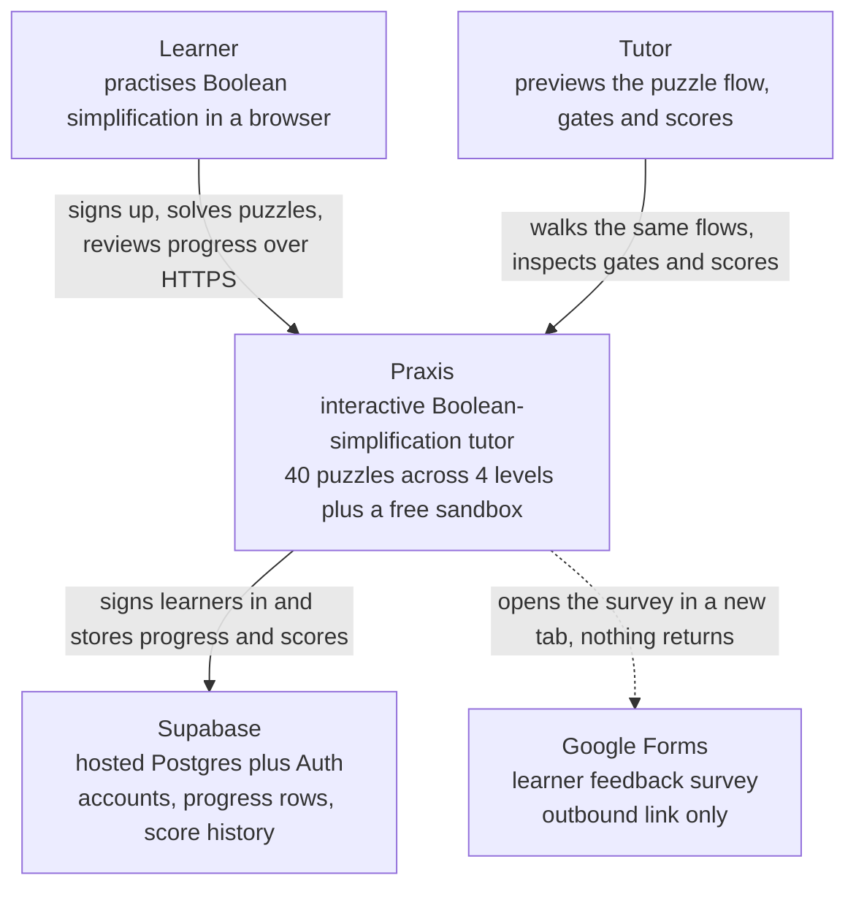

**Notes.**

- The learner talks to Supabase **directly** for sign-in; the Praxis API only ever *validates* the
  resulting token (`frontend/src/services/authActions.js:11,21`, `backend/core/security.py:27`).
- There is no better-auth server and no `POST /sandbox/validate` in this picture, because neither
  exists in the repository. The `vite.config.js` comment about a port-3001 auth server is a dead
  remnant (`frontend/vite.config.js:24-28`).
- The survey link is defined once at `frontend/src/config/appLinks.js:9` and opened from
  `frontend/src/components/layout/SurveyButton.jsx:17`.

---

## D2 — Container diagram (C4 Level 2)

**How to read this:** each solid box is something separately deployed or built; the two arrows leaving
`content/` are the point of the figure — one directory with two independent consumers.

**What it shows:** the React SPA, the FastAPI service and the shared JSON content, plus the two
Supabase capabilities the system uses (Auth and PostgREST). The Boolean engine is **not** drawn as a
container: it is framework-free JavaScript compiled into the SPA bundle, and drawing it as a service
would misstate the architecture — it has its own figure in
[D4 — Boolean engine component diagram](#d4--boolean-engine-component-diagram). Note that `content/`
must ship beside `backend/`, because the repository resolves it as `parents[2] / "content"`; if it is
missing, the content routes fail rather than returning empty data.

**Source of truth:** `backend/main.py:25-36`, `backend/main.py:79-83`, `frontend/vercel.json:2-11`, `frontend/vite.config.js:13-17`, `backend/repositories/content_repository.py:16`, `backend/repositories/content_repository.py:34-43`, `backend/repositories/progress_repository.py:29-73`, `backend/supabase_client.py:87-98`, `backend/config/settings.py:59-63`.

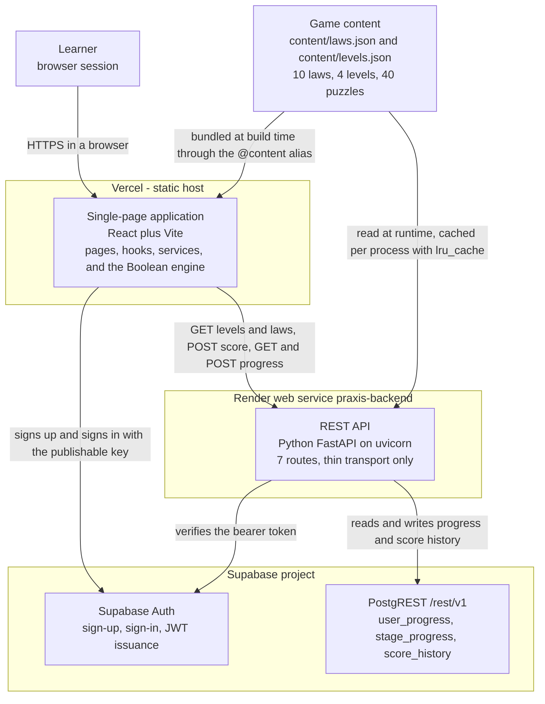

**Notes.**

- The API holds no algebra. It serves content and scores numbers that the browser computed
  (`backend/services/scoring_service.py:32-77`).
- Repository HTTP is **synchronous httpx inside `async def` routes** — a real known limitation, not a
  diagram error (`backend/repositories/progress_repository.py:10`).
- `lru_cache` does not cache exceptions: a failed content load retries on the next request and can
  self-heal without a restart, while a successful load is cached for the life of the process, so later
  edits to `content/*.json` are ignored until it restarts
  (`backend/repositories/content_repository.py:34-43`).

---

## D3 — Entity-relationship diagram

**How to read this:** crow's foot marks the many side, `PK` and `FK` mark the keys, and `AUTH_USERS` is
owned by Supabase rather than created by this repository.

**What it shows:** one learner owns at most one totals row, many stage rows and many score-history
rows, and every foreign key cascades on delete. Three details are load-bearing: `STAGE_PROGRESS` is
unique on `(user_id, level_id, stage_idx)` even though Mermaid has nowhere to attach a table-level
constraint (`database/init.sql:24`); `level_id` stores the **content id**, so Tutorial rows carry
`level_id = 0`; and `hints_used` in `score_history` stores hints **plus** guides as one assistance
figure (`backend/services/scoring_service.py:51`). The visual type `text_array` stands for the real
PostgreSQL `TEXT[]` column — brackets are not safe inside a Mermaid attribute type.

There is deliberately **no** relationship drawn between `STAGE_PROGRESS` and `SCORE_HISTORY`: they
correlate on `(user_id, level_id, stage_idx)` and are written by the same function, but no foreign key
exists between them (`backend/services/progress_service.py:110-122`). Content entities (level, puzzle,
law) are also absent by design — they are JSON, not tables.

**Source of truth:** `database/init.sql:7-13`, `database/init.sql:16-25`, `database/init.sql:24`, `database/init.sql:28-42`, `database/init.sql:45-47`, `database/init.sql:50-58`.

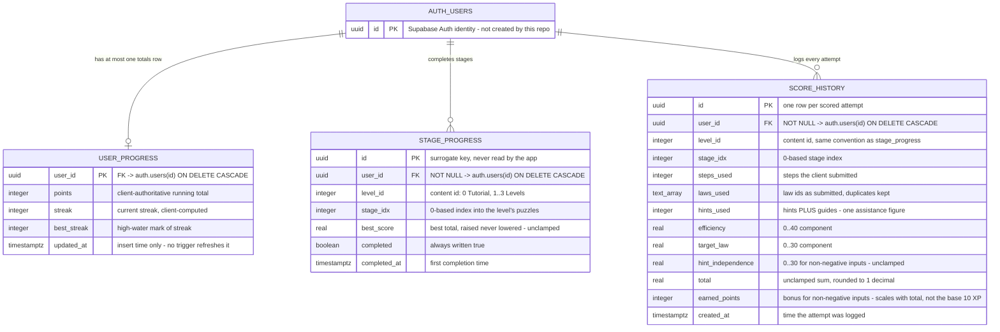

**Notes.**

- `indexes`: `idx_stage_progress_user(user_id)`, `idx_score_history_user(user_id)` and
  `idx_score_history_level(user_id, level_id, stage_idx)` (`database/init.sql:45-47`).
- **The score columns carry no range guarantee.** `hints_used` and `guides_used` reach the formula
  unvalidated, and `hint_independence = max(0, 30 - assistance × 10)` means a **negative** assistance
  count *raises* the score instead of lowering it. So `best_score`, `hint_independence`, `total` and
  `earned_points` are visual-type hints, not constraints: only `target_law` is genuinely bounded (it is
  a ratio). The diagram says `0..30 for non-negative inputs` and `unclamped` deliberately
  (`backend/services/scoring_service.py:51,99-115`).
- **Known discrepancy (RLS).** RLS is enabled on all three tables, but each policy is literally named
  `"Service role full access"` and is `FOR ALL USING (true)` for every role, with no
  `auth.uid() = user_id` predicate anywhere (`database/init.sql:56-58`). These are not per-learner
  policies; do not read the diagram as implying row ownership enforcement.
- **Known discrepancy (auth).** The `init.sql` header comment claims Better Auth tables are created by
  `npx auth migrate` (`database/init.sql:4`). There is no Better Auth installation in this repository;
  auth is Supabase Auth.

---

## D4 — Boolean engine component diagram

**How to read this:** start at the top with the UI; everything inside the engine boundary is pure
JavaScript with no React, no DOM and no network, and every module returns new trees instead of
mutating them.

**What it shows:** the engine's real shape — and three things that a naive "parser → validator →
normalizer → laws → solver" pipeline would get wrong.

1. **The parser normalises internally.** `parseExpr` calls `normalizeFlat` before returning
   (`frontend/src/engine/parser.js:75`), so there is no separate normalizer stage sitting after the
   parser. Full `normalize` exists but is called from the law `apply()` bodies.
2. **There are two string gates, not one.** `validateExpr` (`frontend/src/engine/validate.js:16`) guards
   *generated* sandbox expressions from `sandbox/generator.js:84`; `validateSandboxInput`
   (`frontend/src/engine/sandbox/validate.js:155`) is what the sandbox screen actually calls, at
   `SandboxPage.jsx:122` for the debounced verdict and `:124` for the button, and it is re-run inside
   `buildSandboxPuzzle` (`frontend/src/engine/sandbox/input.js:113`). Merging them into one "validator"
   box is the most likely error in this figure.
3. **Truth-table equivalence is not on the play path.** `isEquivalent` is used by the law helpers for
   absorption decisions — each behind the Module 4 constant guard — and by the sandbox builders to
   verify generated puzzles — never to validate a
   learner's step. See [D5](#d5--sequence-one-derivation-step-end-to-end).

The engine is 23 modules and 3,303 lines of source (4,664 including its tests) and is the only Boolean
algebra implementation in the repository; the backend never re-implements it.

**Source of truth:** `frontend/src/engine/index.js:8-13`, `frontend/src/engine/parser.js:75`, `frontend/src/engine/parser.js:160-166`, `frontend/src/engine/normalize.js:14-69`, `frontend/src/engine/validate.js:16`, `frontend/src/engine/sandbox/validate.js:155`, `frontend/src/engine/sandbox/generator.js:84`, `frontend/src/engine/laws/definitions.js:29-54`, `frontend/src/engine/laws/helpers.js:73`, `frontend/src/engine/laws/helpers.js:100`, `frontend/src/engine/laws/helpers.js:142`, `frontend/src/engine/solver.js:38`, `frontend/src/engine/solver.js:176`, `frontend/src/engine/solver.js:271`, `frontend/src/engine/solver.js:364`.

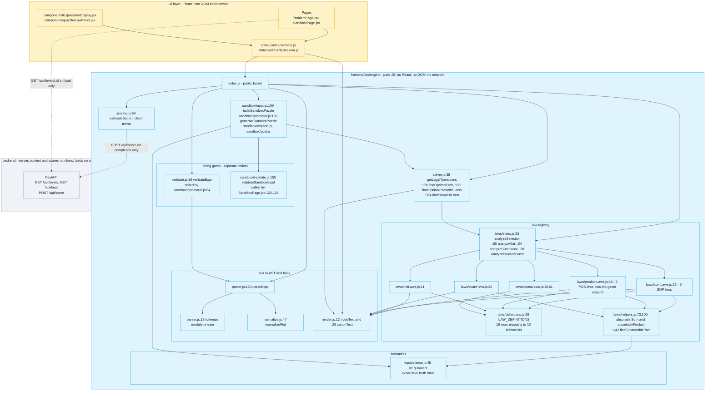

**Notes.**

- The only imports that leave `engine/` are two data modules: `config/gameRules.js` from `scoring.js`
  and `sandbox/input.js`. That is what keeps the engine testable in plain Node
  (`frontend/src/engine/index.js:8-13`).
- `estimateScore` is advisory. The dashed edge to `POST /api/score` is a comparison, not a call: the
  server's returned total overwrites the displayed one
  (`frontend/src/components/puzzle/usePuzzleSession.js:208-213`).
- `LAW_DEFINITIONS` has 16 rows but only **10 distinct law ids**; `identity` legitimately appears twice
  because its sum and product statements differ while the display name does not
  (`frontend/src/engine/laws/definitions.js:29-54`). The engine also knows one id,
  `distributive-expand`, that is not among the 10 reference cards and is enabled only when
  `allowExpand` is set.

---

## D5 — Sequence: one derivation step, end to end

**How to read this:** time runs downward; the numbered messages are one learner step, and the only
wait in the middle is the law animation, which is what commits the step.

**What it shows:** a click carries a node path, the selection machine caps at two items, the law
registry answers with law objects that each carry an `apply()`, and the chosen law produces a new AST
without mutating the old one. The step is appended to the derivation **only after**
`TIMING.lawAnimationMs` (1,350 ms) elapses, and on a tutorial stage there is an extra
`preLawHighlightMs` (1,500 ms) pause first. Completion is then decided by comparing the new
expression's **canonical text** with the goal's canonical text — the truth-table checker is not on
this path. A dead end is an empty `scanHints`.

There is no network hop anywhere in this figure. The only API calls in the puzzle flow are
`GET /api/levels/{id}` when the puzzle loads and `POST /api/score` at completion.

**Source of truth:** `frontend/src/components/ExpressionDisplay.jsx:59-60`, `frontend/src/components/puzzle/DerivationCanvas.jsx:194-199`, `frontend/src/pages/ProblemPage.jsx:307`, `frontend/src/pages/ProblemPage.jsx:315`, `frontend/src/pages/ProblemPage.jsx:321`, `frontend/src/state/useGameState.js:165`, `frontend/src/state/useGameState.js:240`, `frontend/src/state/useGameState.js:351`, `frontend/src/state/useGameState.js:398`, `frontend/src/state/useGameState.js:407-417`, `frontend/src/state/useGameState.js:467-469`, `frontend/src/state/useGameState.js:481`, `frontend/src/state/useGameState.js:54-69`, `frontend/src/config/gameRules.js:60`, `frontend/src/config/gameRules.js:62`.

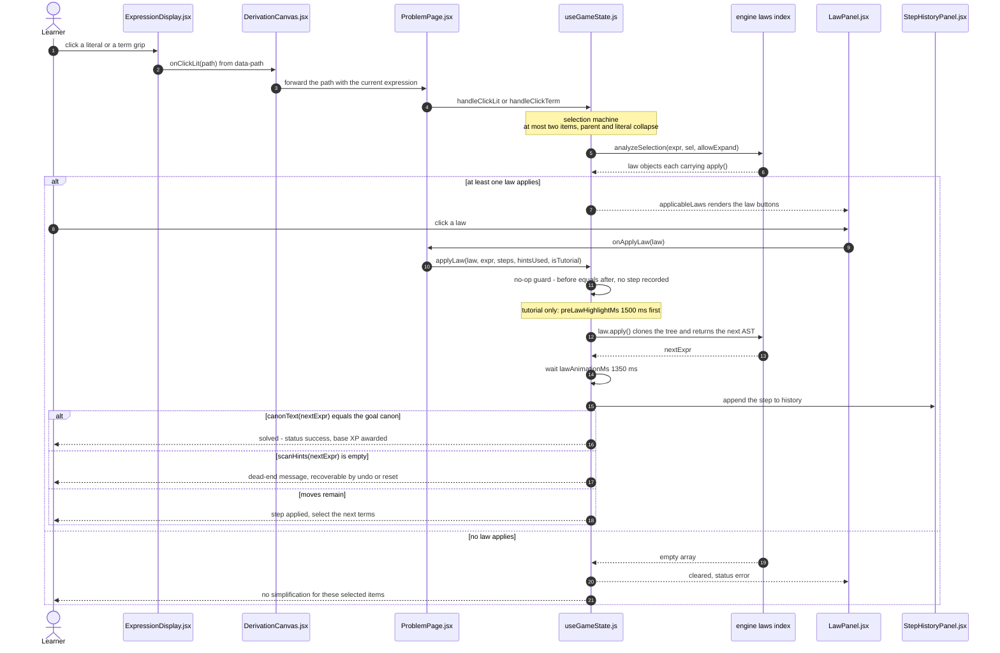

**Notes.**

- **Correction to the original brief.** The brief asked for a sequence containing
  "step submitted → `POST /sandbox/validate`". **That endpoint does not exist**; a step never leaves the
  browser. Validity is structural rather than provational: the learner picks a law and that law's own
  `apply()` produces the next AST, with soundness resting on the law implementations and their property
  tests (`frontend/src/engine/__tests__/law-soundness.property.test.js`).
- A law that changes nothing is rejected before the animation (`frontend/src/state/useGameState.js:407-417`).
- The dead-end message states a fact about the implemented law registry, not a proof of unsolvability
  (`frontend/src/state/hintText.js:10`).

---

## D6 — Sequence: the sandbox, corrected

**How to read this:** everything happens inside one browser tab — no message in this figure crosses a
network boundary, and that is the whole point of the diagram.

**What it shows:** the learner types an expression and gets a live verdict after a 300 ms debounce;
pressing *Validate & Play* runs `buildSandboxPuzzle`, which enforces **solvability** on top of syntax and
whose verdict outranks the live one; on success the puzzle is handed to `/sandbox/play` as route state
with a `sessionStorage` fallback so a refresh keeps the same expression. `/sandbox/play` renders the
same workspace as a graded stage — sandbox mode is detected by the **absence** of route params — and its
completion branch awards no points and persists nothing.

**Source of truth:** `frontend/src/pages/SandboxPage.jsx:117-124`, `frontend/src/pages/SandboxPage.jsx:163-187`, `frontend/src/pages/SandboxPage.jsx:178-181`, `frontend/src/engine/sandbox/validate.js:155`, `frontend/src/engine/sandbox/input.js:109`, `frontend/src/engine/sandbox/input.js:113`, `frontend/src/engine/sandbox/input.js:161`, `frontend/src/engine/sandbox/generator.js:84`, `frontend/src/components/puzzle/sandboxPuzzle.js:46-56`, `frontend/src/components/puzzle/sandboxPuzzle.js:81-86`, `frontend/src/components/puzzle/usePuzzleSession.js:40`, `frontend/src/components/puzzle/usePuzzleSession.js:185-188`, `frontend/src/config/storageKeys.js:22`, `frontend/src/config/gameRules.js:70`, `frontend/src/config/gameRules.js:72`.

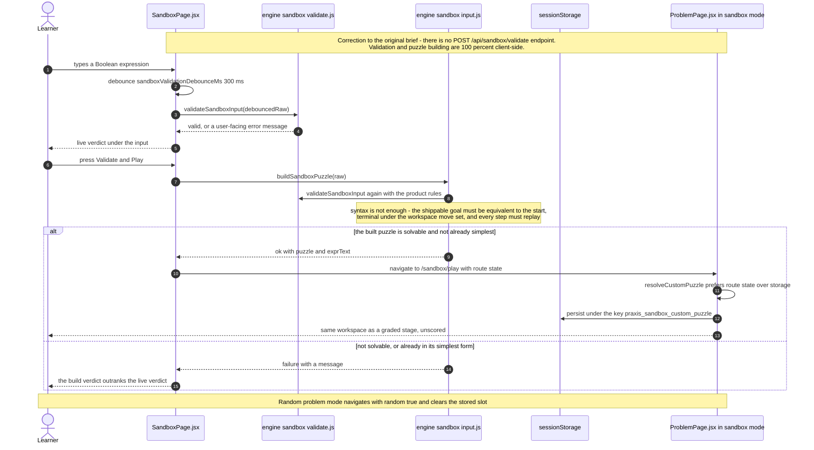

**Notes.**

- **The brief was wrong.** `POST /sandbox/validate` appears nowhere in the 7 application endpoints
  (`backend/main.py:79-83`), and no first-party backend file mentions the sandbox. There is no
  `/api/sandbox/*` route of any kind.
- The two string gates are distinct and both appear here: `validateSandboxInput` is the learner-facing
  gate, while `validateExpr` guards *generated* expressions inside the generator
  (`frontend/src/engine/sandbox/generator.js:84`).
- Sandbox puzzles carry `targetLaws: []` and are not stages of any level, so even the completion branch
  has nothing to score (`frontend/src/engine/sandbox/input.js:190`,
  `frontend/src/engine/sandbox/generator.js:102`).
- The acceptance invariants `buildSandboxPuzzle` enforces are documented at
  `frontend/src/engine/sandbox/input.js:25-31`.

---

## D7 — Sequence: authentication and the bearer token

**How to read this:** there is no Praxis login endpoint — the token is issued by Supabase and only
*validated* by the Praxis API, and the two error lanes at the end are the ones that surprise people.

**What it shows:** sign-up and sign-in go straight from the browser to Supabase Auth; `AuthProvider`
subscribes once and publishes the session to the whole app; `apiClient.authHeaders` awaits
`getSession()` on every call and attaches `Authorization: Bearer <token>` when a session exists. The two
progress routes then **hard-401** without a valid token, whereas `POST /api/score` uses `optional_user`,
answers 200 signed-out and simply skips persistence — an intentional asymmetry, not an oversight.

**Source of truth:** `frontend/src/services/authActions.js:9-31`, `frontend/src/state/AuthProvider.jsx:21-42`, `frontend/src/services/apiClient.js:27-31`, `frontend/src/services/apiClient.js:56-93`, `frontend/src/services/progressApi.js:11-24`, `backend/core/security.py:17-43`, `backend/api/routes/progress.py:20-30`, `backend/api/routes/score.py:24`, `backend/api/routes/score.py:38-39`, `backend/supabase_client.py:87-98`.

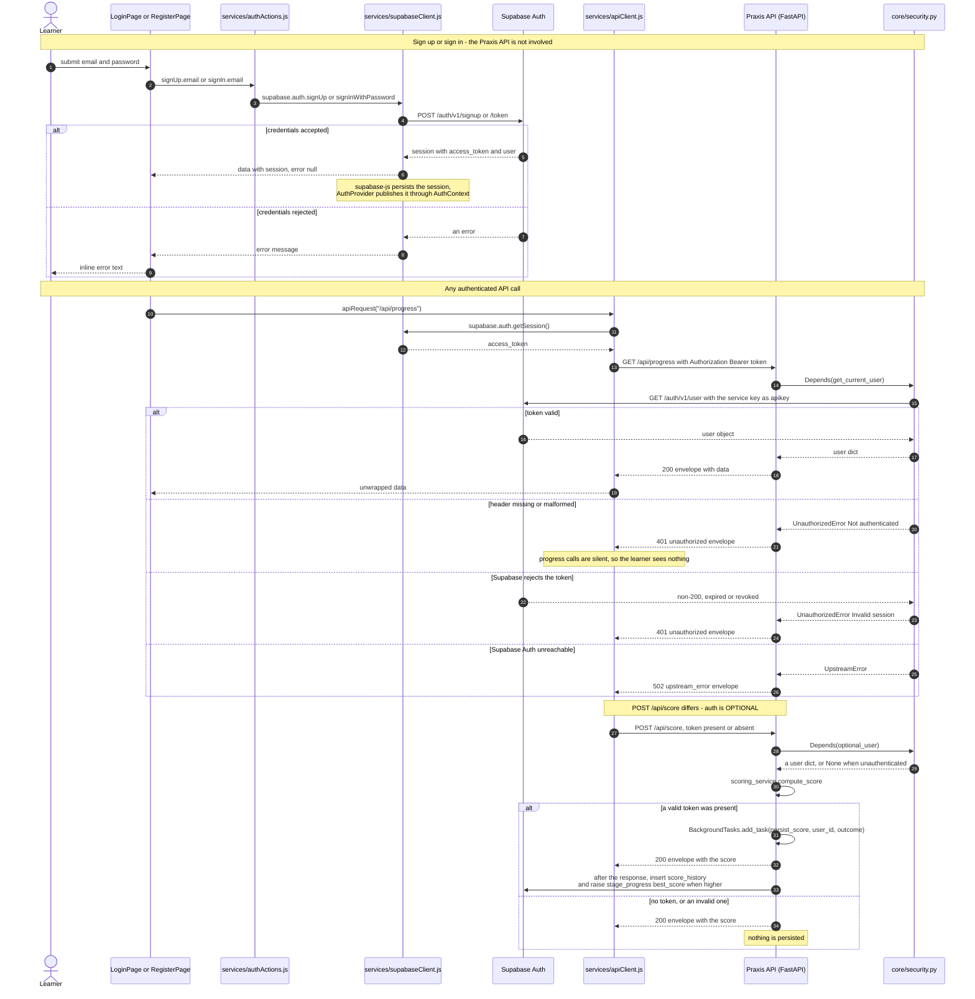

**Notes.**

- **No OpenAPI security scheme is declared**, so `/docs` shows no Authorize button even though two
  routes require a bearer token. The requirement is enforced by a dependency, not by the schema.
- An **invalid** token on `POST /api/score` degrades to unauthenticated rather than 401, because
  `optional_user` swallows only `UnauthorizedError` (`backend/core/security.py:38-43`). A token-bearing
  score call can still return 502 when Supabase Auth is unreachable, because `UpstreamError` is *not*
  swallowed.
- Every response carries `X-Request-ID`, echoed from the request header when supplied
  (`backend/core/middleware.py:18,27,61`). That header is how a client-visible failure is joined to a
  server log line.
- Do not draw a Praxis login route or a port-3001 auth server: neither exists.

---

## D8 — State: puzzle session lifecycle

**How to read this:** each state is a real `status` value or completion flag in `useGameState`; the
sandbox runs the same machine but its completion branch exits before scoring.

**What it shows:** one attempt at one puzzle. `Active` is a composite state because selecting → being
offered laws → being rejected is a sub-cycle that repeats many times without leaving it. `Animating` is
the only state that can reach `Complete` or `DeadEnd`; that is what *step-locking* means here — a step is
committed only after its animation, and only as an append. Two exits from the workspace exist for
failures: an out-of-range stage returns to the stage list, and a fetch failure returns to the level
carousel.

**Source of truth:** `frontend/src/state/useGameState.js:30`, `frontend/src/state/useGameState.js:54-69`, `frontend/src/state/useGameState.js:165-215`, `frontend/src/state/useGameState.js:354-459`, `frontend/src/state/useGameState.js:481`, `frontend/src/state/useGameState.js:505-543`, `frontend/src/state/useGameState.js:545-564`, `frontend/src/state/useGameState.js:604-647`, `frontend/src/components/puzzle/usePuzzleSession.js:118`, `frontend/src/components/puzzle/usePuzzleSession.js:123`, `frontend/src/components/puzzle/usePuzzleSession.js:150-221`, `frontend/src/components/puzzle/usePuzzleSession.js:185-188`, `frontend/src/state/hintText.js:10`, `frontend/src/config/gameRules.js:60`, `frontend/src/config/gameRules.js:62`, `frontend/src/config/gameRules.js:66`.

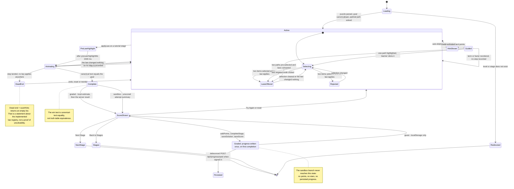

**Notes.**

- A solution replayed from saved progress re-enters `Complete` for **review only**: it does not
  re-award points and does not auto-open the modal
  (`frontend/src/components/puzzle/usePuzzleSession.js:153-156`).
- `Redirected` is a real exit, not decoration: `usePuzzleSession.js:118` navigates to the stage list for
  an out-of-range stage and `:123` navigates to `/levels` when the level fetch fails.
- The three terminal actions from `ScoreShown` are the three buttons the modal offers
  (`frontend/src/components/puzzle/ScoreModal.jsx:191-226`).

---

## D9 — Flowchart: level unlock

**How to read this:** level ids are 0-based — **0 is the Tutorial** — and the only gate that can lock a
level is the diamond requiring both every stage scored and a rounded average of at least 80.

**What it shows:** the Tutorial and Level 1 need no score prerequisite, Levels 2 and 3 are chain-gated
on the previous level's unlock, the Sandbox needs the completed Tutorial, and inside a level stage `n`
opens only once stage `n-1` is complete. Two details make this figure worth reading:

1. **The average is rounded before it is compared.** `Math.round(sum / totalStages)` happens first and
   the comparison is `>= 80` afterwards, so a true average of 79.5 **passes**
   (`frontend/src/state/progressStore.js:301-303` then `:309`).
2. **Unfinished stages count as zero.** The divisor is the level's total stages, not the number of
   stages actually played, so one skipped stage drags the average down.

**This is a frontend rendering gate, not a security boundary.** Nothing server-side records an unlock,
and `GET /api/levels/{level_id}` has no auth dependency, so a learner who types the URL can open any
stage (`backend/api/routes/levels.py:24-27`).

**Source of truth:** `frontend/src/state/progressStore.js:291-313`, `frontend/src/config/gameRules.js:38-46`, `frontend/src/config/gameRules.js:48-49`, `frontend/src/pages/LevelSelectPage.jsx:78`, `frontend/src/pages/LevelSelectPage.jsx:80-92`, `frontend/src/pages/LevelSelectPage.jsx:94-120`, `frontend/src/pages/StageSelectorPage.jsx:55-62`, `frontend/src/components/TutorialGate.jsx:64-75`, `frontend/src/state/progressStore.js:281-285`.

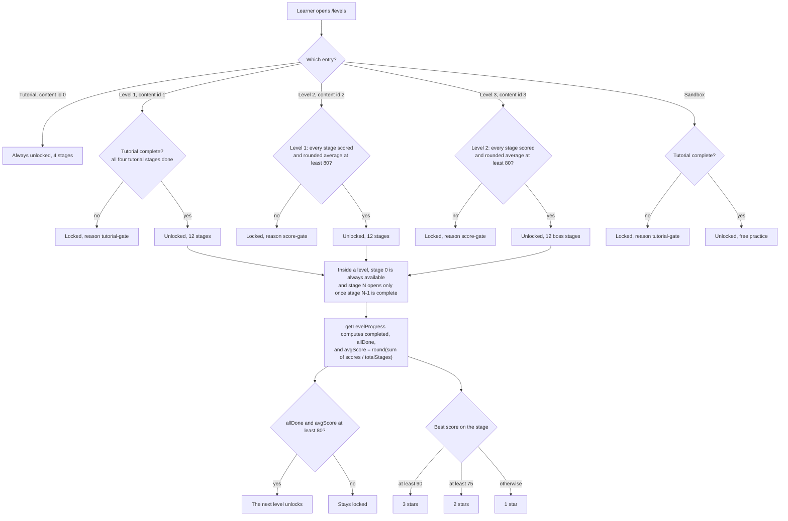

**Notes.**

- Content volumes used above: Tutorial 4 stages; Levels 1–3 have 12 each — **40 puzzles in total**
  (`content/levels.json`, confirmed by `GET /api/levels` returning `puzzleCount` `[4,12,12,12]`).
- `Math.round` on the average is why 79.5 passes; do not restate this as "80 exactly or higher" without
  the rounding clause.
- The tutorial gate redirects unfinished learners to their next incomplete tutorial stage and carries a
  `returnTo` parameter (`frontend/src/components/TutorialGate.jsx:64-75`).

---

## D10 — Flowchart: scoring breakdown

**How to read this:** three components are computed independently and only then summed; the rounding
happens once, at the total.

**What it shows:** efficiency (40) compares steps used with an optimum that is **clamped to be no larger
than what the learner actually used**; target law (30) is proportional and pays full marks when a puzzle
declares none; hint independence (30) loses 10 per hint **or guide**, because hints and guides are
counted as one assistance figure. The total is rounded once to one decimal and is **not capped** at 100;
`earnedPoints` scales with that unclamped total and is 0–5 for non-negative inputs only, paid on top of
the frontend's base 10 XP. Persistence is best-effort in a background task, so a slow database never
delays the response.

The optimum itself comes from the browser: for a graded puzzle it is the **objective-aware** optimum —
the fewest steps that reach the goal *and* apply every `targetLaws` id (`findOptimalPathWithLaws`,
`frontend/src/engine/solver.js:271`) — not the raw shortest path. The efficiency band therefore measures
the learner against the shortest route that teaches the puzzle's laws.

**The server does not verify the derivation.** `stepsUsed`, `lawsUsed`, `hintsUsed` and `guidesUsed` are
all submitted by the browser, the algebra engine is frontend-only, and the server scores the numbers it
is handed. \(stepsUsed = 0\) with a claimed law id returns a total of **100.0**, and
\(optimalSteps = 999\) still yields full efficiency because of the clamp. An unvalidated **negative**
assistance count *buys* score rather than costing it: with `hintsUsed: -99`, `hintIndependence` becomes
`1020.0` instead of clamping at 30, and the total exceeds 1000 with no upper cap — its only floor is 0,
because `efficiency` and `hintIndependence` clamp there and `targetLaw` is a non-negative ratio by
construction. Only `targetLaws` comes from content.

**Source of truth:** `backend/services/scoring_service.py:32-77`, `backend/services/scoring_service.py:80-88`, `backend/services/scoring_service.py:91-96`, `backend/services/scoring_service.py:99-107`, `backend/services/scoring_service.py:110-115`, `backend/config/constants.py:9-25`, `backend/api/routes/score.py:20-48`, `backend/api/schemas/score.py:13-29`, `backend/services/progress_service.py:87`, `frontend/src/engine/scoring.js:54-98`.

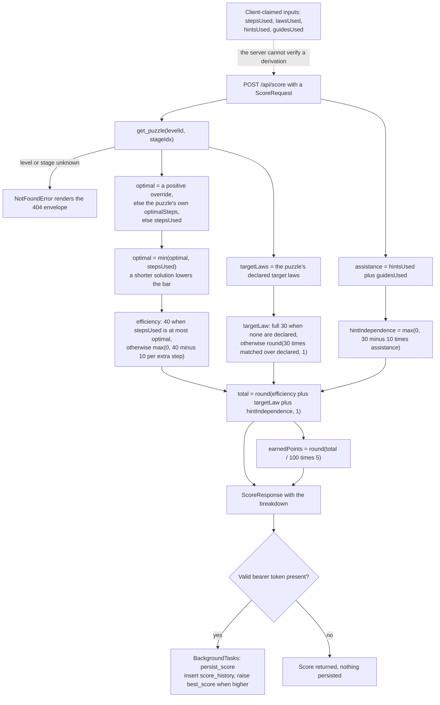

**Notes.**

- **The clamp matters.** The `optimalSteps` echoed in the response is not always the value authored in
  `content/levels.json` (`backend/services/scoring_service.py:87-88`).
- **The client's optimum is objective-aware, and not always the shortest path.** The browser solves the
  state graph for the fewest steps that reach the goal **and** apply every `targetLaws` id
  (`findOptimalPathWithLaws`, `frontend/src/engine/solver.js:271-346`; wired at
  `frontend/src/state/useGameState.js:87-113`). An empty `targetLaws` list falls back to the plain
  shortest path (`frontend/src/engine/solver.js:274`), and an unsatisfiable objective reports
  `found: false`, which makes the workspace fall back to that plain optimum
  (`frontend/src/state/useGameState.js:101-105`). Consequence: a route shorter than the optimum that
  skips a required law still earns the full 40 efficiency points but forfeits that law's target-law
  credit. The two optima now coincide on Tutorial stage 1 — the shortcut there was a semantic
  absorption collapse, forbidden by the proposal's Module 4 — and still differ on 11 of the 40
  puzzles. Worked example and full arithmetic: [scoring-and-rewards.md](../06-reference/scoring-and-rewards.md)
  [W9](../06-reference/scoring-and-rewards.md#w9--the-taught-route-is-now-the-only-route-tutorial-stage-1).
- **The empty-target-laws branch is a guard, not a shipped path:** all 40 puzzles declare at least one
  target law, so that branch is unreachable through today's content
  (`backend/services/scoring_service.py:101-102`).
- **Known discrepancy (rounding across the wire).** The backend uses Python `round()`, which is
  half-to-even, while the frontend mirror uses `Math.round`, which is half-up. At totals of 90.0, 50.0
  and 10.0 the two disagree (`backend/services/scoring_service.py:55` versus
  `frontend/src/engine/scoring.js:80`). The backend value is the one persisted.
- **Known discrepancy (trust).** Because every input except `targetLaws` is client-claimed, a
  hand-crafted request can score 100.0 without solving anything, and a negative assistance count
  inflates the total without limit. Treat the score as a self-report, not as proof
  (`backend/services/scoring_service.py:51,110-115`; independently reproduced against the live endpoint).
- **No range guarantees anywhere in the schema.** `score_history` has no `CHECK` constraints, so none of
  the numeric columns are bounded by the database either (`database/init.sql:28-42`).
- Guides cost 20 points as a **spend** (`frontend/src/config/gameRules.js:35`) and also count as
  assistance for the 10-point deduction. These are two different things; do not conflate them.

---

## D11 — Deployment diagram

**How to read this:** three deployment parties — Render, Vercel and Supabase — and the key routing fact
is that the browser reaches the API through the SPA's own origin rather than calling Render directly.

**What it shows:** `render.yaml` declares exactly **one** service, the Python `praxis-backend`.
The SPA is deployed separately to Vercel, which rewrites `/api/(.*)` to the Render host and everything
else to `/index.html`. The sign-in path goes straight from the browser to Supabase Auth, and the API
independently validates the resulting token. In production `/api/*` is therefore **same-origin to the
SPA and proxied**, which is why the production CORS story is quiet — CORS configuration matters mainly
for local development, where the Vite dev server proxies `/api` to `127.0.0.1:8000`.

**Source of truth:** `render.yaml:1-15`, `frontend/vercel.json:1-11`, `backend/config/settings.py:23-27`, `backend/config/settings.py:59-63`, `backend/config/settings.py:66-71`, `backend/config/settings.py:75`, `backend/main.py:30-36`, `backend/repositories/content_repository.py:16`, `frontend/src/config/storageKeys.js:10`, `frontend/src/config/storageKeys.js:16-25`, `backend/api/routes/health.py:15-18`.

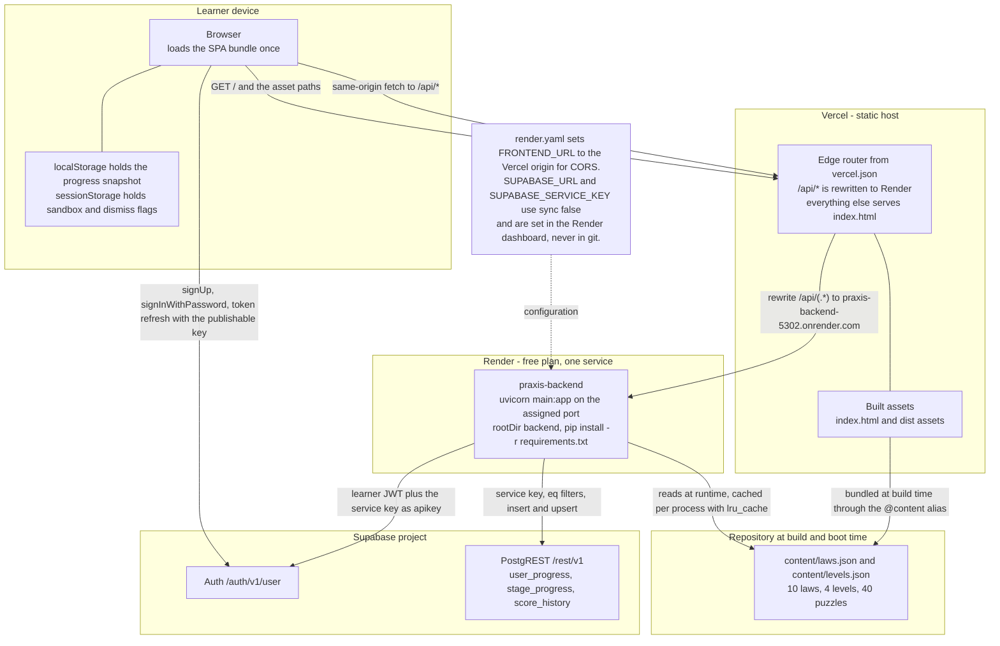

**Notes.**

- **Render hosts only the backend.** There is no frontend service in `render.yaml`; drawing the SPA as
  a Render service would be wrong. `FRONTEND_URL` is a literal in the file
  (`https://praxis-seven-puce.vercel.app`) and is appended to the CORS origins.
- **The rewrite target is hardcoded**: `/api/(.*)` → `https://praxis-backend-5302.onrender.com/api/$1`
  (`frontend/vercel.json:5`). Renaming the Render service breaks production routing silently.
- The one free instance **sleeps when idle**, so the first request after a quiet period pays a cold
  start.
- **Secrets never appear in diagrams or docs.** Use `<service-role-key>` and `<project-ref>`
  placeholders. Only `FRONTEND_URL` is a literal in the repository; the two Supabase values are
  dashboard-only (`render.yaml:10-15`).
- The health probe is `GET /`, which is deliberately plain JSON outside the envelope because Render
  reads it (`backend/api/routes/health.py:15-18`). `render.yaml` does not currently map it to a
  `healthCheckPath`.

---

## D12 — Frontend data flow

**How to read this:** solid arrows are calls and dashed arrows are returns; the return leg comes back up
through a single store, which is what makes a server response and a local point award re-render the same
way.

**What it shows:** components emit events and hold no game state; the state layer decides; the pure
engine computes; **every** network call passes through one chokepoint, `apiClient.apiRequest`, which
attaches the bearer token and unwraps the `{success, data, error}` envelope into `data` or throws
`ApiError`. Writes land as updates on a module-level progress store whose `publish()` notifies every
`useSyncExternalStore` subscriber. `localStorage` is the fast path and the server is the durable one.

**Source of truth:** `frontend/src/pages/ProblemPage.jsx:134-135`, `frontend/src/components/puzzle/usePuzzleSession.js:34-35`, `frontend/src/components/puzzle/usePuzzleSession.js:86-100`, `frontend/src/state/useGameState.js:2-7`, `frontend/src/state/useProgress.js:20-24`, `frontend/src/state/progressStore.js:49-57`, `frontend/src/state/progressStore.js:69-94`, `frontend/src/state/progressStore.js:147-166`, `frontend/src/services/apiClient.js:27-31`, `frontend/src/services/apiClient.js:63`, `frontend/src/services/apiClient.js:33-45`, `frontend/src/services/scoreApi.js:31`, `frontend/src/services/progressApi.js:12`, `frontend/src/services/contentApi.js:49`, `frontend/src/state/AuthProvider.jsx:37-42`.

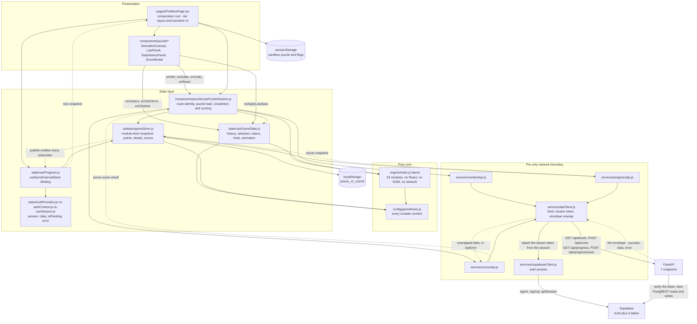

**Notes.**

- `frontend/src/services/apiClient.js:63` is the **only** `fetch` call in `frontend/src`; everything
  else goes through it. Components must never call `fetch` directly.
- The engine has exactly two inbound edges, from `useGameState` and `usePuzzleSession`. That single
  coupling is what lets the engine be tested in plain Node with no DOM.
- `progressStore` is the single write point for progress; `useProgress` is a thin binding, not a second
  store. The server snapshot is merged without ever lowering a best value
  (`frontend/src/state/progressStore.js:97-130`).
- **The auth path is deliberately separate from the API path.** The SPA talks to Supabase Auth directly
  and the API independently verifies the token, so two arrows pointing at Supabase from two different
  places is correct rather than a drawing error.
- The client credits points from its **own** estimate while the server writes its own value to
  `score_history`, so the displayed balance and the ledger can differ
  (`frontend/src/components/puzzle/usePuzzleSession.js:190-213`,
  `backend/services/progress_service.py:87-127`).
