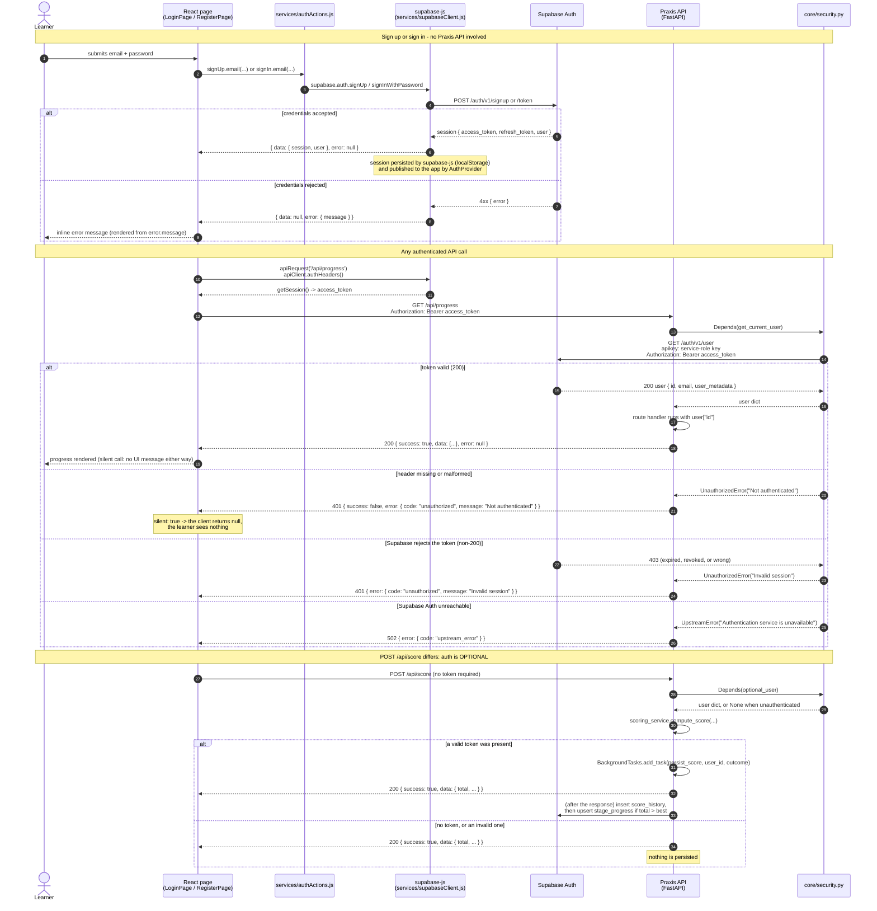
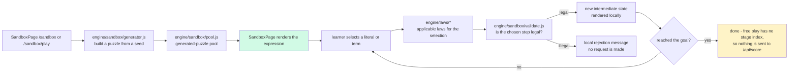

# Diagram input — `backend-api` (task-2)

Ready-to-paste Mermaid source for the diagram(s) in the `backend-api` domain, plus the note the
diagrams teammate needs about the sandbox flow. **The diagrams teammate owns the final
`docs/09-diagrams/DIAGRAMS.md` — this file only supplies verified source and evidence.**

Required by the task brief for this domain: the **auth flow sequence** (Supabase signup/login →
session → bearer on API calls), in the context of the **sandbox decision** (there is no
sandbox endpoint). Domain facts are documented in
[API-REFERENCE.md](../04-api/API-REFERENCE.md) and
[error-codes.md](../06-reference/error-codes.md).

---

## 1. Auth flow sequence diagram (primary deliverable)

Paste the fence below verbatim. It is a `sequenceDiagram`; the first body line is the Mermaid
keyword, which is what the suite's checker requires.

### 1.1 Evidence for every element

| Element in the diagram | Evidence (file:line) | How verified |
|---|---|---|
| Signup/login originates in the pages | `frontend/src/pages/LoginPage.jsx:31`, `frontend/src/pages/RegisterPage.jsx:44` | read |
| Mutations go through `authActions` | `frontend/src/services/authActions.js:9-31` (`signIn.email`, `signUp.email`, `signOut`) | read |
| `signUp.email` passes `options.data.name` | `frontend/src/services/authActions.js:20-25` | read |
| supabase-js client is built once from two Vite env vars | `frontend/src/services/supabaseClient.js:5-10` | read |
| Session is seeded on load and kept fresh by a subscription | `frontend/src/state/AuthProvider.jsx:23,37` | read |
| The bearer token comes from `supabase.auth.getSession()`, added only when a session exists | `frontend/src/services/apiClient.js:27-31` | read |
| Header is exactly `Authorization: Bearer <access_token>` | `frontend/src/services/apiClient.js:30` | read |
| Route dependency for the progress routes | `backend/api/routes/progress.py:21,29` | read |
| `get_current_user` requires the exact `Bearer ` prefix | `backend/core/security.py:19-24` | ran (5-variant header matrix) |
| Token validation is `GET {SUPABASE_URL}/auth/v1/user` with the service key as `apikey` | `backend/supabase_client.py:87-98` | read + ran (live `403` for a bogus token) |
| Non-200 → `None` → `401 Invalid session` | `backend/supabase_client.py:96-98`, `backend/core/security.py:31-32` | ran |
| Transport error → `502 upstream_error` | `backend/core/security.py:28-29` | simulated fault |
| Missing/malformed header → `401 Not authenticated` | `backend/core/security.py:21-22` | ran |
| `POST /api/score` uses `optional_user` | `backend/api/routes/score.py:24` | read |
| `optional_user` swallows only `UnauthorizedError` | `backend/core/security.py:38-43` | read |
| Signed-in scores schedule `persist_score` as a background task | `backend/api/routes/score.py:38-39` | ran (stub) |
| `persist_score` inserts history then conditionally raises the best score | `backend/services/progress_service.py:87-127` | ran (stub) + read |
| Progress calls are silent, so no error text reaches the learner | `frontend/src/services/progressApi.js:12,20` | read |

### 1.2 Accuracy notes for whoever assembles the diagram

1. **Supabase Auth is the only auth provider.** The `vite.config.js` comment about a "Better
   Auth server" on port 3001 and the `init.sql` comment about `npx auth migrate` are dead
   remnants (D3). Do not draw an auth server box.
2. **There is no Praxis login endpoint.** Signup/login never touches `praxis-backend`; the
   browser talks to Supabase directly. The API only ever *validates* a token.
3. **`POST /api/score` is the one route where a missing token is not an error.** Drawing it as
   "authenticated" would be wrong; drawing it as "public" would hide the persistence branch.
   The two-branch form above is the accurate one.
4. **An invalid token on `/api/score` degrades to unauthenticated**, not to `401` — the
   `optional_user` dependency swallows `UnauthorizedError` (`backend/core/security.py:42-43`).
   Verified: `POST /api/score` with `Bearer not-a-real-token` returned `200`.
5. **A token-bearing `POST /api/score` can still `502`** when Supabase Auth is unreachable,
   because `optional_user` does *not* swallow `UpstreamError`. Verified by injecting an
   `httpx.ConnectError`: `502 upstream_error`; the same request with no token returned `200`.
6. **`X-Request-ID` travels on every response** (except CORS preflights) and is what joins a
   client-visible failure to a server log line. If the diagram gets a second panel, that is the
   natural one.
7. Keep the terminology from the conventions table: *learner* (not user/student) when naming
   the actor in prose, though the diagram may keep `Learner` as the actor label.

---

## 2. The sandbox flow — what is actually true

The task brief's diagram list asked for a sandbox sequence featuring
`POST /sandbox/validate`. **That endpoint does not exist.** Correct the brief rather than
drawing it. The sandbox is entirely client-side.

### 2.1 Evidence

| Fact | Evidence | How verified |
|---|---|---|
| The complete route list is 7 paths, none under `/sandbox` | `backend/main.py:79-83`; observed `GET /openapi.json` → paths are `/`, `/api/levels`, `/api/levels/{level_id}`, `/api/laws`, `/api/score`, `/api/progress`, `/api/progress/save` | ran |
| No first-party file in `backend/` mentions "sandbox" | `git ls-files 'backend/*.py' \| xargs grep -l sandbox` → no matches (the only hits in the tree are inside the vendored `backend/venv/`) | ran |
| Exactly 7 route decorators exist in the tracked backend source | `git ls-files 'backend/*.py' \| xargs grep -n '@router\.'` → 7 lines: `health.py:15`, `laws.py:18`, `levels.py:18`, `levels.py:24`, `progress.py:20`, `progress.py:26`, `score.py:20` | ran |
| Sandbox validation is a pure JS module | `frontend/src/engine/sandbox/validate.js` (251 lines) | read |
| Sandbox puzzle generation is pure JS | `frontend/src/engine/sandbox/generator.js` (245 lines), `frontend/src/engine/sandbox/pool.js` (47 lines) | read |
| The engine is framework-free, network-free and React-free | `frontend/src/engine/index.js` and the modules under `frontend/src/engine/` | read |
| The sandbox has its own page | `frontend/src/pages/SandboxPage.jsx`; routes `/sandbox` and `/sandbox/play` at `frontend/src/App.jsx:47,53` | read |
| The sandbox is behind auth **and** the tutorial gate | `frontend/src/App.jsx:47,53` wrap both routes in `ProtectedRoute` + `TutorialGate` | read |
| Sandbox puzzles carry no target laws and are not stages of a level | `frontend/src/engine/sandbox/generator.js:102`, `frontend/src/engine/sandbox/input.js:190` (`targetLaws: []`) | read |

### 2.2 If the diagrams teammate wants a sandbox diagram, use this shape

The honest flow has **no HTTP hop at all**. A copy-pasteable source, if it helps:

Evidence: `frontend/src/engine/sandbox/validate.js`, `generator.js`, `pool.js`,
`frontend/src/pages/SandboxPage.jsx`. Verified by reading those modules and by the absence of
any sandbox route in `/openapi.json`.

### 2.3 The one-sentence version for the diagram caption

> The sandbox is a client-side feature: `frontend/src/engine/sandbox/*` generates and validates
> puzzles in the browser, so there is no `/api/sandbox/*` endpoint and no network round-trip —
> unlike the stage puzzles, which do call `POST /api/score` when a derivation finishes.

---

## 3. Optional extra: the request lifecycle

If the diagrams teammate wants a second backend diagram (the API request pipeline), the source
is already in [API-REFERENCE.md §5](../04-api/API-REFERENCE.md#5-request-lifecycle) — a
`flowchart TD` covering CORS → `RequestContextMiddleware` → route → dependency → envelope →
`X-Request-ID`. Reuse it rather than duplicating: one source of truth.

---

## 4. Checklist for the diagrams teammate

- [ ] Use §1 verbatim for the auth sequence; do not add a Praxis login route.
- [ ] Use §2.3 as the sandbox caption; do **not** draw `POST /sandbox/validate`.
- [ ] If you add a persistence hop, place it **after** the `200` response (it is a
      `BackgroundTask`: `backend/api/routes/score.py:38-39`).
- [ ] Keep the actor label `Learner` and the terms *envelope*, *access token*, *bearer*.
- [ ] Nothing in these diagrams should contain a real credential — the only value that crosses
      the wire is `<supabase-access-token>`, which is opaque and per-session.
