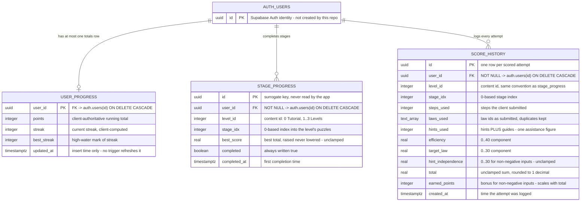
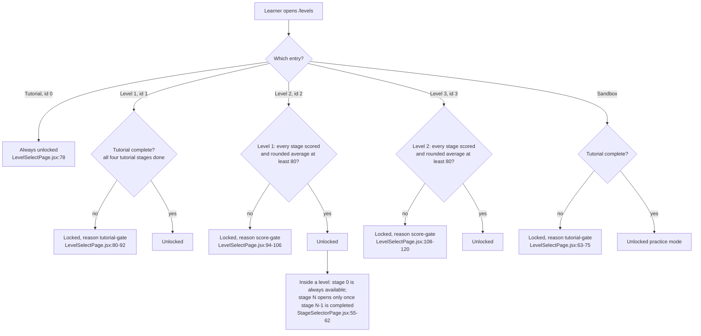
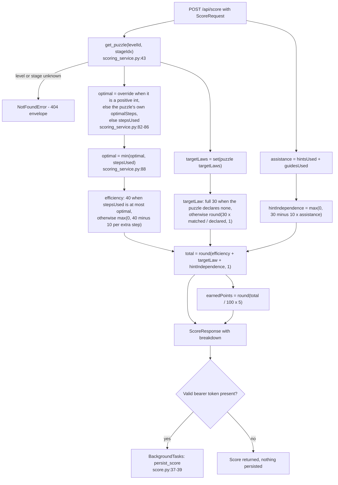

# Diagram input — data & scoring (owner: `data-scoring`)

**What this is:** copy-paste-ready Mermaid source for the three diagrams the data-scoring domain owns,
plus the evidence behind every node and edge so the diagrams teammate can assemble `09-diagrams/DIAGRAMS.md`
without re-deriving anything.
**How to use it:** paste the fences as they are. They are already placed in the docs that own them —
the `erDiagram` in [../03-database/ERD.md](../03-database/ERD.md), both flowcharts in
[../06-reference/scoring-and-rewards.md](../06-reference/scoring-and-rewards.md) — so the diagrams
teammate can lift them verbatim or link to the owning doc instead of duplicating.

**House rules these fences already follow** (checked against `docs/_staging/tools/check-docs.mjs`):
the first non-comment line of every fence is a real Mermaid keyword (`erDiagram`, `flowchart`); labels
avoid `<`, `>`, `&` and inner double quotes so no renderer-specific escaping is needed; `%%` lines are
comments and are ignored by the checker.

---

## 1. Full `erDiagram` — the entire Praxis schema

### Node and edge list (for whoever wants to restyle it)

| Node | Kind | Attribute count | Evidence |
|---|---|---|---|
| `AUTH_USERS` | external entity, `auth` schema | 1 (`id`) | `database/init.sql:8,18,30` |
| `USER_PROGRESS` | table | 5 | `database/init.sql:7-13` |
| `STAGE_PROGRESS` | table | 7 | `database/init.sql:16-25` |
| `SCORE_HISTORY` | table | 13 | `database/init.sql:28-42` |

| Edge | Mermaid | Cardinality meaning | Evidence |
|---|---|---|---|
| learner → totals | `AUTH_USERS \|\|--o\| USER_PROGRESS` | one to zero-or-one: `user_id` is PK **and** FK | `database/init.sql:8` |
| learner → stages | `AUTH_USERS \|\|--o{ STAGE_PROGRESS` | one to zero-or-more, capped at one row per `(level_id, stage_idx)` by the UNIQUE constraint; 40 max today | `database/init.sql:18,24` |
| learner → attempts | `AUTH_USERS \|\|--o{ SCORE_HISTORY` | one to zero-or-more, unbounded (one row per completion) | `database/init.sql:30` |

| Deliberate omission | Why |
|---|---|
| `STAGE_PROGRESS → SCORE_HISTORY` | **No FK exists.** They correlate on `(user_id, level_id, stage_idx)` and are written by the same function (`backend/services/progress_service.py:110-122`), but nothing enforces it. Do not draw a crow's foot between them. |
| Any content entity (level, puzzle, law) | Content is JSON, not a table — `content/levels.json` (4 levels, 40 puzzles), `content/laws.json` (10 laws), served from disk with `lru_cache` (`backend/repositories/content_repository.py:16,34-43`). |
| An "owns their rows" edge for RLS | The policies are `FOR ALL USING (true)` with no `auth.uid()` predicate (`database/init.sql:56-58`), so no ownership constraint exists to draw. |

### Attribute conventions used above

- Types are single tokens because Mermaid restricts attribute types: `uuid`, `integer`, `real`,
  `boolean`, `timestamptz`, and `text_array` standing in for PostgreSQL `TEXT[]`.
- `PK` / `FK` markers are the real keys; there is no `UK` marker even though
  `UNIQUE(user_id, level_id, stage_idx)` exists, because Mermaid has no place to attach a
  table-level constraint. Anyone who needs it should put it in the caption: *"`STAGE_PROGRESS` is
  unique on `(user_id, level_id, stage_idx)` — `database/init.sql:24`."*

---

## 2. Level-unlock flowchart

### Node and edge list

| Node | Meaning | Evidence |
|---|---|---|
| `S` | Entry point: the level carousel at `/levels`. | `frontend/src/pages/LevelSelectPage.jsx:37-51` |
| `T1` | Tutorial (content id 0) needs no prerequisite. | `frontend/src/pages/LevelSelectPage.jsx:78` |
| `U1 → OK1 / L1` | Level 1 requires the whole Tutorial: all four `TUTORIAL.stageIndexes` present in `stageProgress["0"]`. | `frontend/src/pages/LevelSelectPage.jsx:80-92`; `frontend/src/config/gameRules.js:82-85`; `frontend/src/state/progressStore.js:330-335` |
| `V2 → OK2 / L2` | Level 2 requires `getLevelProgress(1, 12).unlocked`. | `frontend/src/pages/LevelSelectPage.jsx:94-106` |
| `V3 → OK3 / L3` | Level 3 requires `getLevelProgress(2, 12).unlocked`. | `frontend/src/pages/LevelSelectPage.jsx:108-120` |
| `U4 → OK4 / L4` | Sandbox mode requires the whole Tutorial too. | `frontend/src/pages/LevelSelectPage.jsx:63-75` |
| `ST` | Stage-level gating inside a level: `idx === 0 || completedSet.has(idx - 1)`. | `frontend/src/pages/StageSelectorPage.jsx:55-62` |

`unlocked` itself is `allDone && avgScore >= 80`, where `avgScore` is
`Math.round(sum of non-null scores / totalStages)` and `allDone` counts non-null scores
(`frontend/src/state/progressStore.js:291-313`, threshold at
`frontend/src/config/gameRules.js:49`). Two caption-worthy subtleties for the assembled diagram:

1. The average divides by **total stages** (4 for the Tutorial, 12 for Levels 1–3 from the API's
   `puzzleCount`), so unfinished stages count as zero (`backend/repositories/content_repository.py:54`).
2. The comparison is `>= 80` **after** `Math.round`, so a true 79.5 passes.

> **Do not present this as enforced.** It is a rendering rule in the SPA. `GET /api/levels/{id}` has
> no auth dependency (`backend/api/routes/levels.py:24-27`) and no server state records an unlock, so
> a learner with the URL can open any stage. Worth a footnote if the diagram is described as a
> "gate".

---

## 3. Scoring-breakdown flowchart

### Node and edge list

| Node | Code it represents | Evidence |
|---|---|---|
| `A` | `ScoreRequest`: `levelId`, `stageIdx`, `stepsUsed`, `lawsUsed[]`, `hintsUsed`, `guidesUsed`, `optimalSteps`. | `backend/api/schemas/score.py:13-20` |
| `B → C` | `content_service.get_puzzle` raises `NotFoundError` for an unknown level or an out-of-range stage; the API renders the 404 envelope. | `backend/services/scoring_service.py:43`; `backend/services/content_service.py:32-42` |
| `D` | Override wins only when it is a positive integer; otherwise the puzzle's `optimalSteps`; otherwise `stepsUsed`. | `backend/services/scoring_service.py:80-86` |
| `E` | The clamp: `min(optimal, steps_used)`. This is the non-obvious rule — a shorter-than-recorded solution lowers the bar. | `backend/services/scoring_service.py:87-88` |
| `F` | `efficiency = 40 if steps_used <= optimal else max(0, 40 - over*10)`. | `backend/services/scoring_service.py:91-96` |
| `H` | Empty declared set → full 30; else `round(30 * matched / declared, 1)`. | `backend/services/scoring_service.py:99-107` |
| `I` | `assistance = (hints_used or 0) + (guides_used or 0)` — hints and Guides share one figure. | `backend/services/scoring_service.py:51` |
| `J` | `hint_independence = max(0, 30 - assistance * 10)`. | `backend/services/scoring_service.py:110-115` |
| `K` | `total = round(efficiency + target_law + hint_independence, 1)`. | `backend/services/scoring_service.py:54` |
| `L` | `earned_points = round((total / 100) * 5)` — **Python `round` is half-to-even**, see the caption below. | `backend/services/scoring_service.py:55` |
| `M` | The envelope payload: `efficiency`, `targetLaw`, `hintIndependence`, `total`, `earnedPoints`, `breakdown`. | `backend/api/routes/score.py:41-48`; `backend/api/schemas/score.py:23-29` |
| `N → O` | Persistence happens only for authenticated callers, in a `BackgroundTasks` job. | `backend/api/routes/score.py:37-39`; `backend/services/progress_service.py:87-108` |

### Caption material the assembler needs (do not drop these)

1. **`optimal` is clamped** (`E`). The `optimalSteps` echoed in the response is not always the value
   authored in `content/levels.json`; worked example W2 returns `2` where the file declares `3`.
2. **The empty-target-laws branch** (`H`) is unreachable through the shipped content: all 40 puzzles
   declare at least one target law. It is a guard for future/generated content, demonstrated by a
   stubbed lookup.
3. **`earnedPoints` rounding diverges across the wire** (`L`): the backend's Python `round()` is
   half-to-even, the frontend mirror's `Math.round` is half-up. Totals of 90.0, 50.0 and 10.0 produce
   `4/5`, `2/3` and `0/1` respectively. Register row **D21**. Source: `backend/services/scoring_service.py:55`
   vs `frontend/src/engine/scoring.js:80`.
4. **Everything on the left of `K` is client-claimed** except `targetLaws`. `stepsUsed`, `lawsUsed`
   and the assistance counters are all submitted by the browser, and the algebra engine is
   frontend-only, so the server cannot verify a derivation. Register-worthy limitation, documented in
   [../06-reference/scoring-and-rewards.md](../06-reference/scoring-and-rewards.md) § Limits.

---

## 4. Optional fourth diagram (only if the assembler needs it): the write paths

Not required by the brief, but the data-scoring domain also owns the answer to "which code writes
which table", which pair naturally with the `erDiagram`:

| Trigger | Function | Tables | Evidence |
|---|---|---|---|
| `POST /api/progress/save` | `progress_service.save_progress` | `user_progress` upsert + one `stage_progress` upsert per completed stage | `backend/api/routes/progress.py:26-41`; `backend/services/progress_service.py:53-84` |
| `POST /api/score` (bearer present) | `progress_service.persist_score` (background) | `score_history` insert, then `stage_progress` upsert when `total > current_best` | `backend/api/routes/score.py:37-39`; `backend/services/progress_service.py:87-122` |
| `GET /api/progress` | `progress_service.load_progress` → `build_progress` | reads `user_progress` + `stage_progress`; never reads `score_history` | `backend/repositories/progress_repository.py:29-42`; `backend/services/progress_service.py:18-50` |

A ready-made flowchart of exactly this lives in [../03-database/ERD.md](../03-database/ERD.md) under
"Life of a row" — lift it verbatim if a fourth diagram is wanted, or link to it.

## 5. Verification status of the diagrams

| Diagram | Verified how |
|---|---|
| `erDiagram` | Every entity, attribute and key read from `database/init.sql:7-42` (58-line file read in full). Cardinalities derived from the PK/FK/UNIQUE declarations. Attribute types cross-checked against the DDL. |
| Level-unlock flowchart | Every edge read from `frontend/src/pages/LevelSelectPage.jsx:60-123` and `frontend/src/pages/StageSelectorPage.jsx:55-62`; the `unlocked` predicate from `frontend/src/state/progressStore.js:291-313`. |
| Scoring-breakdown flowchart | Every node read from `backend/services/scoring_service.py:32-115`, `backend/api/routes/score.py:20-49` and `backend/api/schemas/score.py:13-29`; all arithmetic confirmed by executing the real scorer (eight worked examples, see `claims-data-scoring.md`). |
| Mermaid syntax | Fence heads verified against the keyword list in `docs/_staging/tools/check-docs.mjs:63-68`. **Not rendered** — no Mermaid CLI in this workspace, so the assembler should eyeball the render once when merging into `09-diagrams/DIAGRAMS.md`. |
