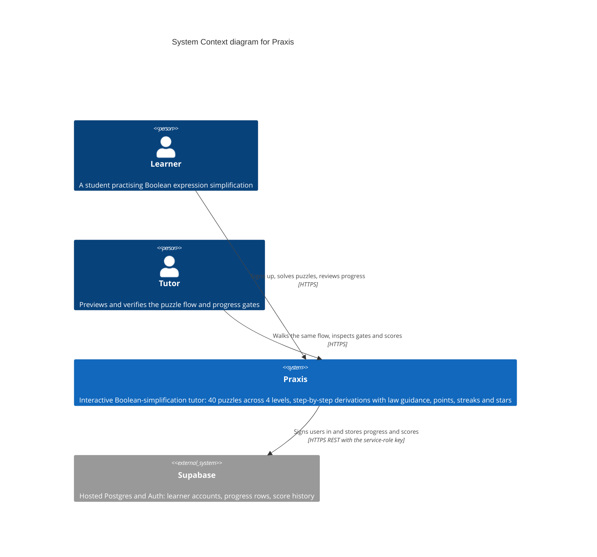
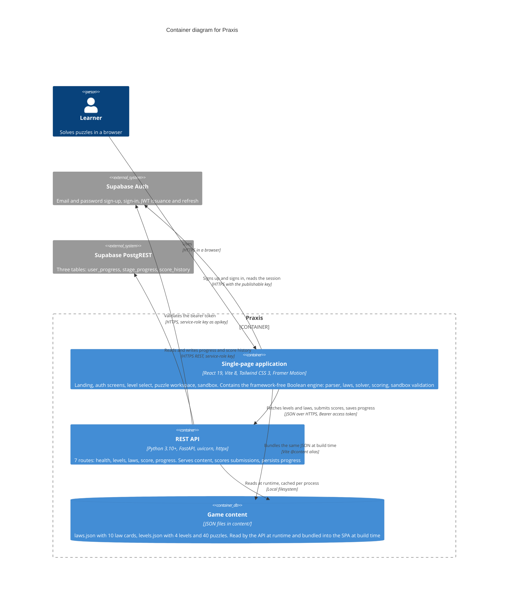
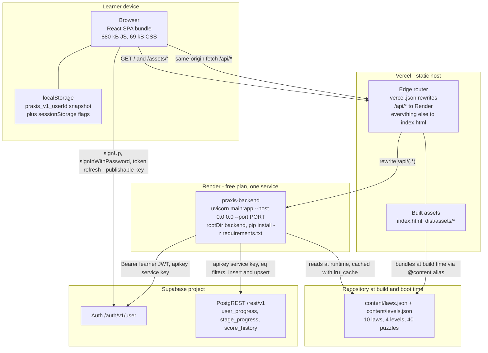
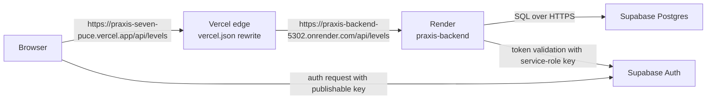

# Diagram input — devops-ops (task-4)

Mermaid-ready source for the three diagrams owned by this writer's domain: **C4 Level 1 (system
context)**, **C4 Level 2 (containers)** and the **deployment diagram**. The diagrams teammate owns the
final `docs/09-diagrams/DIAGRAMS.md`; this file supplies the source and the evidence behind every node
and edge.

All facts below are verified against commit `3838343`, with the evidence quoted as `file:line`. The
three fences are copy-pasteable as-is: each begins with a recognised Mermaid diagram keyword
(`C4Context`, `C4Container`, `flowchart`).

---

## 1. C4 Level 1 — system context

**What it shows:** who uses Praxis and which external systems it depends on. One software system
(Praxis), two kinds of human actor, and the Supabase project that supplies identity and storage.
Hosting platforms deliberately do **not** appear here — they belong in the deployment diagram (§3).

### Node and edge evidence

| Element | Evidence |
|---|---|
| Learner is the human actor | the whole UI is puzzle-centric; onboarding is a tutorial gate, `frontend/src/components/TutorialGate.jsx:10-33` |
| Praxis is one system in context | `backend/main.py:25` (`FastAPI(title="Praxis API", version="1.0.0")`) plus the SPA in `frontend/` |
| 40 puzzles / 4 levels | `content/levels.json`: 4 levels with `[4, 12, 12, 12]` puzzles (`read` + counted) |
| Supabase is external | `backend/supabase_client.py:22-31` (`{url}/rest/v1`, `apikey` header) and `:87-98` (`{url}/auth/v1/user`) |
| Supabase owns accounts | `database/init.sql:8`, `:18`, `:30` reference `auth.users(id)` |
| Sign-in is a direct learner → Supabase Auth call | `frontend/src/services/authActions.js:9-33` calls `supabase.auth.signInWithPassword` / `signUp` / `signOut` |
| The backend validates the learner's token against Supabase | `backend/core/security.py:17-35` |

**Deliberate omissions:** no `POST /sandbox/validate` (there is no such endpoint — the sandbox lives
entirely in the browser, `frontend/src/engine/sandbox/*`), and no Better Auth server (dead remnant,
`frontend/vite.config.js:24-28`).

---

## 2. C4 Level 2 — containers

**What it shows:** the deployable/runnable pieces inside Praxis and how they talk. The Boolean engine
is **not** drawn as a separate container: it is a framework-free module compiled into the SPA bundle
(`frontend/src/engine/`), and drawing it as its own container would misstate the architecture. It is
described inside the SPA container and is the subject of the engine-teammate's component diagram.

### Node and edge evidence

| Element / edge | Evidence |
|---|---|
| SPA stack | `frontend/package.json:13-19` (React 19.2.6, react-router-dom 7, framer-motion 12, @supabase/supabase-js 2.106.1), `frontend/package.json:32` (tailwindcss 3.4.19) |
| Engine is inside the SPA, not a service | `frontend/src/engine/` is pure JS; the backend never re-implements algebra (`backend/services/scoring_service.py` scores submitted numbers) |
| API routes | `backend/main.py:79-83`; exactly 7 paths in `/openapi.json` (measured) |
| API serves content | `backend/api/routes/levels.py`, `backend/api/routes/laws.py` → `backend/services/content_service.py` → `backend/repositories/content_repository.py:34-43` |
| Content JSON is shared by both consumers | `frontend/vite.config.js:16` (`@content` alias) and `backend/repositories/content_repository.py:16` (`CONTENT_DIR`) |
| Content volume | `content/laws.json` 10 cards; `content/levels.json` 4 levels, 40 puzzles (counted) |
| SPA → Auth | `frontend/src/services/supabaseClient.js:5-10` + `frontend/src/services/authActions.js:9-33` |
| SPA → API with bearer token | `frontend/src/services/apiClient.js:27-31`, `:56-67` |
| API → Auth validation | `backend/supabase_client.py:87-98`, `backend/core/security.py:27-32` |
| API → PostgREST | `backend/repositories/progress_repository.py:29-73`; tables from `database/init.sql:7-42` |
| Service-role key on both API edges | `backend/supabase_client.py:26-31` (`apikey` + `Authorization: Bearer <key>`) |

---

## 3. Deployment diagram

**What it shows:** the two hosting platforms, the one-process backend, the static SPA, the routing
between them, and the direct browser → Supabase Auth path. Verified facts that must survive the
diagrams teammate's edit:

| Fact | Evidence |
|---|---|
| Render hosts **only** the backend, as one free-plan Python web service | `render.yaml:1-8` |
| Vercel hosts the SPA; `/api/*` is rewritten to the Render host | `frontend/vercel.json:3-6` |
| Vercel serves `index.html` for every other path | `frontend/vercel.json:7-10` |
| Supabase hosts Postgres + Auth | `backend/supabase_client.py:24`, `:89` |
| Both env-file layers are required locally, and the backend's is required at import | `backend/config/settings.py:60-61`, `:74-75` |
| `content/` must ship beside `backend/` | `backend/repositories/content_repository.py:16` |

### Node and edge notes for the diagrams teammate

| Node / edge | Note |
|---|---|
| `browser --- storage` | localStorage holds the progress snapshot under `praxis_v1_<userId>` (`frontend/src/config/storageKeys.js:10`); sessionStorage holds four session flags (`:16-25`) |
| `browser --> auth` | This is the edge people miss: sign-in goes **straight from the browser to Supabase**, not through the backend. The backend only validates the resulting JWT |
| `edge --> api` | The rewrite target is hardcoded: `https://praxis-backend-5302.onrender.com/api/$1` (`frontend/vercel.json:5`). Renaming the Render service breaks production routing |
| `api` node | One process, one free instance; it sleeps when idle, so the first request after a quiet period pays a cold start (measured 22.08 s) |
| `contentJson` node | Deliberately drawn in the repository block because it is the same bytes with two consumers — the API reads it at runtime and the SPA bundles it at build time. If the diagrams teammate prefers C4 purity, this becomes a note rather than a node |
| Missing on purpose | No sidecar, no cache tier, no queue, no Docker image, no `auth-server` on port 3001, no `/api/sandbox/validate` endpoint |

### Optional variant — the routing path only

If the full diagram is too dense for one figure, this smaller one shows just the production request
path and is a drop-in replacement for the flowchart's centre:

---

## 4. Conventions for the final diagrams

1. **Terminology:** *learner* / *tutor*, *literal*, *term*, *product*, *sum*, *law id* (for example
   `absorption`, `demorgan-and`), *step*, *intermediate state*, *AST*, *engine contract*. The full
   table is in `docs/_staging/GROUND-TRUTH.md` §8.6.
2. **No secrets.** Every credential is a placeholder (`<service-role-key>`, `<anon-key>`) or a
   description ("the service-role key").
3. **Fact vs platform.** `render.yaml`, `frontend/vercel.json` and the code are facts; Vercel's
   dashboard settings (Root Directory `frontend`, Build `npm run build`) are **not in the repository**
   and are documented as expected configuration, not as verified values.
4. **Health probe.** If a diagram mentions monitoring, the probe is `GET /`, which is deliberately
   plain JSON (`backend/api/routes/health.py:1-3`, `:15-18`) — note that `render.yaml` does not
   currently map it to a `healthCheckPath`.
5. **Numbering trap.** Tutorial = content level **0**; Levels 1–3 are content ids 1–3. A diagram that
   shows "Level 1" as id 0 would contradict `content/levels.json` and
   `frontend/src/config/gameRules.js:83`.
