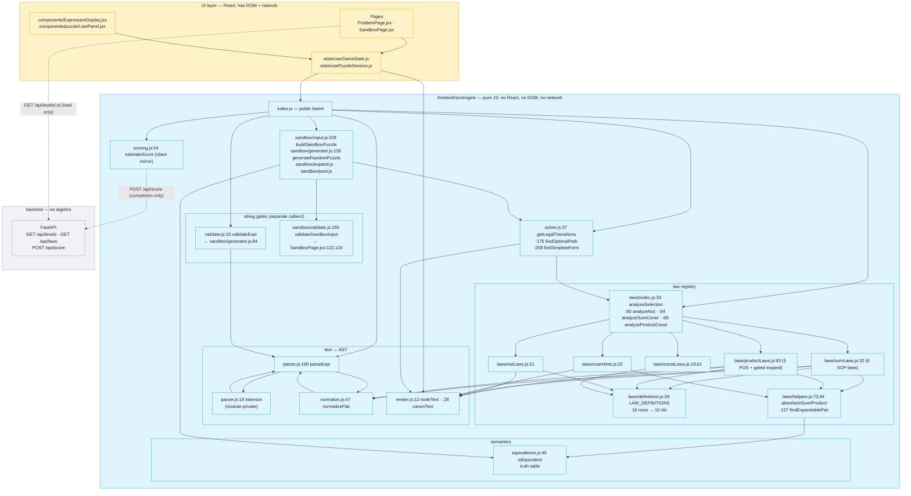
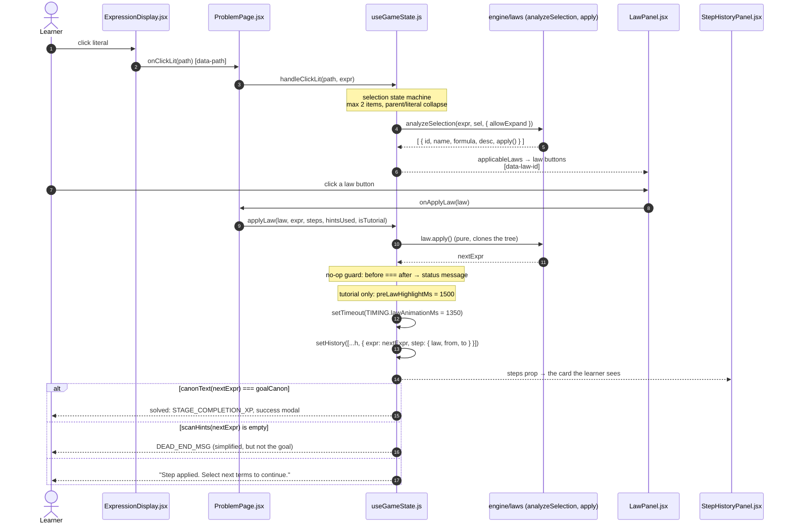
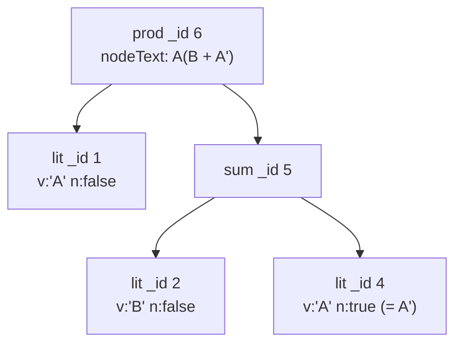

# Diagram input — engine & guides (`engine-guides`)

**For the diagrams teammate.** Two required diagrams for the engine domain, plus one bonus, as
copy-pasteable `mermaid` fences with the evidence for every node and edge. Verified against commit
`3838343` by reading and running the code.

**Three accuracy rules that matter for these diagrams.**

1. **There is no `POST /sandbox/validate` endpoint.** A step never leaves the browser. The only
   network calls in the puzzle flow are `GET /api/levels/{id}` on load and `POST /api/score` on
   completion. Do not draw a server box in the step-submission diagram (this corrects the task
   brief's requested sequence; see GROUND-TRUTH §7-D1 and D23).
2. **Step validity is structural, not provational.** Completion is canonical-text equality
   (`frontend/src/state/useGameState.js:437`); dead-end detection is an empty `scanHints`
   (`:61`, `:504`, `:562`). `isEquivalent` is **not** on the per-step path at all — its only
   consumers are `laws/helpers.js:77,98`, `sandbox/generator.js:94` and `sandbox/input.js:161`.
3. **Two different string gates exist** and they must not be merged into one "validator" node:
   `validateExpr` (`engine/validate.js:16`) guards *generated* sandbox expressions
   (`sandbox/generator.js:84`), while `validateSandboxInput`
   (`engine/sandbox/validate.js:155`) is what the sandbox screen calls
   (`pages/SandboxPage.jsx:122` debounced for feedback, `:124` on the raw text for the button) and
   what `buildSandboxPuzzle` re-runs internally (`sandbox/input.js:113`).

---

## 1. Engine component diagram (required)

**Purpose.** Show what the engine is made of and which way the arrows really point — including that
`parseExpr` normalises internally and that there is no server in this picture.



### Precise node/edge list (if the teammate prefers to lay it out by hand)

| Node | Label | Evidence |
|---|---|---|
| `parseExpr` | text → AST | `frontend/src/engine/parser.js:160-166` |
| `tokenize` | private tokenizer, silently drops unknown chars | `parser.js:11`, `:18-56` |
| `normalizeFlat` | flatten-only canonicalisation, called **inside** `parseExpr` | `parser.js:75`; `normalize.js:47-68` |
| `normalize` | full simplification, called **only** by law `apply()` bodies | `notLaws.js:39,69,99`; `constLaws.js:53,95`; `sumLaws.js:138,156,201,228,253`; `productLaws.js:144,165,184` |
| `nodeText` / `canonText` | display text / order-independent canonical text | `render.js:12-25`, `:28-46` |
| `validateExpr` | string gate; **caller: generated sandbox expressions only** | `validate.js:16`; caller `sandbox/generator.js:84` |
| `validateSandboxInput` | sandbox gate with product rules and exact messages | `sandbox/validate.js:155-234`; callers `pages/SandboxPage.jsx:122,124`, `sandbox/input.js:113` |
| `isEquivalent` | exhaustive truth table | `equivalence.js:45-57` |
| `analyzeSelection` / `analyzeNot` / `analyzeSumConst` / `analyzeProductConst` | the four law entry points | `laws/index.js:33,60,64,68` |
| `scanHints` | whole-expression hint scan (Hint, Guide, dead-end) | `laws/scanHints.js:22-134` |
| `LAW_DEFINITIONS` | 16 rows → 10 distinct ids, 16 `name`+`form` keys (15 display names: `Identity Law` exists for `sum` and for `product`) | `laws/definitions.js:29-54` |
| `scanHints` token vocabulary | emits four hint tokens over the 40 authored expressions: `absorption`, `distributive`, `demorgan`, `idempotent` — note the un-suffixed **`demorgan`**, which is neither card id | `laws/scanHints.js:38`; `state/hintText.js:39-42` |
| `sumLaws` / `productLaws` / `notLaws` / `constLaws` | the builders | `sumLaws.js:32`, `productLaws.js:63`, `notLaws.js:21`, `constLaws.js:19,61` |
| `absorbsInSum` / `absorbsInProduct` / `findExpandablePair` | semantic decisions and the gated expand detector | `laws/helpers.js:73,94,127` |
| `getLegalTransitions` / `findOptimalPath` / `findSimplestForm` | BFS over law applications | `solver.js:37,175,258` |
| `estimateScore` | client score mirror (server authoritative) | `scoring.js:54-97` |
| `buildSandboxPuzzle` / `generateRandomPuzzle` | learner input → verified puzzle | `sandbox/input.js:109`, `sandbox/generator.js:139` |
| Backend | serves content, scores numbers — **no algebra** | `backend/main.py:79-83`; routes in `backend/api/routes/` |

**Edges to draw, with their direction of truth**

| From → To | Meaning |
|---|---|
| UI hooks → `engine/index.js` | consumers import the barrel, not deep modules (`index.js:12-13`) |
| `parseExpr` → `tokenize` → `parseExpr` | internal, same module |
| `parseExpr` → `normalizeFlat` | **the parse step normalises; do not draw a separate "normalizer" stage after parsing** |
| law builders → `definitions.defineLaw` | a law's identity comes from one table (`definitions.js:79-84`) |
| builders/scanner → `helpers` → `isEquivalent` | semantic absorption + expand detection |
| `solver` → `analyze*` | BFS enumerates law applications |
| `solver` → `canonText` | states de-duplicated by canonical text (`solver.js:48-50,194`) |
| `buildSandboxPuzzle` → `validateSandboxInput` → `findSimplestForm` → `findOptimalPath` | the sandbox build pipeline (`sandbox/input.js:109-206`) |
| `estimateScore` ⇢ `POST /api/score` | **dashed**: the client estimate is advisory; the server value overwrites it (`usePuzzleSession.js:208-213`) |

## 2. Step-submission sequence diagram (required)

**Purpose.** One learner click, end to end. This is the diagram where a wrong arrow into a server box
would be the most damaging, so it is drawn with the **real** participants only.



**Evidence per step**

| Step | Evidence |
|---|---|
| click carries a path | `components/ExpressionDisplay.jsx:59-60` (`data-path={path}`, `onClickLit(path)`) |
| page wrapper passes the expr snapshot | `pages/ProblemPage.jsx:305-316` |
| selection machine (max 2, parent↔literal collapse, NOT-node reset) | `state/useGameState.js:199-270`, `:272-306`, `:308-348` |
| `analyzeSelection` with the sandbox flag | `state/useGameState.js:156`; flag from `usePuzzleSession.js:84` |
| law buttons carry the law id | `components/puzzle/LawPanel.jsx:126-137, 164-176` (`data-law-id={law.id}`) |
| `applyLaw` purity + no-op guard | `state/useGameState.js:354-373` |
| tutorial pre-highlight 1500 ms | `:450-455`; `config/gameRules.js` `TIMING.preLawHighlightMs` |
| step recorded after 1350 ms | `:423-425, 447`; `TIMING.lawAnimationMs` |
| step history card | `components/puzzle/StepHistoryPanel.jsx:50-84` (`s.law`, `s.from`, `s.to`) |
| completion branch | `:437-443` |
| dead-end branch | `:53-74`; `state/hintText.js:10` `DEAD_END_MSG` |
| **no network in this path** | no `fetch`/`apiRequest` under `engine/` or `useGameState.js`; the only API calls are `usePuzzleSession.js:111` (`GET /api/levels/:id`) and `submitScore` at completion (`:200`, `:237`) |

**Correction box for the diagram caption** (please include it): the task brief asked for a sequence
with a "step submitted → `POST /sandbox/validate`" hop. **That endpoint does not exist.** The step is
validated by construction — the learner picks a law and the law's own `apply()` produces the next AST
— and success is decided by comparing canonical text with the goal's canonical text
(`useGameState.js:437`). Soundness comes from the law implementations, guarded by
`frontend/src/engine/__tests__/law-soundness.property.test.js`.

## 3. Bonus: the sandbox input path (different gate, different flow)

Useful precisely because it is *not* the graded flow, and it is where the two string gates live
side by side.

```mermaid
flowchart LR
    T["Learner types text"] --> R["SandboxPage.jsx raw"]
    R -->|"debounce 300 ms<br/>TIMING.sandboxValidationDebounceMs"| DB["debouncedRaw"]
    DB --> LV["validateSandboxInput (live)<br/>SandboxPage.jsx:122 → feedback text"]
    R --> CU["validateSandboxInput (raw)<br/>SandboxPage.jsx:124 → enables Play"]
    CU -->|"Play"| BP["buildSandboxPuzzle<br/>sandbox/input.js:109"]
    BP --> VG["validateSandboxInput again<br/>input.js:113"]
    VG --> RT["round-trip guards<br/>input.js:127-149"]
    RT --> SF["findSimplestForm + findOptimalPath<br/>allowExpand: true"]
    SF --> EQ{"isEquivalent(start, terminal)?"}
    EQ -->|no| REF["not-simplifiable"]
    EQ -->|yes| SHIP["shipsCleanly(): goal terminal<br/>+ solution replays through the UI move set"]
    SHIP -->|ok| PZ["puzzle { expr, goal, optimalSteps,<br/>solutionPath, allowExpand: true }"]
    SHIP -->|no| REF
    PZ --> ROUTE["navigate to /sandbox/play<br/>route state + sessionStorage"]
```



| Part | Evidence |
|---|---|
| debounce 300 ms | `pages/SandboxPage.jsx:117-120`; `config/gameRules.js` `TIMING.sandboxValidationDebounceMs` |
| live vs current verdict | `pages/SandboxPage.jsx:122-126` |
| build on submit | `pages/SandboxPage.jsx:171` |
| re-validation inside the builder | `sandbox/input.js:113-116` |
| character round-trip guard | `sandbox/input.js:130-149` |
| equivalence guard | `sandbox/input.js:161-163` |
| workspace move-set self-check | `sandbox/input.js:59-93, 180-182` |
| puzzle hand-off | `sandbox/input.js:187-205`; `components/puzzle/sandboxPuzzle.js:46-56,81+` |
| no server anywhere | there is no `/api/sandbox/*` route in `backend/api/routes/` |

## 4. Bonus: the AST shape used in the walkthrough



Evidence: real `JSON.stringify(parseExpr("A(B + A')"))` output; node shapes from
`frontend/src/engine/node.js:19-23`; `_id` is a per-process counter (`node.js:15-17`), so the numbers
are only reproducible when the parse is the first engine call in the process.

**Verification for the teammate:** every line above can be re-checked with

```bash
cd frontend && node --input-type=module -e "
import { parseExpr } from './src/engine/parser.js'
import { nodeText, canonText, analyzeSelection, scanHints } from './src/engine/index.js'
const t = parseExpr(\"A(B + A')\")
console.log(JSON.stringify(t, null, 1))
console.log(nodeText(t), canonText(t))
console.log(scanHints(t, 'R'), scanHints(t, 'R', { allowExpand: true }).map(h => h.law))
"
```

Expected (verified): the AST above, `A(B + A') A(A'+B)`, `[]`, `['distributive-expand']`.
