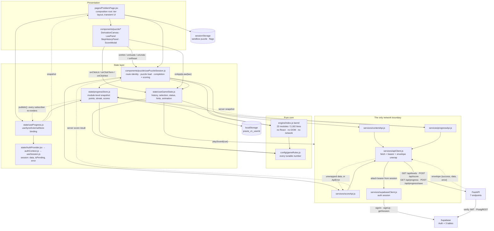
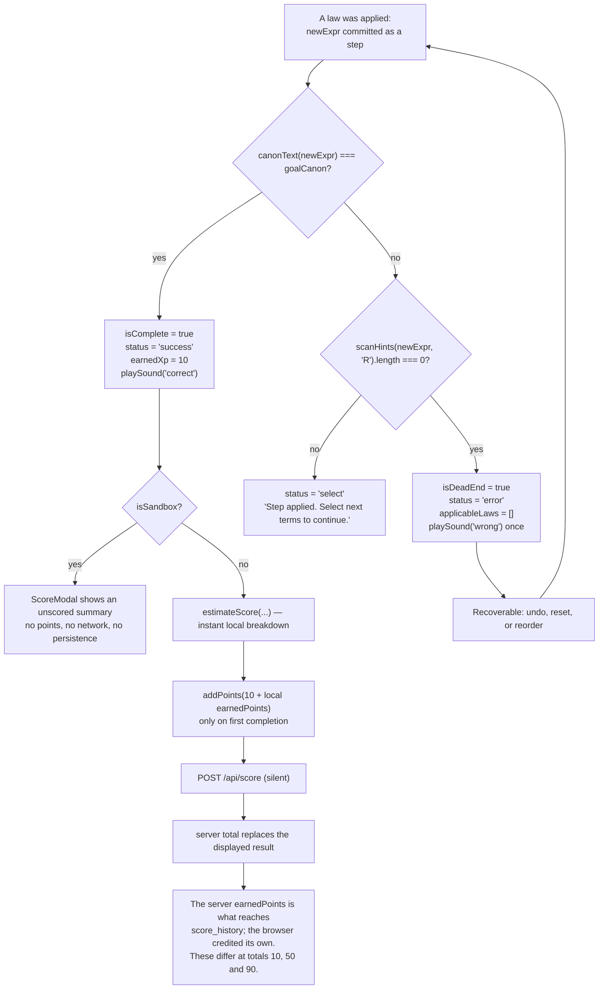

# Diagram input — product/architecture domain

**Owner:** `product-arch` (task-5). **Consumer:** the diagrams teammate, who assembles the
final `docs/09-diagrams/DIAGRAMS.md`.

**What this is.** Copy-pasteable Mermaid source for the two diagrams in this writer's domain:

1. **The puzzle-session state diagram** — the full lifecycle of one puzzle attempt, including
   the dead-end and reset transitions.
2. **The frontend data-flow diagram** — component → hook → context → API client → backend →
   response → store update → re-render.

Every node and every edge below was derived from source, and the evidence column names the
`file:line` that justifies it. Nothing here is invented for the drawing.

**Conventions used.** Terminology follows the project glossary (`literal`, `term`, `clause`,
`step`, `intermediate state`, `step-locking`, `engine contract`, `tutor`/`learner`). Node labels
are short; the detail lives in the notes under each diagram so the final assembled figure stays
legible.

---

## Contents

1. [Diagram 1 — puzzle-session state diagram](#diagram-1--puzzle-session-state-diagram)
2. [Diagram 2 — frontend data-flow diagram](#diagram-2--frontend-data-flow-diagram)
3. [Diagram 3 (bonus) — the completion decision, in detail](#diagram-3-bonus--the-completion-decision-in-detail)
4. [Evidence table for every edge](#evidence-table-for-every-edge)
5. [Caption text for the diagrams writer](#caption-text-for-the-diagrams-writer)

---

## Diagram 1 — puzzle-session state diagram

**What it shows.** One attempt at one puzzle: the route loads the puzzle, the learner makes
steps, the run either reaches the goal, dead-ends, or is reset — and, for a graded stage only,
the completion is scored and the progress is persisted.

**Scope note for the diagrams writer.** This is the *session* state, not the *route* state.
`isSandbox` is decided once from the absence of route params and never changes during a session,
so the sandbox is drawn as a parallel branch off the same machine rather than as a second
machine.

```mermaid
stateDiagram-v2
    [*] --> Loading

    Loading --> Active : puzzle parsed, goal canonicalised, optimal path solved
    Loading --> Redirected : level or stage does not exist

    state Active {
        [*] --> Selecting
        Selecting --> LawsOffered : two items selected, laws apply
        Selecting --> Rejected : two items selected, no law applies
        Selecting --> LawsOffered : one negated node clicked (De Morgan / Double Negation)
        Rejected --> Selecting : selection changed
        LawsOffered --> Selecting : selection cleared or law unchanged
    }

    Active --> PreLawHighlight : applyLaw on a tutorial stage below stage 3
    PreLawHighlight --> Animating : after 1500 ms
    Active --> Animating : applyLaw outside the tutorial
    Animating --> Active : step landed, not the goal, moves remain
    Animating --> DeadEnd : step landed, no law applies anywhere
    Animating --> Complete : canonical text equals the goal
    Animating --> Active : law changed nothing, no step recorded

    Active --> HintShown : Hint pressed
    HintShown --> Active : auto-dismiss after 6000 ms
    Active --> Guided : Guide activated and points available
    Guided --> LawsOffered : two paths pre-selected, laws computed
    Guided --> Selecting : one path highlighted, learner clicks it
    Active --> Active : term or factor reordered (no step recorded)
    DeadEnd --> Active : undo, reset, or reorder

    Complete --> ScoreShown : graded - local estimate, then the server result
    Complete --> ScoreShown : sandbox - unscored attempt summary
    ScoreShown --> Active : Try Again or reset
    ScoreShown --> NextStage : Next Stage
    ScoreShown --> Stages : Back to Stages

    state GradedProgress as "Graded: progress written once, on first completion"
    ScoreShown --> GradedProgress : addPoints, completeStage, saveSolution, saveScore
    GradedProgress --> Persisted : debounced POST /api/progress/save (signed in)
    GradedProgress --> ScoreShown : guest - localStorage only

    NextStage --> [*]
    Stages --> [*]
    Redirected --> [*]

    note right of DeadEnd
        Dead end = scanHints returns an empty list.
        It is a statement about the implemented law
        registry, not a proof of unsolvability.
    end note

    note right of Complete
        The win test is canonical-text equality,
        not truth-table equivalence.
    end note

    note right of GradedProgress
        The sandbox branch never reaches this state:
        no points, no stars, no persisted progress.
    end note
```

### Reading notes for the assembler

- **`Active` is a composite state**, because selecting → offering laws → rejecting is a
  *sub-cycle* that happens many times per puzzle without leaving the state. Collapsing it makes
  the diagram much shorter; expanding it makes the rejection path visible. If both are wanted,
  the composite can be split into a second figure.
- **`Animating` is the only state that can reach `Complete` or `DeadEnd`.** Everything else is
  reversible. This is what "step-locking" means in this product: a step is committed only after
  the animation, and only as an append.
- **The three terminal exits from `ScoreShown`** are the three actions the modal offers
  (`ScoreModal.jsx:191-226`).
- **`Redirected` exists** because two different failures leave the workspace: an out-of-range
  stage navigates back to the stage list, and a fetch failure navigates to the level carousel
  (`usePuzzleSession.js:118`, `:123`).

## Diagram 2 — frontend data-flow diagram

**What it shows.** How one learner interaction travels: a component emits an event, a state hook
decides, the engine computes, a service talks to the network, the response lands in the shared
store, and every subscribed screen re-renders.

**Scope note.** This is the **read/write** path, not the render tree. The point of the diagram is
to show that there is exactly one network boundary, exactly one progress store, and that the
engine is a pure leaf.



### Reading notes for the assembler

- **Solid arrows are calls; dashed arrows are returns.** The one exception worth keeping is
  `playSound`, drawn as a call because it is a side effect rather than data flow — consider
  dropping it from the final figure if it clutters the main story.
- **`engine/` has exactly two inbound edges**, from `useGameState` and `usePuzzleSession`. That
  is the whole coupling between the UI and the algebra, and it is why the engine can be tested
  in plain Node.
- **`services/apiClient.js` is a chokepoint.** Every arrow that leaves the browser for the API
  passes through it. If the figure needs to be simplified, collapse `contentApi`, `scoreApi` and
  `progressApi` into one node labelled "services/*Api.js" and keep `apiClient` separate — the
  distinction between the two layers is the architectural point.
- **`progressStore` is the single write point for progress.** `useProgress` is a thin binding,
  not a second store.
- **The auth path is deliberately separate** from the API path: the SPA talks to Supabase Auth
  directly, and the API independently verifies the token. Two arrows pointing at Supabase from
  two different containers is correct, not a drawing error.
- **The re-render loop is the return leg.** `publish()` notifies every subscriber; each
  `useProgress()` consumer re-reads the snapshot through `useSyncExternalStore`. The diagram
  shows this as one dashed edge back to `uProgress` because React fans it out — drawing one edge
  per consuming screen would add five arrows for no information.

## Diagram 3 (bonus) — the completion decision, in detail

Optional, but it is the diagram most likely to prevent a future defect: it makes visible that the
win test and the dead-end test share one comparison, and that the truth-table checker is
**not** on this path.



**Evidence.** Win test `frontend/src/state/useGameState.js:437` and goal canonicalisation `:83`;
dead-end test `:53-68` with the scan at `:61`; success branch `:438-443`; step commit `:425`;
sandbox short-circuit `frontend/src/components/puzzle/usePuzzleSession.js:185-188`; local
estimate `:173`; credit `:190-192`; submission `:200-213`; server persistence
`backend/services/progress_service.py:87-127`.

**Why this diagram earns its place.** It answers three questions that have already caused
confusion in this project: why a puzzle can fail to complete even when the answer is logically
right (canonical text, not `isEquivalent`); why a sandbox solve awards nothing (the branch
returns before any credit); and why the learner's point balance can differ from the ledger
(two authors of one number).

## Evidence table for every edge

| Diagram | Edge / node | Evidence |
|---|---|---|
| State | `Loading → Active` | `frontend/src/state/useGameState.js:76-145` (`loadPuzzle`), `frontend/src/pages/ProblemPage.jsx:338-347` (spinner while `!level \|\| !puzzle`) |
| State | `Loading → Redirected` | `frontend/src/components/puzzle/usePuzzleSession.js:118` (bad stage), `:123` (fetch failure) |
| State | `Selecting → LawsOffered` (two items) | `useGameState.js:155-164` |
| State | `Selecting → Rejected` (no law) | `useGameState.js:162-164` — "No simplification for these selected items" |
| State | `Selecting → LawsOffered` (one negated node) | `useGameState.js:172-179` |
| State | `Active → PreLawHighlight`, 1500 ms | `useGameState.js:450-455`, `frontend/src/config/gameRules.js:61` |
| State | `Active → Animating`, 1350 ms | `useGameState.js:384-447`, `gameRules.js:59` |
| State | `Animating → Active` (step landed) | `useGameState.js:445` — `syncDeadEndStatus(newExpr, 'Step applied…')` |
| State | `Animating → DeadEnd` | `useGameState.js:61-68` |
| State | `Animating → Complete` | `useGameState.js:437-443` |
| State | `Animating → Active` (law changed nothing) | `useGameState.js:363-373` — no step, message only |
| State | `Active → HintShown`, 6000 ms auto-dismiss | `useGameState.js:501-520`, `frontend/src/pages/ProblemPage.jsx:228-236`, `gameRules.js:66` |
| State | `Active → Guided` | `useGameState.js:560-603`, `frontend/src/pages/ProblemPage.jsx:263-273` (cost gate) |
| State | `Guided → LawsOffered` / `Selecting` | `useGameState.js:578-602` (one path vs two) |
| State | `Active → Active` (reorder, no step) | `useGameState.js:522-558` |
| State | `DeadEnd → Active` (undo / reset / reorder) | `useGameState.js:461-485`, `:487-499`, `:555-557` |
| State | `Complete → ScoreShown` (graded and sandbox) | `usePuzzleSession.js:216` (200 ms), `:186` (sandbox) |
| State | `ScoreShown → GradedProgress` | `usePuzzleSession.js:190-197` |
| State | `GradedProgress → Persisted` | `frontend/src/state/progressStore.js:87-94` (debounced), `frontend/src/services/progressApi.js:19-24` |
| State | `ScoreShown → Active` (Try Again) | `frontend/src/components/puzzle/ScoreModal.jsx:216-226` |
| Data | component → `useGameState` | `frontend/src/pages/ProblemPage.jsx:305-322` |
| Data | `usePuzzleSession → useGameState` | `usePuzzleSession.js:86-100` |
| Data | `useGameState → engine` | `frontend/src/state/useGameState.js:2-6` (`engine/index.js` barrel) |
| Data | `engine → gameRules` | `frontend/src/engine/scoring.js:18`, `frontend/src/engine/sandbox/input.js:36` — the only two cross-folder engine imports |
| Data | `progressStore → localStorage` | `progressStore.js:69-75` |
| Data | `progressStore → progressApi` | `progressStore.js:87-94`, `:158-165` |
| Data | `useProgress → progressStore` | `frontend/src/state/useProgress.js:24` (`useSyncExternalStore`) |
| Data | `useProgress → useSession` | `useProgress.js:10`, `:16` |
| Data | `*Api → apiClient` | `services/scoreApi.js:31`, `services/progressApi.js:12`, `services/contentApi.js:49` |
| Data | `apiClient → supabaseClient` (bearer) | `services/apiClient.js:27-31` |
| Data | `apiClient → backend` | `services/apiClient.js:63` — the only `fetch` in `frontend/src/` |
| Data | `supabaseClient → Supabase Auth` | `services/supabaseClient.js:10`, `services/authActions.js:11`, `:21` |
| Data | `backend → Supabase` | `backend/supabase_client.py:87-98` (auth), `:67-81` (PostgREST) |
| Data | envelope return | `backend/core/responses.py:32-43`, unwrapped at `services/apiClient.js:33-45` |
| Data | `publish()` → re-render | `progressStore.js:49-57`, `useProgress.js:24` |
| Decision | canonical-text win test | `useGameState.js:437`, goal at `:83`; `isEquivalent` **absent** — consumers are `engine/laws/helpers.js:77`, `:98`, `engine/sandbox/generator.js:94`, `engine/sandbox/input.js:161` |
| Decision | dead-end = empty `scanHints` | `useGameState.js:61`, `:504`, `:562` |
| Decision | sandbox writes nothing | `usePuzzleSession.js:185-188` |
| Decision | balance vs ledger divergence | credit at `usePuzzleSession.js:190-192`; server value at `backend/services/progress_service.py:106`; divergence at totals 10, 50, 90 (enumerated) |

## Caption text for the diagrams writer

Suggested captions, ready to paste:

> **Figure — Puzzle session lifecycle.** A single attempt at one puzzle. The learner browses
> laws on a selection, applies one, and the engine commits the step only after the animation
> (1350 ms, plus a 1500 ms highlight on tutorial stages). Three exits matter: the goal, a dead
> end, and a reset. The sandbox runs the same machine but its completion branch awards nothing
> and persists nothing. Source: `frontend/src/state/useGameState.js`,
> `frontend/src/components/puzzle/usePuzzleSession.js`.

> **Figure — Frontend data flow.** One interaction's round trip. Components emit events and hold
> no game state; the state layer decides; the pure engine computes; every network call passes
> through a single `apiClient`; the response lands in one shared progress store, whose
> `publish()` re-renders every subscribed screen. The engine is a leaf — it imports nothing from
> the app. Source: `frontend/src/services/apiClient.js`,
> `frontend/src/state/progressStore.js`, `frontend/src/engine/index.js`.

**Accessibility note for the assembler.** Both diagrams carry their essential information in
edge labels, not in colour. If the final figure uses colour, keep the distinction orthogonal
(e.g. graded vs sandbox) and never encode "success" or "failure" in hue alone.

**Cross-references for `DIAGRAMS.md`.** These two figures are the entry points for the narrative
in [SAD.md](../02-architecture/SAD.md) §9 (runtime flows) and
[SDD.md](../02-architecture/SDD.md) §8 (main runtime flows). The state diagram pairs with the
workspace modules in [SDD.md](../02-architecture/SDD.md) §5.2 and §5.5; the data-flow diagram
pairs with the layer contracts in [SAD.md](../02-architecture/SAD.md) §4-5.
