# prep-diagrams.md — verified scaffolding for `docs/09-diagrams/DIAGRAMS.md`

> **Status: PREP ONLY.** `task-7` is blocked on `task-1` … `task-6`. This file is the
> diagrams owner's independently verified fact base plus a *draft* of all 12 Mermaid
> diagrams, drafted against the code and validated with the real Mermaid parser.
> It is **not** the deliverable. `docs/09-diagrams/DIAGRAMS.md` is written only after the
> Lead confirms the six writer inputs are complete.
>
> Owner: `diagrams`. Commit inspected: `3838343`.

---

## 1. Verification harness (real Mermaid parser, not eyeballing)

A broken fence is a failed deliverable, so every draft below was parsed with Mermaid 12.0.0
(a real `mermaid.parse()` call inside jsdom), not checked by eye.

```bash
# staging-only harness (inside this writer's scope; removed before task-7 is completed)
cd docs/_staging/tools/.mermaid-check
node validate-mermaid.mjs ../../../docs/_staging/prep-diagrams.md
```

`syntax failure modes confirmed with the parser` — these are the rules the drafts follow:

| Construct | Verdict | Rule adopted |
|---|---|---|
| `A[SandboxPage (typed input)]` | **FAILS** — `Parse error … got 'PS'` | always quote labels containing `(`, `)`, `/`, `,`, `:` |
| `A["one -- two"]` | passes | still avoided; `--` never appears inside a label |
| `erDiagram` attribute `text[] laws_used` | passes on Mermaid 12 | **not used** — `TEXT[]` is fragile on older renderers; exported visual type is `text_array`, with the true `TEXT[]` column type stated in prose |
| `A -->|"label"| B` | passes | used |
| `subgraph Vercel["Vercel"]` | passes | used |
| `participant` before use in `sequenceDiagram` | required | every participant is declared before the first message |
| `stateDiagram-v2` with `state "Active (select)" as Active` | passes | used |

Everything in §4 below parses. Final gate for the assembled file: run the harness on
`DIAGRAMS.md` and require **12/12 PASS**.

---

## 2. Verified facts (my own reads / runs, not copied from GROUND-TRUTH)

### 2.1 The 9 frontend routes — the brief's "12 routes" is wrong

`frontend/src/App.jsx:30-57` declares exactly **9** `<Route>` elements; the OpenAPI-style
count for the brief's "12 frontend routes" does not exist anywhere in the repo.

| # | Path | Page | Gate | Evidence |
|---|---|---|---|---|
| 1 | `/` | `LandingPage` | public | `frontend/src/App.jsx:32` |
| 2 | `/login` | `LoginPage` | public | `frontend/src/App.jsx:33` |
| 3 | `/register` | `RegisterPage` | public | `frontend/src/App.jsx:34` |
| 4 | `/levels` | `LevelSelectPage` | `ProtectedRoute` + `TutorialGate` | `frontend/src/App.jsx:40` |
| 5 | `/level/:levelId/stages` | `StageSelectorPage` | `ProtectedRoute` + `TutorialGate` | `frontend/src/App.jsx:41` |
| 6 | `/level/:levelId/stage/:stageIdx` | `ProblemPage` | `ProtectedRoute` + `TutorialGate` | `frontend/src/App.jsx:42` |
| 7 | `/sandbox` | `SandboxPage` | `ProtectedRoute` + `TutorialGate` | `frontend/src/App.jsx:47` |
| 8 | `/sandbox/play` | `ProblemPage` (sandbox mode) | `ProtectedRoute` + `TutorialGate` | `frontend/src/App.jsx:53` |
| 9 | `*` | `<Navigate to="/" replace />` | — | `frontend/src/App.jsx:56` |

Gate semantics: `ProtectedRoute` renders a spinner while `isPending`, then
`<Navigate to="/login" replace />` when there is no session (`frontend/src/components/ProtectedRoute.jsx:9-32`).
`TutorialGate` exempts level 0 (`frontend/src/components/TutorialGate.jsx:41-43`), holds the screen
until `progressHydrated` (`:47`), and redirects unfinished learners to
`/level/0/stage/<next incomplete>?tutorial=true` with a `returnTo` parameter (`:64-75`).
The tutorial route is deliberately **outside** the gate so the redirect target is always
reachable (`frontend/src/App.jsx:36-39`).

### 2.2 The 7 API endpoints — live-verified from the running app

Enumerated from `main.app.openapi()["paths"]` with `fastapi.testclient` (not by reading docs):

```
GET  /                      GET  /api/levels        GET  /api/levels/{level_id}
GET  /api/laws              POST /api/score         GET  /api/progress
POST /api/progress/save
```

**Application endpoint count = 7**, matching `backend/main.py:79-83`
(`health` unprefixed + `levels`/`laws`/`score`/`progress` under `prefix="/api"`).

Live-verified responses:

| Request | Status | Body (verbatim) |
|---|---|---|
| `GET /` | 200 | `{"message":"Praxis API is running","docs":"/docs"}` — **outside** the envelope (`backend/api/routes/health.py:15-18`) |
| `GET /api/levels/999` | 404 | `{"success":false,"data":null,"error":{"code":"not_found","message":"Level 999 not found","detail":null}}` |
| `GET /api/progress` (no bearer) | 401 | `{"success":false,"data":null,"error":{"code":"unauthorized","message":"Not authenticated","detail":null}}` |
| `POST /api/progress/save` (no bearer) | 401 | identical 401 envelope |
| `POST /api/score` (no bearer) | 200 | `{"success":true,"data":{"efficiency":40.0,"targetLaw":30.0,"hintIndependence":30.0,"total":100.0,"earnedPoints":5,…},"error":null}` |
| `GET /api/levels` | 200 | `data` = 4 summaries, `puzzleCount` `[4,12,12,12]` |
| `GET /api/laws` | 200 | `data` = 10 law cards |

Every response carried `x-request-id` (`backend/core/middleware.py`). Envelope builders:
`success()`/`failure()` at `backend/core/responses.py:32-43`; the error body is
`{code,message,detail}` (`backend/core/responses.py:16-21`).

Auth asymmetry that the auth diagram must show: `get_current_user` hard-401s
(`backend/core/security.py:17-35`) while `optional_user` swallows only `UnauthorizedError`
and returns `None` (`backend/core/security.py:38-43`); `POST /api/score` uses `optional_user`
and only schedules persistence when a user is present (`backend/api/routes/score.py:24,38-39`).

### 2.3 Backend layering — verified by import direction

```
main.py:15,79-83  →  api/routes/*.py  →  services/*.py  →  repositories/*.py  →  supabase_client.py
```

| Edge | Evidence |
|---|---|
| `main` imports the five routers | `backend/main.py:15` |
| routes import services | `backend/api/routes/score.py:15`, `backend/api/routes/progress.py:15` |
| services import repositories | `backend/services/content_service.py:11`, `backend/services/progress_service.py:12` |
| repositories import `supabase_client` | `backend/repositories/progress_repository.py:13` |
| `supabase_client` reads settings, owns httpx | `backend/supabase_client.py:12,26-31` |
| `core/security.py` uses the shim directly (bypasses repositories) | `backend/core/security.py:14,27` |

Two honest nuances for the prose: `core.y` is a cross-cutting layer imported by both routes
and repositories, and `supabase_client` exposes only `eq` filters + `select`/`insert`/`upsert`
(`backend/supabase_client.py:15-20`) with **synchronous httpx inside `async def` routes**.

### 2.4 Frontend engine pipeline

Barrel: `frontend/src/engine/index.js:16-84`. Framework-free: the layering rule forbids
imports from `components/`, `pages/`*, `state/`, `services/`, `hooks/`
(`frontend/src/engine/index.js:8-11`; note the comment says `screens/`, the real directory is
`pages/` — worth a footnote in the prose, not a diagram).

| Stage | Module | Entry points | Rewrites the tree? |
|---|---|---|---|
| AST primitives | `engine/node.js` | `lit`, `con`, `prod`, `sum`, `neg`, `cloneN`, `ensureNodeId` | builds |
| Path access | `engine/tree.js` | `getNode`, `setNode`, `findCommonSum`, `findCommonProd` | locates |
| Text → AST | `engine/parser.js:160-166` | `parseExpr` (grammar in the header, `:4-11`) | yes, ends with `normalizeFlat` |
| Text rendering | `engine/render.js:12,28` | `nodeText`, `canonText` | no |
| String gate | `engine/validate.js:16-77` | `validateExpr` → `{valid,error}` | no |
| Canonicalisation | `engine/normalize.js:14-69` | `normalize`, `normalizeFlat` | yes |
| Semantics | `engine/equivalence.js:11-57` | `extractVariables`, `evalAST`, `isEquivalent` (2ⁿ truth table) | no |
| Law registry | `engine/laws/index.js:33-70` | `analyzeSelection`, `analyzeNot`, `analyzeSumConst`, `analyzeProductConst`, `scanHints` | returns law objects |
| Law families | `laws/notLaws.js`, `laws/constLaws.js`, `laws/productLaws.js`, `laws/sumLaws.js`, `laws/scanHints.js`, `laws/definitions.js` | `LAW_DEFINITIONS` (`laws/definitions.js:29-56`) | — |
| Search | `engine/solver.js:37,175,258` | `getLegalTransitions`, `findOptimalPath`, `findSimplestForm` | explores |
| Client scoring | `engine/scoring.js:54-98` | `estimateScore`, `lawsUsedFromSteps`, `effectiveOptimalSteps` | no |
| Sandbox builders | `engine/sandbox/input.js`, `generator.js`, `pool.js`, `validate.js`, `expand.js` | `validateSandboxInput`, `buildSandboxPuzzle`, `generatePuzzlePair` | builds |

**Load-bearing subtlety found by reading, not assumed:** the in-play completion test is
**canonical-text equality**, `canonText(newExpr) === goalCanonRef.current`
(`frontend/src/state/useGameState.js:437`), and dead-end detection is an empty `scanHints`
(`frontend/src/state/useGameState.js:59-68`). `isEquivalent` is **not** used for the goal
test; its consumers are `laws/helpers.js:77,98`, `sandbox/generator.js:94` and
`sandbox/input.js:161`. The engine diagram's prose must not claim truth-table equivalence
gates each step.

`solver.js` reads `SOLVER_BUDGET` from `config/gameRules.js` and is driven off `canonText`
(`frontend/src/engine/solver.js:1,175`).

### 2.5 Database — 3 tables, all FK to `auth.users`

`database/init.sql` (58 lines): `user_progress` (`:7-13`, PK `user_id`), `stage_progress`
(`:16-25`, UNIQUE `(user_id, level_id, stage_idx)` at `:24`), `score_history` (`:28-42`,
`laws_used TEXT[]` at `:34`). Indexes `:45-47`. RLS enabled on all three `:50-52` with one
`FOR ALL USING (true)` policy each, literally named `"Service role full access"`, **not**
scoped to `service_role` and with no `auth.uid() = user_id` predicate anywhere (`:56-58`).
The init.sql header's `npx auth migrate` / Better Auth comment (`:4`) is a dead remnant.

`stage_progress.level_id` stores the **content id**, so `0` = Tutorial.

### 2.6 Sandbox — client-side only, no `/api/sandbox/*`

There is no sandbox endpoint in the OpenAPI path list (§2.2). The real flow:

1. `SandboxPage.jsx` runs live syntax validation, debounced by
   `TIMING.sandboxValidationDebounceMs` = **300 ms** (`frontend/src/pages/SandboxPage.jsx:117-124`,
   `frontend/src/config/gameRules.js:70`).
2. On submit it calls `buildSandboxPuzzle(raw)` behind a `sandboxBusyPaintMs` = **30 ms**
   paint delay (`frontend/src/pages/SandboxPage.jsx:163-187`,
   `frontend/src/config/gameRules.js:72`), which also enforces *solvability*, not just syntax
   (`frontend/src/engine/sandbox/input.js:109`, invariants documented at `:25-31`).
3. On success it navigates with route state `{ customPuzzle, exprText }` to `/sandbox/play`
   (`frontend/src/pages/SandboxPage.jsx:178-181`); `{ random: true }` means a generated problem
   (`frontend/src/pages/SandboxPage.jsx:207`).
4. `/sandbox/play` renders the same `ProblemPage`; sandbox mode is detected by the **absence**
   of route params (`frontend/src/components/puzzle/usePuzzleSession.js:40`).
5. `resolveCustomPuzzle` prefers route state, treats `{random:true}` as "no custom puzzle",
   and otherwise falls back to `sessionStorage` (`frontend/src/components/puzzle/sandboxPuzzle.js:81-86`),
   re-persisted per visit by `useStoredCustomPuzzleSlot` (`:46-56`) under key
   `praxis_sandbox_custom_puzzle` = `CUSTOM_SANDBOX_PUZZLE`
   (`frontend/src/config/storageKeys.js:22`).
6. Sandbox completion never scores or persists (`frontend/src/components/puzzle/usePuzzleSession.js:185-188`).

Accepted notation is the sandbox scanner's own alphabet
(`frontend/src/engine/sandbox/validate.js:10-17,51-57`) — `∨` is accepted for OR while `~` is
deliberately absent.

### 2.7 Content: **40 puzzles**, 10 laws — live-verified

`GET /api/levels` and `content/levels.json` agree exactly:

| `id` | Name | `varCount` | Puzzles |
|---|---|---|---|
| 0 | Tutorial | 2 | **4** |
| 1 | Level 1 | 2 | 12 |
| 2 | Level 2 | 3 | 12 |
| 3 | Level 3 — Boss | 4 | 12 |

**Total = 40 puzzles.** `content/laws.json` = 10 laws, ids in authoring order: `complement,
idempotent, absorption, identity, annulment, distributive, double-neg, demorgan-and,
demorgan-or, associative`. The engine additionally knows `distributive-expand`
(`frontend/src/engine/laws/definitions.js:44`), enabled only when `allowExpand` is set
(`frontend/src/engine/laws/index.js:17,34`) — i.e. the sandbox.

### 2.8 Unlock gate, 0-based

`getLevelProgress` (`frontend/src/state/progressStore.js:291-313`): `avgScore` divides by
`totalStages` (a stage with no score counts as 0), `allDone = completed === totalStages`, and
`unlocked = allDone && avgScore >= UNLOCK_AVERAGE_SCORE` where the threshold is **80**
(`frontend/src/config/gameRules.js:48-49`). Missing scores therefore *drag the average down*.
`LevelSelectPage` chain-gates: Level 2 needs Level 1 unlocked, Level 3 needs Level 2 unlocked
(`frontend/src/pages/LevelSelectPage.jsx:94-120`), and level 0/sandbox use the tutorial gate
instead (`:85-92`). Stars: `>= 90` → 3, `>= 75` → 2, else 1
(`frontend/src/state/progressStore.js:281-285`).

### 2.9 Scoring (backend authoritative, client mirror)

Weights/penalties `backend/config/constants.py:9-25`; algorithm
`backend/services/scoring_service.py:32-77`; `optimal = min(declared, steps_used)` at `:88`;
no target laws ⇒ full 30 at `:101-102`; `earned_points = round(total/100*5)` at `:55`.
Client mirror `frontend/src/engine/scoring.js:54-98` (same weights, same 1-dp rounding,
`round1` at `:22`). `earnedPoints` is a **bonus on top of** `STAGE_COMPLETION_XP = 10`
(`frontend/src/components/puzzle/usePuzzleSession.js:191`).

### 2.10 Deployment — three parties

| Party | Evidence |
|---|---|
| Render web service `praxis-backend`, `rootDir: backend`, `uvicorn main:app` | `render.yaml:2-8` |
| `FRONTEND_URL=https://praxis-seven-puce.vercel.app` | `render.yaml:10-11`; consumed by `build_cors_origins` (`backend/config/settings.py:66-71`) |
| Vercel SPA: `/api/(.*)` → `https://praxis-backend-5302.onrender.com/api/$1`, everything else → `/index.html` | `frontend/vercel.json:2-11` |
| Supabase: Postgres + Auth, credentials required at import time | `backend/config/settings.py:59-63,75` |

There is **no frontend service in `render.yaml`**. Note the extra nuance for the deployment
diagram: in production the browser's `/api/*` calls are *same-origin to the SPA* and Vercel
proxies them to Render, so CORS matters mainly for local dev (CORS origins
`backend/config/settings.py:23-27`).

### 2.11 One more external system: the learner survey

The C4 Level 1 context diagram is incomplete without it: the SPA links out to a Google Forms
survey, defined once as `SURVEY_URL` (`frontend/src/config/appLinks.js:8-9`) and opened in a new
tab from `frontend/src/components/layout/SurveyButton.jsx:17` and
`frontend/src/components/ui/SurveyBillboard.jsx:46`. It is an **outbound link only** — no API
integration, no data flows back into Praxis. `02-architecture/SAD.md` draws it the same way, so
D1 includes it to stay consistent across the suite.

---

## 3. Corrections I am carrying into the deliverable

| # | Brief / GROUND-TRUTH said | Code says | Action |
|---|---|---|---|
| C1 | "the 12 frontend routes" (my task prompt) | **9** routes (`frontend/src/App.jsx:30-57`); GROUND-TRUTH §7-D5 also says 9 | use 9; does not change any required diagram. **Verified by the Lead** |
| C2 | GROUND-TRUTH §3 headline "4 levels, 12 stages each = **48** puzzles"; D10 same | **40** — `[4,12,12,12]`, live-verified via `GET /api/levels` | use 40. **Already corrected by the Lead** (`team-message-1a8e7180`), confirmed independently |
| C3 | "parser → validator → normalizer → laws → engine" as a strict pipeline (task-7's wording) | the normalizer is called **inside** the parser (`engine/parser.js:75,166`) and the public string gate `validateExpr` is a separate, optional entry; during play, selection/law analysis is the driver | keep the required stage names in the title, but draw the real edges and explain the deviation in the "What it shows" prose. **Verified by the Lead** |
| C4 | goal reached test implies equivalence | goal test is `canonText` equality (`frontend/src/state/useGameState.js:437`); `isEquivalent` confined to `laws/helpers.js:77,98`, `sandbox/generator.js:94`, `sandbox/input.js:161` | state it in prose; never label that edge "isEquivalent". **Verified by the Lead** |
| C5 | deployment = Render for the whole app (D19) | SPA on Vercel, API on Render, Supabase third | three-party deployment diagram |
| C6 | `POST /sandbox/validate` (D1) | does not exist | sandbox sequence diagram shows the client-side flow **plus** an explicit boxed correction note |

---

## 4. Draft Mermaid — all 12, parser-validated

> Drafts are code-justified already. When `task-7` unblocks, each is reconciled against the
> six `docs/_staging/diagram-input-*.md` files: **where a writer's input conflicts with the
> code, the code wins** and the conflict is logged in `claims-diagrams.md`.

### D1 — System context (C4 Level 1)

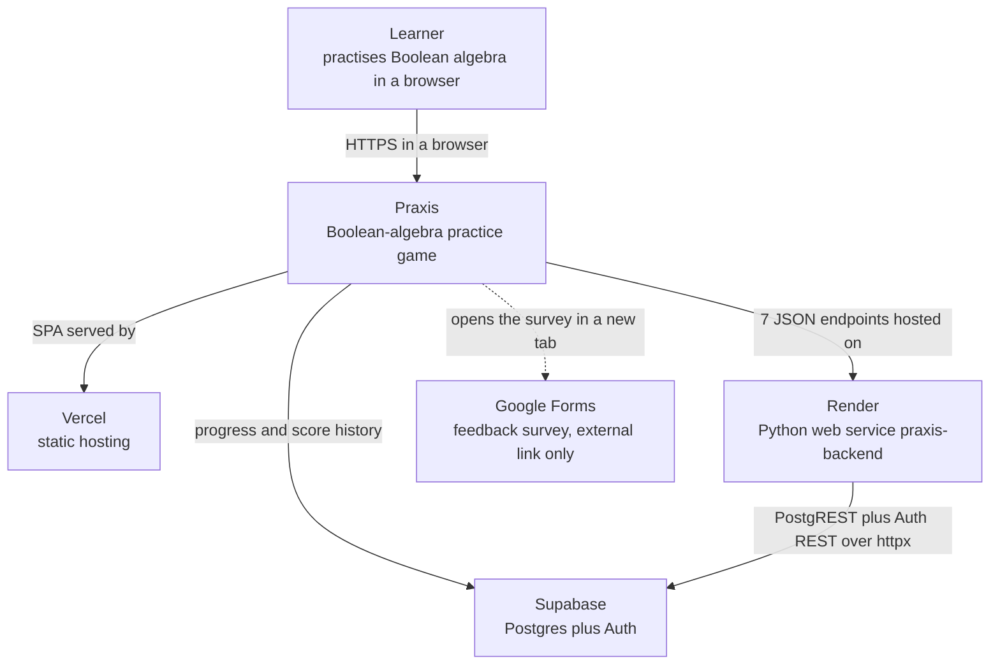

### D2 — Container (C4 Level 2)

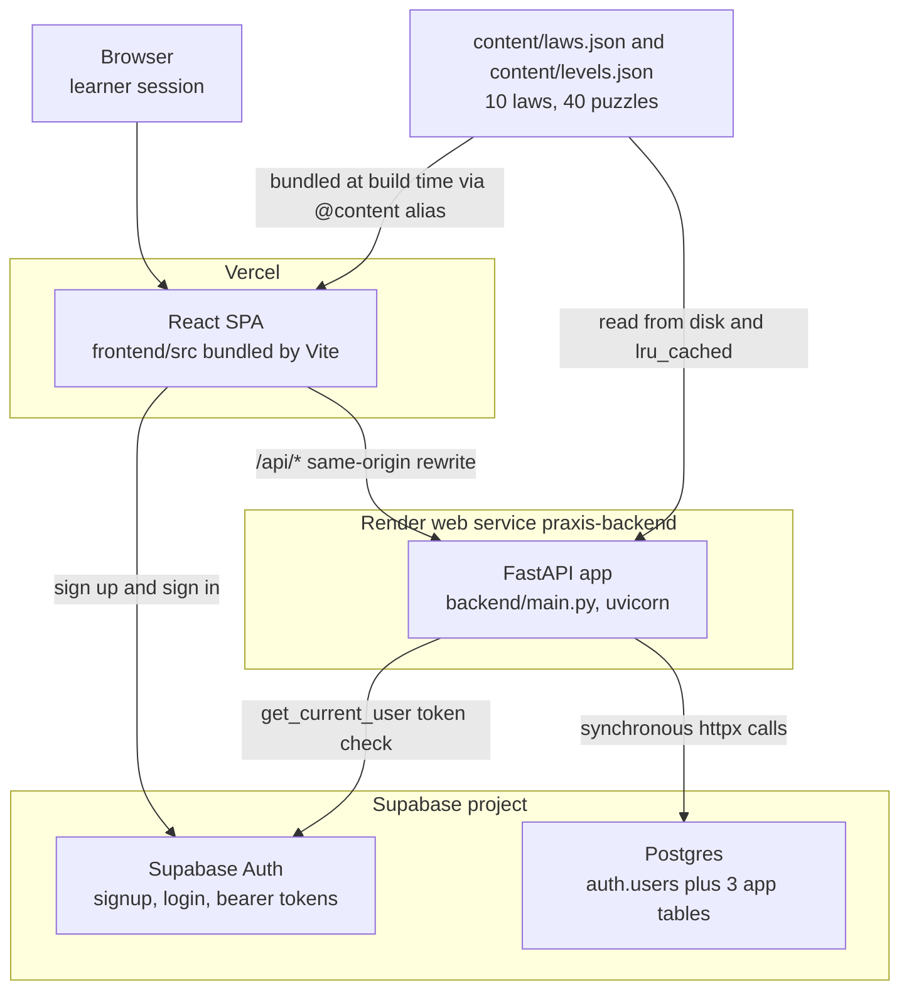

### D3 — ERD

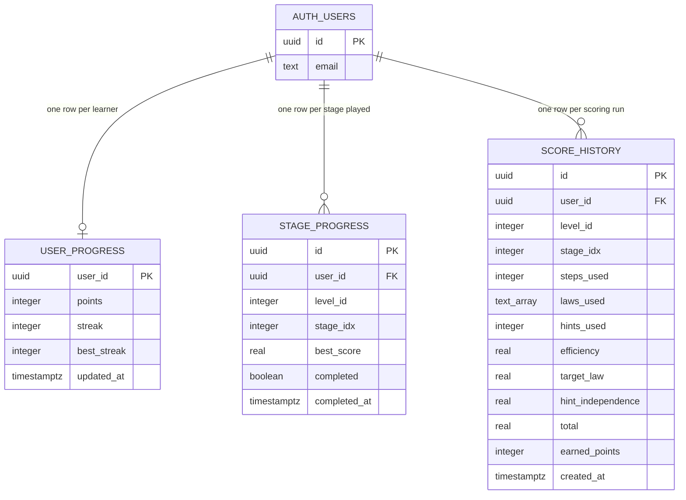

### D4 — Engine component diagram

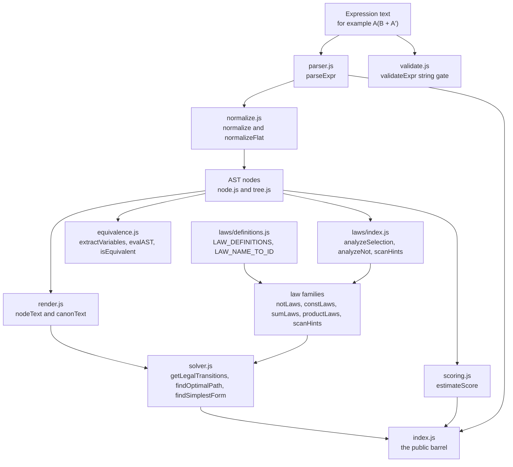

### D5 — Sequence: click to applied step

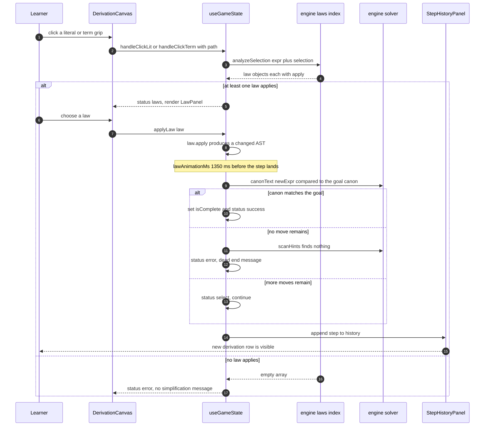

### D6 — Sequence: the real sandbox flow (corrects the brief)

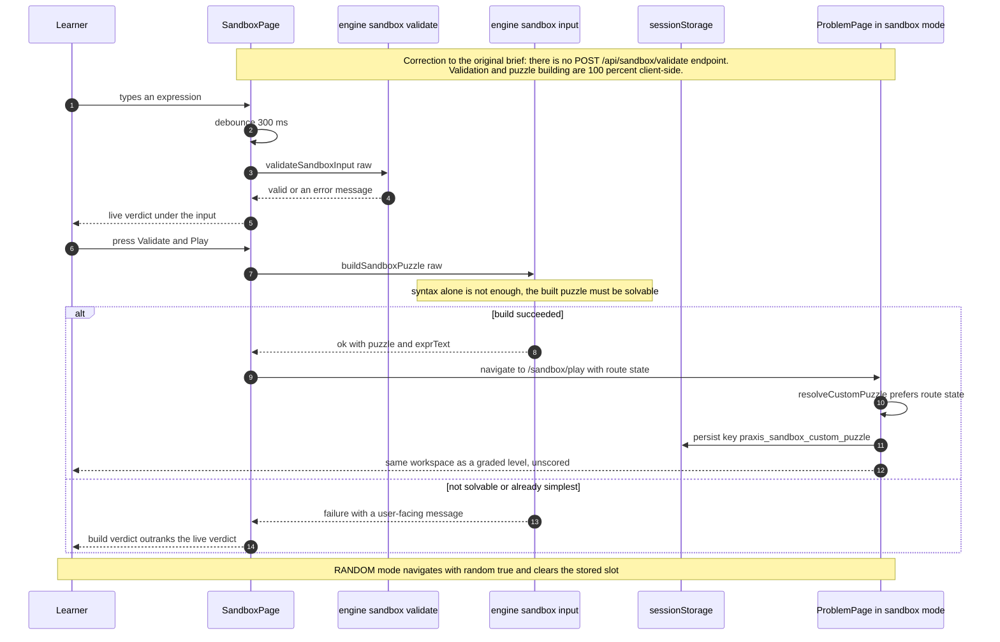

### D7 — Sequence: auth

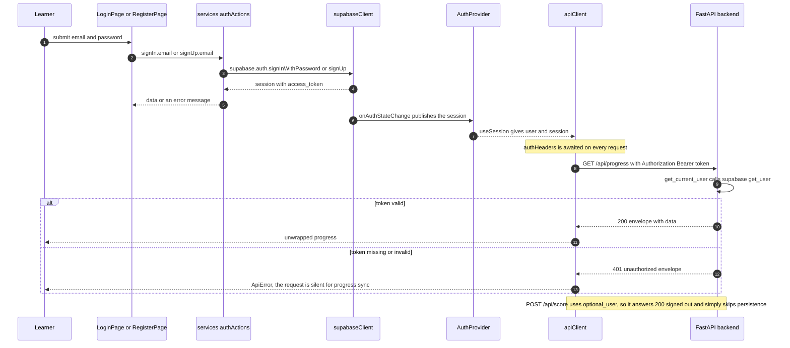

### D8 — State: puzzle session lifecycle

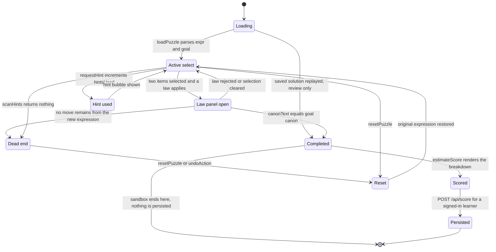

### D9 — Flowchart: level unlock

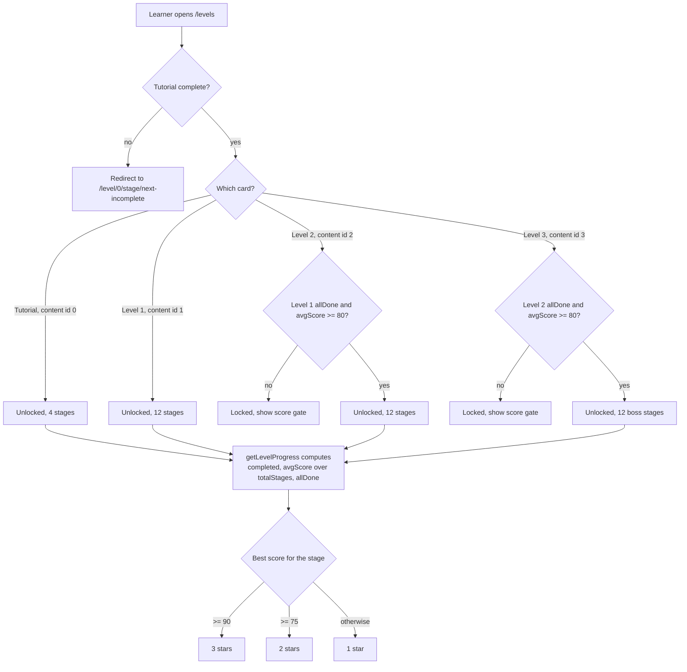

### D10 — Flowchart: scoring breakdown

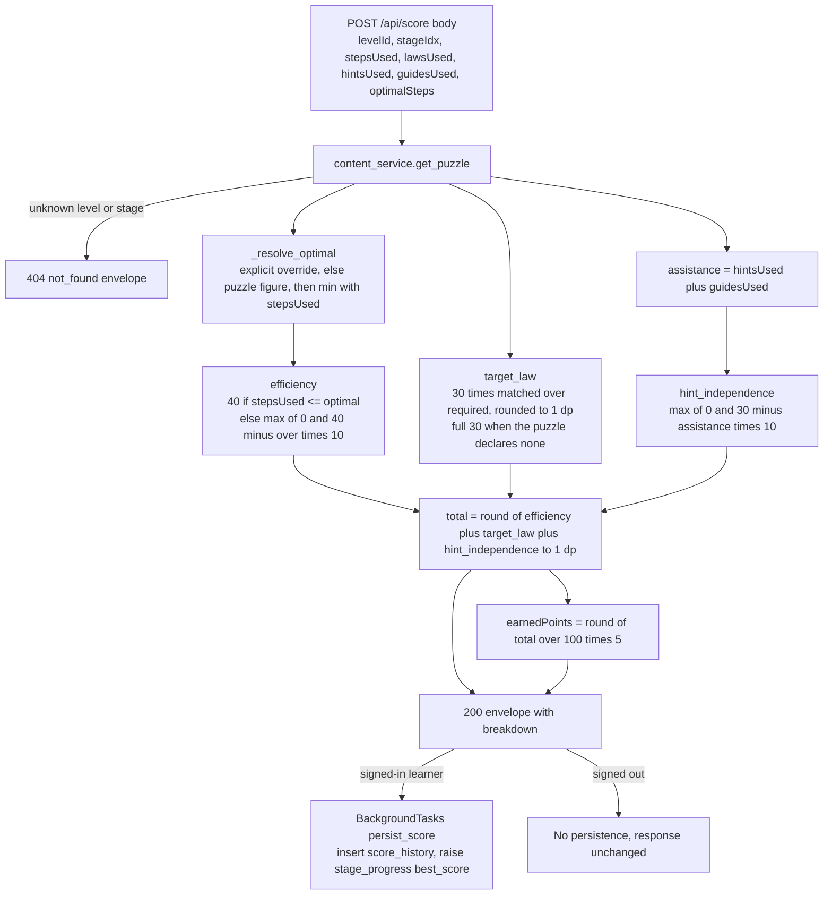

### D11 — Deployment

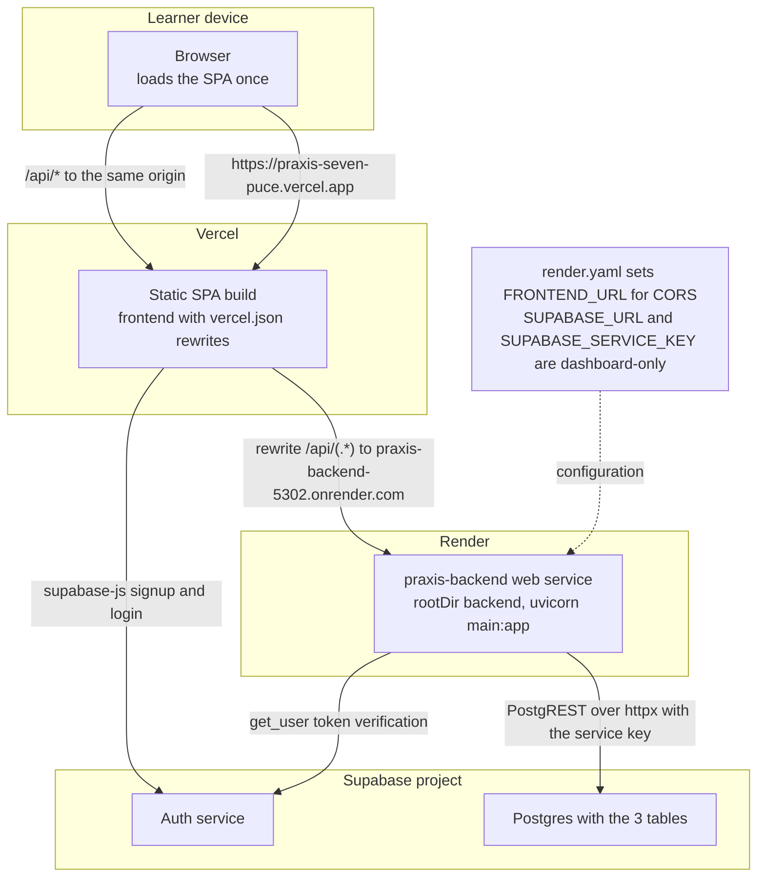

### D12 — Frontend data flow

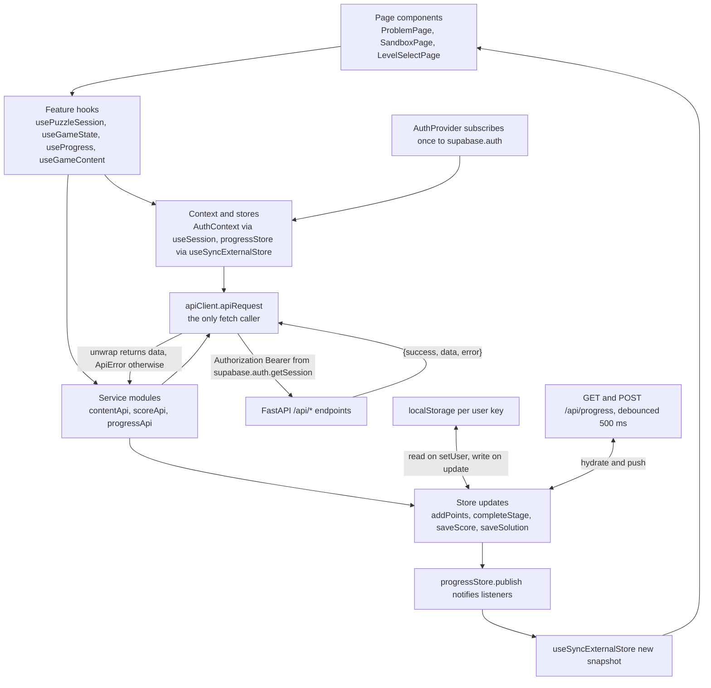

---

## 5. Handoff contract (requested by the Lead)

### 5.1 The exact parser gate command

Run from the repository root. Requires the staging harness to still exist (it lives at
`docs/_staging/tools/.mermaid-check/` and is deleted with the rest of `_staging`):

```bash
cd docs/_staging/tools/.mermaid-check && node validate-mermaid.mjs ../../../docs/09-diagrams/DIAGRAMS.md
```

Expected output ends with `ALL 12 MERMAID FENCES PARSE OK` and exit code `0`; any fence that
would not render prints `FAIL` with Mermaid's own parse error. This is a **real** parse
(`mermaid.parse()` from Mermaid 12.0.0 inside jsdom), not a keyword check — it catches the
class of error the suite checker cannot, e.g. an unquoted `A[Label (parens)]` node, which is
syntactically invisible to `check-docs.mjs` section 4.

### 5.2 Harness hygiene — one trap I already removed

`docs/_staging/tools/check-docs.mjs` walks **every `.md` file under `docs/`**, including
`node_modules`. A raw `npm install` under `docs/_staging/` therefore injected ~250 real
`README.md`/`CHANGELOG.md` files whose relative links are broken, and the checker reported
them as **BLOCKER**s against files nobody wrote:

```
[BLOCKER] docs/_staging/tools/.mermaid-check/node_modules/undici/README.md:14 — broken link target: ./CONTRIBUTING.md
[MAJOR]   docs/_staging/tools/.mermaid-check/node_modules/katex/contrib/.../README.md:37 — unclosed code fence
```

I deleted every non-`LICENSE`/non-`COPYING` `.md` inside the harness `node_modules` (247 files,
14 license files kept) and re-ran the checker: **0 findings** now reference `.mermaid-check`.
The harness still parses 12/12 after the strip. Nothing of mine survives inside `docs/` at
handoff except files under `docs/_staging/`, which the Lead deletes.

### 5.3 Heads-up for the final gate: a pre-existing secret finding

The checker currently reports three **BLOCKER** secret hits that are *not* mine and are outside
my write scope:

```
docs/context.md:232 — possible real secret reproduced (assigned SUPABASE_URL value)
docs/context.md:233 — possible real secret reproduced (supabase publishable key)
docs/context.md:233 — possible real secret reproduced (assigned VITE_SUPABASE_* value)
```

`docs/context.md` is a frozen legacy file the Lead owns (GROUND-TRUTH §7-D15). The secret scan
in `check-docs.mjs` walks all of `docs/`, so these three hits will fail the final gate unless
`context.md` is sanitised to placeholders or the file is excluded. Flagging for the Lead's
decision — I have not touched the file.

### 5.4 Early reconciliation of the three sibling diagrams already on disk

Before the writers' `diagram-input-*.md` files existed, I parser-checked the Mermaid they have
already published and cross-read it against my verified facts. **All 9 existing fences parse**
(`docs/03-database/ERD.md` 2/2, `docs/02-architecture/SAD.md` 5/5,
`docs/04-api/API-REFERENCE.md` 2/2) and I found **no factual conflict** with §2:

| Their diagram | Overlaps my | Agreement checked |
|---|---|---|
| `03-database/ERD.md` erDiagram | D3 | same three cardinalities, same `text_array` renderer-safety choice, same `level_id` "0 = Tutorial" note, `hints_used` = hints **plus** guides |
| `02-architecture/SAD.md` C4 L1 + container + backend components | D1, D2, D4 | 1,241 lines / 28 modules, the exact `main → routes → services → repositories → supabase_client` chain, `parents[2]/content`, `@content` alias, Render/Vercel split |
| `04-api/API-REFERENCE.md` auth sequence + middleware flowchart | D7 | 7 routes, `UnauthorizedError` → 401, `UpstreamError` → 502 |

Their diagrams **complement** mine rather than duplicate them: e.g. their auth sequence omits
the `optional_user` branch on `POST /api/score`, and their container diagram omits the Vercel
`/api` rewrite — both of which my D7/D2/D11 carry. I introduced the Google Forms survey into D1
so the system context matches `SAD.md` (§2.11). DIAGRAMS.md remains the single authoritative
copy; where a writer's input later conflicts with the code, the code wins and the conflict is
logged in `claims-diagrams.md`.

---

## 6. Per-diagram assembly scaffold (title / how-to-read / what-it-shows / source-of-truth)

Every required element of `DIAGRAMS.md`, pre-written and citation-complete, so assembly after
unblocking is mechanical. `How to read this` is the one-line orientation; `Source of truth` is
the `file:line` line the verifier spot-checks. Prose is code-derived and survives reconciliation.

### D1 — System context (C4 Level 1)

- **Title:** D1 — System context (C4 Level 1): who and what surrounds Praxis.
- **How to read this:** Start at the learner; solid arrows are live data flows and the dotted arrow is an outbound link that carries nothing back.
- **What it shows:** Praxis is one system with four neighbours: the learner in a browser, the two managed platforms that host it (Vercel for the SPA, Render for the API), Supabase for data and identity, and an external feedback form that is a plain hyperlink.
- **Source of truth:** `render.yaml:2-8`, `frontend/vercel.json:2-11`, `backend/config/settings.py:59-63`, `frontend/src/config/appLinks.js:8-9`, `frontend/src/components/layout/SurveyButton.jsx:17`.

### D2 — Container (C4 Level 2)

- **Title:** D2 — Container diagram (C4 Level 2): the deployable pieces and the shared content directory.
- **How to read this:** Each box is a separately deployed container; the two arrows leaving `content/` show the one directory both the SPA and the API read.
- **What it shows:** A React SPA calls the FastAPI container over `/api/*`, signs in against Supabase Auth, and the API reaches Postgres through the hand-rolled PostgREST shim. `content/laws.json` and `content/levels.json` (10 laws, 40 puzzles) are bundled at build time **and** read from disk at runtime, which is why `content/` must ship beside `backend/`.
- **Source of truth:** `frontend/vercel.json:2-11`, `backend/main.py:25-36`, `backend/main.py:79-83`, `backend/repositories/content_repository.py:16`, `backend/repositories/content_repository.py:34-43`, `frontend/vite.config.js:13-17`.
- **Discrepancy note:** the SPA is **not** a Render service (GROUND-TRUTH D19) — `render.yaml` declares only `praxis-backend`.

### D3 — Entity-relationship diagram

- **Title:** D3 — Entity-relationship diagram: three application tables plus Supabase's `auth.users`.
- **How to read this:** Crow's foot marks the many side, `PK`/`FK` mark keys, and `auth.users` is owned by Supabase, not by this repository.
- **What it shows:** One learner owns at most one totals row, many stage rows and many score-history rows; every foreign key cascades on delete. The visual type `text_array` is the true Postgres `TEXT[]` column, spelled without brackets because brackets are unsafe inside a Mermaid `erDiagram` attribute.
- **Source of truth:** `database/init.sql:7-13`, `database/init.sql:16-25`, `database/init.sql:28-42`, `database/init.sql:45-47`.
- **Honesty note:** RLS is enabled on all three tables but each policy is `FOR ALL USING (true)` for every role with no `auth.uid() = user_id` predicate (`database/init.sql:50-58`).

### D4 — Boolean engine component diagram

- **Title:** D4 — Component diagram: the Boolean engine (`frontend/src/engine/`).
- **How to read this:** Text enters at the top; every box is a pure module that returns a new tree and never mutates its input, and the barrel is the only public surface.
- **What it shows:** `parseExpr` produces the AST and calls `normalizeFlat` internally, so parser and normalizer are **not** cleanly separable stages. There are **two distinct string gates** and they must not be conflated: `validateExpr` (`engine/validate.js`) guards generated sandbox expressions inside `sandbox/generator.js`, while `validateSandboxInput` (`engine/sandbox/validate.js`) is the live gate the sandbox screen actually calls. Law analysis over a selection is what drives play, and the solver explores transitions to find the optimal path. The in-play goal test is **canonical-text equality**, not truth-table equivalence.
- **Source of truth:** `frontend/src/engine/index.js:16-84`, `frontend/src/engine/parser.js:75`, `frontend/src/engine/parser.js:160-166`, `frontend/src/engine/normalize.js:14-69`, `frontend/src/engine/validate.js:16-77`, `frontend/src/engine/sandbox/validate.js:155`, `frontend/src/engine/sandbox/generator.js:84`, `frontend/src/engine/laws/index.js:33-70`, `frontend/src/engine/solver.js:37`, `frontend/src/engine/solver.js:175`, `frontend/src/engine/scoring.js:54-98`, `frontend/src/state/useGameState.js:437`.
- **Discrepancy note:** `equivalence.js` is used by `laws/helpers.js:77,98`, `sandbox/generator.js:94` and `sandbox/input.js:161` — it does not gate each step.
- **Two-gates note:** `validateExpr` is consumed only by `sandbox/generator.js:84` and the barrel (`engine/index.js:35`); the sandbox screen uses `validateSandboxInput` instead (`pages/SandboxPage.jsx:122,124`).

### D5 — Sequence: from a click to a recorded step

- **Title:** D5 — Sequence diagram: literal click → law panel → law applied → step history.
- **How to read this:** Time runs downward; the numbered messages are one complete learner step, including the animation window before the step is committed.
- **What it shows:** Clicking a literal or a term grip runs law analysis over the current selection; a non-empty result opens the law panel, and the chosen law produces a new AST. The step is appended only after `lawAnimationMs` (1,350 ms), and completion is decided by comparing the new expression's canonical text with the goal's canonical text.
- **Source of truth:** `frontend/src/pages/ProblemPage.jsx:307`, `frontend/src/pages/ProblemPage.jsx:321`, `frontend/src/components/puzzle/LawPanel.jsx:132`, `frontend/src/components/puzzle/DerivationCanvas.jsx:197-199`, `frontend/src/state/useGameState.js:147`, `frontend/src/state/useGameState.js:199`, `frontend/src/state/useGameState.js:354`, `frontend/src/state/useGameState.js:425`, `frontend/src/state/useGameState.js:437`, `frontend/src/config/gameRules.js:60`.

### D6 — Sequence: the real sandbox flow (corrects the brief)

- **Title:** D6 — Sequence diagram: the sandbox, validated entirely in the browser.
- **How to read this:** Everything between the learner and the engine happens in one browser tab; no message in this diagram leaves the client.
- **What it shows:** Live validation is debounced by 300 ms; submit runs `buildSandboxPuzzle`, which enforces solvability and not just syntax and outranks the live verdict when it fails; success hands `{ customPuzzle, exprText }` to `/sandbox/play`, which detects sandbox mode by the absence of route params and reuses the graded workspace with scoring and persistence switched off.
- **Source of truth:** `frontend/src/pages/SandboxPage.jsx:117-124`, `frontend/src/pages/SandboxPage.jsx:163-187`, `frontend/src/engine/sandbox/input.js:109`, `frontend/src/components/puzzle/sandboxPuzzle.js:81-86`, `frontend/src/config/storageKeys.js:22`, `frontend/src/components/puzzle/usePuzzleSession.js:40`, `frontend/src/components/puzzle/usePuzzleSession.js:185-188`, `frontend/src/config/gameRules.js:70`, `frontend/src/config/gameRules.js:72`.
- **Required correction box:** the brief asked for `POST /sandbox/validate`; **no such endpoint exists** — it appears nowhere in the 7 application endpoints (`backend/main.py:79-83`). Validation and puzzle building are 100 % client-side.

### D7 — Sequence: auth

- **Title:** D7 — Sequence diagram: Supabase sign-in, the bearer token, and the two 401/optional paths.
- **How to read this:** The token is issued by Supabase but verified by the Praxis API on every protected request; the closing note explains why `POST /api/score` behaves differently.
- **What it shows:** `AuthProvider` subscribes once to Supabase and publishes the session; `apiClient.authHeaders` awaits `getSession()` on every call and attaches `Authorization: Bearer`. The two progress routes hard-401 without a valid token, while `POST /api/score` uses `optional_user`, answers 200 signed-out and simply skips persistence — an intentional asymmetry.
- **Source of truth:** `frontend/src/services/authActions.js:9-31`, `frontend/src/state/AuthProvider.jsx:21-42`, `frontend/src/services/apiClient.js:27-31`, `backend/core/security.py:17-43`, `backend/api/routes/score.py:24`, `backend/api/routes/score.py:38-39`, `backend/api/routes/progress.py:20-30`.
- **Extra detail worth keeping:** no OpenAPI security scheme is declared, so `/docs` shows no Authorize button even though two routes require a bearer token.

### D8 — State diagram: puzzle session lifecycle

- **Title:** D8 — State diagram: the lifecycle of one puzzle session.
- **How to read this:** Each state is a real `status` value or completion flag in `useGameState`; the sandbox exits before the scoring branch.
- **What it shows:** A session runs loading → active → (law panel | hint) → completed → scored → persisted, with a dead-end branch that only a reset or undo escapes. A solution loaded from saved progress re-enters completed as review only, and never re-awards points or re-opens the modal.
- **Source of truth:** `frontend/src/state/useGameState.js:29`, `frontend/src/state/useGameState.js:59-68`, `frontend/src/state/useGameState.js:437`, `frontend/src/state/useGameState.js:461`, `frontend/src/state/useGameState.js:487`, `frontend/src/state/useGameState.js:501`, `frontend/src/components/puzzle/usePuzzleSession.js:150-221`, `frontend/src/components/puzzle/usePuzzleSession.js:185-188`, `frontend/src/state/hintText.js:10`.

### D9 — Flowchart: level unlock

- **Title:** D9 — Flowchart: how a level unlocks (0-based ids, all stages plus an 80 % average).
- **How to read this:** Level ids are 0-based — **0 is the Tutorial** — and the only real gate is the diamond that requires both every stage complete and the average at or above 80.
- **What it shows:** The tutorial gate sends unfinished learners to their next incomplete tutorial stage; Levels 2 and 3 are chain-gated on the previous level's unlock, and stars are cut at 90 (three) and 75 (two). Because `avgScore` divides by the level's total stages, a stage with no recorded score counts as zero and drags the average down.
- **Source of truth:** `frontend/src/state/progressStore.js:291-313`, `frontend/src/config/gameRules.js:38-46`, `frontend/src/config/gameRules.js:48-49`, `frontend/src/pages/LevelSelectPage.jsx:94-120`, `frontend/src/components/TutorialGate.jsx:64-75`.
- **Content volume to quote:** 4 levels, 40 puzzles — `[4,12,12,12]`.

### D10 — Flowchart: scoring breakdown

- **Title:** D10 — Flowchart: how one submitted derivation becomes a score.
- **How to read this:** Three components are computed independently and only then summed; the rounding step happens once, at the total.
- **What it shows:** Efficiency (40) compares steps used with an optimum that is clamped to be no larger than what the learner actually used; target law (30) is proportional and pays full marks when the puzzle declares no target laws; hint independence (30) loses 10 per hint **or guide**, counted as one assistance figure. `earnedPoints` is a 0–5 bonus on top of the frontend's base 10 XP, and persistence is best-effort in a background task.
- **Source of truth:** `backend/services/scoring_service.py:32-77`, `backend/services/scoring_service.py:80-88`, `backend/services/scoring_service.py:91-115`, `backend/config/constants.py:9-25`, `backend/api/routes/score.py:20-48`, `backend/services/progress_service.py:87`, `frontend/src/engine/scoring.js:54-98`.
- **Known discrepancy:** GROUND-TRUTH D8 — the frontend mirror and the backend agree on weights and 1-dp rounding, but the backend is authoritative for what is persisted.

### D11 — Deployment diagram

- **Title:** D11 — Deployment diagram: Render, Vercel and Supabase.
- **How to read this:** Three deployment parties; the browser reaches the API through the SPA's own origin rather than calling Render directly.
- **What it shows:** `render.yaml` declares exactly one service (`praxis-backend`, `rootDir: backend`, `uvicorn main:app`), the SPA is deployed separately to Vercel, and Supabase supplies both Postgres and Auth. Vercel rewrites `/api/(.*)` to the Render host, so in production `/api/*` is **same-origin and proxied**, which is why the production CORS story is quiet; CORS config matters mainly for local development.
- **Source of truth:** `render.yaml:1-15`, `frontend/vercel.json:1-11`, `backend/config/settings.py:23-27`, `backend/config/settings.py:66-71`, `backend/config/settings.py:75`, `backend/main.py:30-36`.
- **Secret hygiene:** `FRONTEND_URL` is a literal in `render.yaml`; `SUPABASE_URL` and `SUPABASE_SERVICE_KEY` use `sync: false` and are set in the Render dashboard. Never print their values (`render.yaml:10-15`).

### D12 — Frontend data-flow diagram

- **Title:** D12 — Data-flow diagram: component → hook → store → API → store → re-render.
- **How to read this:** The top row is the render path downward to the network, and the bottom row is the return path back up through the store; the store lives outside React, which is why a server response and a local point award re-render the same way.
- **What it shows:** Pages call feature hooks; hooks read the auth context and the external progress store and call service modules; only `apiClient.apiRequest` calls `fetch`, unwrapping the `{success, data, error}` envelope into `data` or throwing `ApiError`. Score and progress writes land as store mutations whose `publish()` notifies every `useSyncExternalStore` subscriber; localStorage is the fast path and the server is the durable one.
- **Source of truth:** `frontend/src/pages/ProblemPage.jsx:134-135`, `frontend/src/components/puzzle/usePuzzleSession.js:34-35`, `frontend/src/state/useProgress.js:20-24`, `frontend/src/state/progressStore.js:49-54`, `frontend/src/state/progressStore.js:87-94`, `frontend/src/state/progressStore.js:134-166`, `frontend/src/services/apiClient.js:56-93`, `frontend/src/services/scoreApi.js:22-35`, `frontend/src/state/AuthProvider.jsx:37-42`.

---

## 7. Open items for when `task-7` unblocks

1. Read all six `docs/_staging/diagram-input-*.md` files; diff each against §2/§4 and §5.4.
2. Log every conflict in `docs/_staging/claims-diagrams.md` with `file:line` and say which
   side the code supports.
3. Assemble `DIAGRAMS.md` from §4 (validated fences) + §6 (title, how-to-read, what-it-shows,
   source-of-truth) and add the `## Contents` list once the file is known to exceed 200 lines.
4. Run the §5.1 parser gate on the assembled `DIAGRAMS.md`: require 12/12 PASS.
5. Run `node docs/_staging/tools/check-docs.mjs --verbose` from the repo root and confirm the
   `09-diagrams/DIAGRAMS.md` row is clean (links resolve, mermaid keywords present, no secret
   patterns).
6. Delete `docs/_staging/tools/.mermaid-check/` and `docs/_staging/tools/.npm-cache/` before
   completing the task, then send the Lead the §5.1 command.


